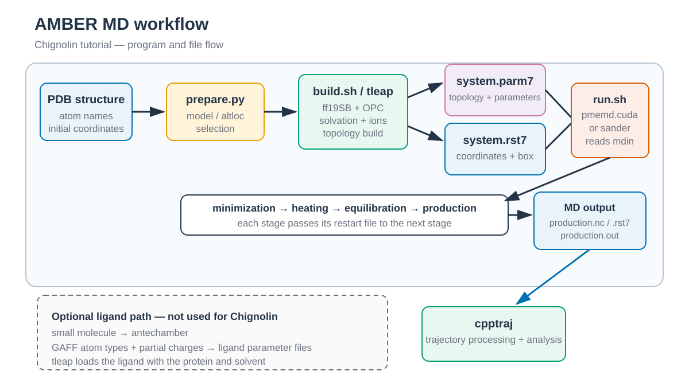

# Chignolin conventional MD / Chignolin 일반 MD

*PDB를 정리한 뒤 `tleap`으로 topology와 initial coordinate file을 만들고, MD engine이 stage별 restart를 이어받아 trajectory를 생성합니다. `cpptraj`은 topology와 trajectory를 함께 읽어 분석합니다. / After PDB preparation, `tleap` creates the topology and initial coordinate file. The MD engine passes restart files between stages, and `cpptraj` reads the topology and trajectory for analysis.*

## 한국어

PDB 1UAO의 첫 NMR model로 10-residue chignolin system을 만듭니다.
Force field는 ff19SB, water model은 TIP3P입니다.
계산은 minimization, 200 ps heating, 100 ps NPT equilibration 및 1 ns production 순으로 진행됩니다.

Conventional MD에서는 모든 원자가 같은 physical Hamiltonian과 bath temperature를 따릅니다.
이 작은 protein 예제는 구조 준비, explicit-solvent build와 initial/restart input의 차이를 배우는 기준 workflow입니다.

### AMBER program과 전체 흐름

AmberTools에는 `tleap`, `sander`, `antechamber`와 `cpptraj`이 포함됩니다.
성능 최적화 engine인 `pmemd`와 GPU용 `pmemd.cuda`는 별도의 Amber installation에
포함됩니다.

| Program | 역할 |
| --- | --- |
| `tleap` | PDB를 읽고 residue template와 force-field parameter를 연결합니다. 이 예제에서는 ff19SB protein에 TIP3P water와 ion을 추가하고 `parm7`/`rst7`을 생성합니다. |
| `sander` | AmberTools에 포함된 기본 minimization/MD engine입니다. 다양한 기능을 지원하며 CPU에서 짧은 test를 실행할 때 사용할 수 있습니다. |
| `pmemd`, `pmemd.cuda` | `sander`와 거의 같은 input을 사용하는 성능 최적화 MD engine입니다. `pmemd.cuda`는 GPU를 사용하며 이 예제의 기본 production engine입니다. |
| `antechamber` | Small organic molecule의 GAFF/GAFF2 atom type과 partial charge를 준비합니다. Protein-only Chignolin에는 사용하지 않습니다. Protein–ligand workflow에서는 `parmchk2`로 누락 parameter를 확인한 뒤 ligand file을 `tleap`에 전달합니다. |
| `cpptraj` | `parm7`과 trajectory/restart를 함께 읽어 imaging, alignment, frame 추출과 RMSD 같은 분석을 수행합니다. Simulation을 전파하는 engine은 아닙니다. |

이 예제의 file 흐름은 다음과 같습니다.

1. `download.sh`와 `prepare.py`가 raw PDB에서 첫 NMR model을 선택해 `chignolin.pdb`를 만듭니다.
2. `build.sh`가 `tleap`을 호출해 water와 ion을 추가하고 `system.parm7`과 `system.rst7`을 만듭니다.
3. `run.sh`가 같은 `parm7`을 유지한 채 minimization → heating → equilibration → production 순서로 계산합니다. 각 `rst7`은 다음 stage의 coordinate input입니다. Heating이 velocity를 생성하고 equilibration과 production은 이를 이어받습니다.
4. Production은 `production.nc`, `production.rst7`과 `production.out`을 남깁니다. 이후 [analysis tutorial](../../../2_Analysis/README.md)의 `cpptraj` workflow는 `system.parm7`과 `production.nc`를 함께 사용합니다.

| File type | 포함하는 정보 |
| --- | --- |
| PDB | Atom/residue 이름과 한 frame의 원자 좌표를 담습니다. Amber force-field parameter 전체를 담는 file은 아닙니다. |
| `parm7` | Atom type, partial charge, mass, residue/molecule 구성, bond connectivity, bonded/nonbonded parameter와 exclusion 등 Hamiltonian 계산에 필요한 topology를 담습니다. Periodic system metadata도 포함할 수 있지만 trajectory frame의 좌표는 저장하지 않습니다. |
| `rst7` | 한 frame의 원자 좌표, 선택적인 velocity와 periodic box 정보를 담습니다. Initial coordinate file과 stage continuation에 모두 사용되며 force-field parameter는 `parm7`에서 읽습니다. |
| `inputs/*.in` | `mdin` control file입니다. Timestep, step 수, thermostat, pressure coupling, restraint와 output 주기 등 계산 방법을 지정합니다. |
| `*.out`, `*.info` | Engine log와 진행 상황입니다. Energy, temperature, pressure, warning과 종료 상태를 확인합니다. |
| `*.nc` | 여러 frame의 좌표와 time/box 정보를 저장하는 NetCDF trajectory입니다. 분석할 때 대응하는 `parm7`이 필요합니다. |

### Script 역할

| 파일 | 역할 | 주요 input과 output |
| --- | --- | --- |
| `download.sh` | 1UAO PDB와 mmCIF download 및 checksum 기록 | `structure/1UAO.raw.pdb`, `1UAO.cif`, `SHA256SUMS` |
| `prepare.py` | 첫 NMR model과 허용된 alternate location 선택 | raw PDB → `structure/chignolin.pdb` |
| `build.sh` | ff19SB/TIP3P solvation, neutralization과 topology build | prepared PDB → `work/system.parm7`, `system.rst7`, `system.pdb` |
| `run.sh` | minimization부터 production까지의 계산 실행 | topology/restart → `work/*.out`, `*.rst7`, `*.nc` |

~~~bash
cd 1_Simulation/1_MD/1.1_Soluble_Protein
./download.sh
python3 prepare.py structure/1UAO.raw.pdb structure/chignolin.pdb
./build.sh structure/chignolin.pdb
./run.sh --dry-run
./run.sh
~~~

### 주요 option

| Option | 의미 |
| --- | --- |
| `nstlim`, `dt=0.002` | simulation의 길이를 정합니다. SHAKE를 사용하므로 timestep은 2 fs입니다. |
| `ntt=3`, `gamma_ln=1.0` | Langevin thermostat와 collision frequency를 설정합니다. |
| `ntb=2`, `ntp=1`, `barostat=2` | Equilibration과 production에서 isotropic NPT와 Monte Carlo barostat을 사용합니다. |
| `ntc=2`, `ntf=2` | 수소가 포함된 bond를 SHAKE로 고정하고 해당 bond force 계산을 생략합니다. |
| `restraintmask` | Heating과 equilibration에서 solvent와 ion을 제외한 protein heavy atom을 restraint합니다. |
| `irest`, `ntx` | Heating은 새 velocity를 만들고 이후 stage는 restart의 좌표와 velocity를 읽습니다. |

`structure/SHA256SUMS`에 PDB와 mmCIF checksum이 기록됩니다.
`build.sh`는 `work/system.parm7`과 `work/system.rst7`을 만듭니다.
`work/leap.log`에서 unknown residue, missing atom과 net charge를 확인합니다.

Terminal state, protonation state, disulfide bond의 존재 유무 등은 build 전에 확인합니다.
Heating에서 새 velocity를 만들고 이후 단계는 restart의 좌표와 velocity를 이어받습니다.
기본 engine은 `pmemd.cuda`이며 다른 실행 파일은 `AMBER_ENGINE`으로 지정합니다.
1 ns production 결과는 folding equilibrium이나 수렴 판단에 사용하지 않습니다.

## English

The first NMR model of PDB 1UAO is built with ff19SB and TIP3P. The workflow runs
minimization, 200 ps heating, 100 ps NPT equilibration, and 1 ns production.

Conventional MD propagates one physical Hamiltonian at one bath temperature.
This small protein provides a baseline for structure preparation, explicit
solvation, and the distinction between initial and continuation inputs.

### AMBER programs and overall workflow

AmberTools includes `tleap`, `sander`, `antechamber`, and `cpptraj`. The
performance-optimized `pmemd` and GPU-enabled `pmemd.cuda` engines are supplied
with a separate Amber installation.

| Program | Role |
| --- | --- |
| `tleap` | Reads the PDB, assigns residue templates and force-field parameters, adds TIP3P water and ions, and writes `parm7`/`rst7`. |
| `sander` | The general minimization and MD engine included with AmberTools. It can be used for short CPU tests when the selected input features are supported. |
| `pmemd`, `pmemd.cuda` | Performance-optimized engines that use nearly the same inputs as `sander`. The GPU-enabled `pmemd.cuda` is the default production engine here. |
| `antechamber` | Prepares GAFF/GAFF2 atom types and partial charges for small organic molecules. It is not used for protein-only Chignolin. Protein–ligand workflows check missing parameters with `parmchk2` before passing the ligand files to `tleap`. |
| `cpptraj` | Reads a topology together with trajectories or restarts for imaging, alignment, frame extraction, and analyses such as RMSD. It does not propagate MD. |

The workflow is PDB preparation → `tleap` system build → minimization → heating
→ equilibration → production → `cpptraj` analysis. `build.sh` creates
`system.parm7` and `system.rst7`. `run.sh` keeps the topology fixed and passes
each restart to the next stage as its coordinate input. Heating creates
velocities, which equilibration and production continue. Production writes
`production.nc`, `production.rst7`, and `production.out`; the downstream
[`cpptraj` tutorials](../../../2_Analysis/README.md) read `system.parm7`
together with `production.nc`.

| File type | Contents |
| --- | --- |
| PDB | Atom/residue names and one coordinate frame, but not the complete Amber force-field parameters. |
| `parm7` | Atom types, partial charges, masses, residues/molecules, bond connectivity, bonded and nonbonded parameters, exclusions, and other topology data required to evaluate the Hamiltonian. It can include periodic-system metadata but not trajectory-frame coordinates. |
| `rst7` | One coordinate frame, optional velocities, and periodic-box data. It supplies initial or continuation state; force-field parameters remain in `parm7`. |
| `inputs/*.in` | `mdin` controls for timestep, step count, thermostat, pressure coupling, restraints, and output intervals. |
| `*.out`, `*.info` | Text output and progress information used to inspect energies, temperature, pressure, warnings, and completion. |
| `*.nc` | A NetCDF trajectory containing multiple coordinate frames plus time/box data. Analysis requires the matching `parm7`. |

### Script roles

| File | Role |
| --- | --- |
| `download.sh` | Downloads the 1UAO PDB/mmCIF files and records checksums. |
| `prepare.py` | Selects the first NMR model and supported alternate locations. |
| `build.sh` | Builds the solvated ff19SB/TIP3P topology and restart. |
| `run.sh` | Runs minimization, heating, equilibration, and production. |

Key controls are `nstlim`/`dt` for stage length, `ntt=3` and `gamma_ln=1.0`
for Langevin temperature control, `ntb=2`, `ntp=1`, and `barostat=2` for
isotropic NPT, and `ntc=2`/`ntf=2` for SHAKE. Heating creates velocities;
later stages use `irest=1`, `ntx=5` to continue coordinates and velocities.

Check `structure/SHA256SUMS`, terminal states, protonation states, disulfide
bonds, and `work/leap.log` before building the system.
`build.sh` writes `work/system.parm7` and `work/system.rst7`. Heating creates
velocities, and later stages continue from the restart. `run.sh` uses
`pmemd.cuda`; `AMBER_ENGINE` overrides it.
The 1 ns production result is not evidence of folding equilibrium or
convergence.

## References / 참고 자료

- [RCSB PDB 1UAO](https://www.rcsb.org/structure/1UAO)
