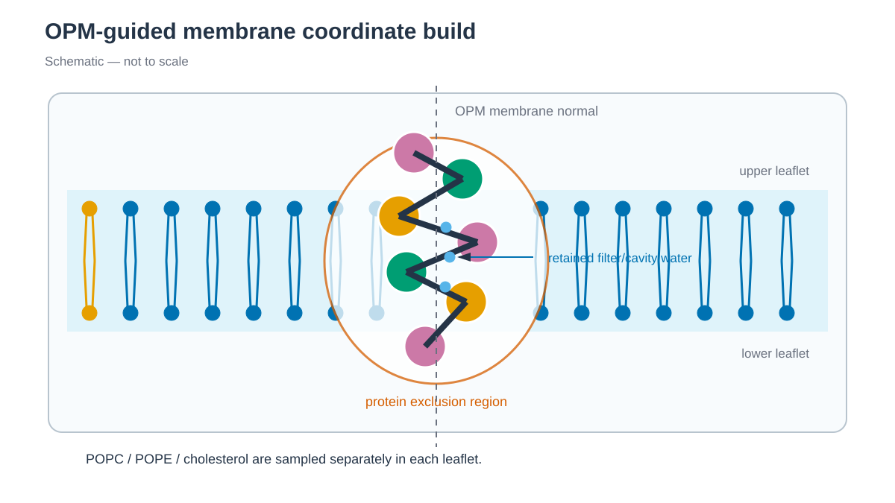

# Stage 1: coordinate build / 1단계: coordinate build

*OPM membrane normal을 유지하면서 protein exclusion 영역 밖에 두 leaflet을 배치합니다. / Two leaflets are placed outside the protein exclusion region while retaining the OPM membrane normal.*

## 한국어

OPM에서 membrane normal에 맞춰 배향한 KcsA를 평형화된 Lipid21 bilayer에 삽입합니다.
나머지 lipid를 무작위로 채우지 않고, 기존 bilayer unit cell을 x·y 방향으로 복제합니다.

### 파일 역할

`download.sh`는 다음 coordinate를 `structure/`에 받습니다.

| 파일 | 용도 |
| --- | --- |
| `1K4C-opm.pdb` | OPM 기준으로 membrane에 배치된 2.0 Å KcsA 구조입니다. Membrane boundary는 z=±15.0 Å입니다. |
| `3EFF-opm.pdb` | 1K4C에서 빠진 Ser22 OG와 Arg117 side chain의 초기 conformer를 가져옵니다. |
| `POPC.gro`, `POPE.gro`, `CHOL15.gro` | 공개 Lipid21 bilayer coordinate입니다. |

`prepare.py`는 OPM 1K4C의 chain C·F·I·L을 KcsA tetramer로 선택합니다.
Filter K+ 7개와 filter·cavity water 16개를 유지하고, Fab과 bulk crystal water는 제거합니다.
Neutral-pH baseline은 E71=`GLH`, D80=`ASP`, H25=`HIE`, E118/E120=`GLU`입니다.
Side chain이 불완전한 terminal H124는 제외합니다.

1K4C의 Ser22 OG와 Arg117 side chain은 tleap이 만들게 두지 않습니다.
`prepare.py`가 closed KcsA 3EFF의 해당 side chain을 residue local backbone에 alignment해 추가합니다.
tleap internal coordinate만 사용하면 Arg117이 이웃 subunit과 비물리적으로 겹칠 수 있습니다.

`build_membrane.py`는 protein x·y 크기와 padding으로 필요한 unit-cell 복제 수를 계산합니다.
Protein과 겹치는 lipid를 분자 단위로 제거한 뒤 POPC 일부를 POPE와 cholesterol로 치환합니다.
Protein footprint가 leaflet마다 다르므로 lipid 수를 인위적으로 맞추지 않습니다.

### 실행

~~~bash
cd 1_Simulation/1_MD/1.3_Membrane_Protein/1_Coordinate_Build
./download.sh
python3 prepare.py \
    structure/1K4C-opm.pdb \
    work/kcsa.pdb \
    structure/3EFF-opm.pdb
./run.sh --dry-run work/kcsa.pdb
./run.sh work/kcsa.pdb
~~~

기본 결과는 `work/system-coordinates.pdb`입니다.
KcsA에서 box는 124.072×124.686×105.054 Å, leaflet 조성은 upper 186/10/10과
lower 196/11/11 POPC/POPE/cholesterol입니다.
정수로 반올림하므로 정확히 90%/5%/5%가 아닐 수 있습니다.

### 주요 option

`run.sh` 상단에서 다음 값을 바꿉니다.

| 값 | 기본값 | 의미 |
| --- | ---: | --- |
| `composition` | `POPC=90,POPE=5,CHOL=5` | 각 leaflet의 목표 지질 비율입니다. |
| `xy_padding` | 25 Å | Protein 폭에 더해 unit-cell 복제 수를 정합니다. |
| `water_padding` | 20 Å | Protein z 경계 밖의 water 두께입니다. |
| `protein_lipid_distance` | 2.0 Å | Protein heavy atom과 이 거리 안에 든 lipid를 제거합니다. |

Cholesterol은 box 경계에서 5 Å 안쪽의 lipid만 치환 후보로 쓰고,
이웃 lipid heavy atom과 1.8 Å, 모든 atom과 0.9 Å 이상 떨어진
배향을 15° 간격으로 찾습니다. 이 값은
ring이 periodic boundary를 관통하는 초기 구조를 피하기 위한 geometry
조건입니다.

`build_membrane.py`는 KcsA residue number를 사용하지 않습니다. 다른 OPM
protein에도 사용하려면 system에 맞는 preparation script로 assembly,
missing atom, protonation과 보존할 ligand를 먼저 정리합니다. Protein은 OPM
orientation을 유지하고 다음 형식의 첫 줄을 포함해야 합니다.

~~~text
REMARK OPM MEMBRANE HALF-THICKNESS 15.000 ANGSTROM
~~~

Builder는 membrane normal이 z인 orthorhombic system만 다룹니다. OPM data가
없을 때 protein orientation을 예측하는 기능은 포함하지 않습니다.

### PACKMOL과 coordinate builder

Membrane system은 PACKMOL이나 PACKMOL-Memgen으로도 만들 수 있습니다.
여러 분자를 지정한 영역에 배치할 수 있어 lipid 종류와 조성을 바꾸기
편리합니다. Packing으로 만든 coordinate는 protein–lipid contact,
periodic boundary의 lipid piercing과 initial energy를 별도로 확인해야 합니다.

이 tutorial에서는 PACKMOL input을 제공하지 않고 `build_membrane.py`를
사용합니다. OPM orientation과 평형화된 Lipid21 bilayer patch를 활용해
box, overlap cutoff과 lipid 치환 과정을 code에서 직접 확인하고 수정할 수
있게 구성했습니다.

VMD 등으로 protein orientation, leaflet, lipid tail piercing, hydrophobic
core의 bulk water, filter K+·water를 확인한 뒤 2단계로 넘어갑니다.

## English

This stage inserts 1K4C, positioned relative to the membrane according to OPM,
into replicated, equilibrated Lipid21 bilayer patches. It tiles an existing
bilayer unit cell in x and y instead of randomly packing the remaining lipids.
`prepare.py` selects the KcsA tetramer, seven filter K+ ions, and 16
filter/cavity waters. It transfers the missing Ser22 and Arg117 side-chain
atoms from closed KcsA 3EFF by a local backbone alignment. H124 is omitted
because its terminal side chain is incomplete.

The builder derives the number of x/y unit-cell copies from the protein size
and padding. It removes complete overlapping lipids and preserves the natural
leaflet asymmetry produced by the protein footprint. The default KcsA box is
124.072×124.686×105.054 Å. Integer molecule counts mean that the resulting
composition may differ slightly from exactly 90% POPC, 5% POPE, and 5%
cholesterol. Edit the clearly named values near the top of `run.sh` to change
composition or padding.

The builder itself does not use KcsA residue numbers. Another OPM protein can
be supplied after a system-specific preparation step has selected the
assembly, repaired missing atoms, assigned protonation, and preserved the OPM
orientation and half-thickness remark. It assumes an orthorhombic system with
the membrane normal along z; it does not predict orientation when OPM data are
absent.

PACKMOL and PACKMOL-Memgen can also construct membrane systems and are useful
when changing molecular components or lipid composition. Their packed
coordinates still require inspection for protein–lipid contacts, lipid piercing
across periodic boundaries, and initial energy. This tutorial instead provides
`build_membrane.py`, allowing learners to inspect and modify how OPM orientation
and equilibrated Lipid21 patches are used.

## References / 참고 자료

- [RCSB PDB 1K4C](https://www.rcsb.org/structure/1K4C)
- [RCSB PDB 3EFF](https://www.rcsb.org/structure/3EFF)
- [OPM database](https://opm.phar.umich.edu/)
- [Lipid21](https://doi.org/10.1021/acs.jctc.1c01217)
- [PACKMOL-Memgen](https://doi.org/10.1021/acs.jcim.9b00269)
- [PACKMOL user guide](https://m3g.github.io/packmol/userguide.shtml)
