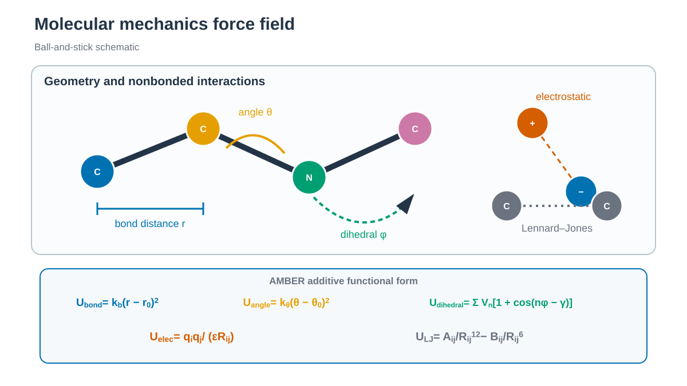

# System-based conventional MD / 시스템별 일반 MD

*Bond, angle, dihedral과 nonbonded interaction이 force-field energy를 구성합니다. / Bonded and nonbonded terms make up the force-field energy.*

## 한국어

세 가지 system으로 AMBER 일반 MD를 연습합니다. Production은 모두 1 ns로
설정되어 있습니다.

Conventional MD는 추가 bias나 replica 교환 없이 선택한 force field의
Hamiltonian으로 시간에 따른 원자 운동을 계산합니다. Minimization으로 큰
steric clash를 줄이고, heating에서 velocity를 만든 뒤, equilibration에서
온도와 밀도를 안정화하고 production trajectory를 수집합니다.

위 그림은 AMBER의 기본 additive force-field 식을 bond, angle, dihedral,
electrostatic과 Lennard-Jones 항으로 나눠 표시합니다. 실제 energy는 topology에
정의된 모든 bonded term과 nonbonded atom pair에 대해 합산됩니다.

- [수용성 단백질: chignolin (PDB 1UAO)](1.1_Soluble_Protein/README.md)
- [단백질–리간드: T4 lysozyme–JZ4 (PDB 3HTB)](1.2_Protein_Ligand/README.md)
- [막 단백질: KcsA (PDB 1K4C)](1.3_Membrane_Protein/README.md)

각 `download.sh`가 RCSB 구조와 checksum을 저장합니다. Protonation, missing
atom, 결정학적 첨가물과 force field는 build 전에 확인합니다. 기본 engine은
`pmemd.cuda`입니다. Chignolin과 T4 lysozyme–JZ4는 TIP3P, KcsA는 OPC를
사용합니다. Download와 전처리 구조는 `structure/`, AMBER control
file은 `inputs/`, 생성된 topology·restart·trajectory는 `work/`에 둡니다.

각 system README는 실제 script의 input과 output, restraint, thermostat,
pressure coupling 및 restart option을 설명합니다. 1 ns라는 동일한 길이는
workflow 학습을 위한 값이며 세 system의 수렴 시간을 같다고 가정한 값이
아닙니다.

## English

Three systems cover the basic AMBER MD workflow. Each production input is set
to 1 ns.

Conventional MD propagates one force-field Hamiltonian without an added bias or
replica exchange. The examples move from clash removal and velocity generation
to density equilibration and production trajectory collection.

The figure separates the basic additive AMBER force-field expression into bond,
angle, dihedral, electrostatic, and Lennard-Jones terms. The actual energy sums
these terms over the bonded interactions and nonbonded atom pairs defined by the
topology.

- [Soluble protein: chignolin (PDB 1UAO)](1.1_Soluble_Protein/README.md)
- [Protein–ligand: T4 lysozyme–JZ4 (PDB 3HTB)](1.2_Protein_Ligand/README.md)
- [Membrane protein: KcsA (PDB 1K4C)](1.3_Membrane_Protein/README.md)

Each `download.sh` records the RCSB source and checksum. Check protonation,
missing atoms, crystallographic additives, and force-field choices before the
build. Chignolin and T4 lysozyme–JZ4 use TIP3P; KcsA uses OPC. The default
engine is `pmemd.cuda`. Source and prepared structures use `structure/`, AMBER
control files use `inputs/`, and generated files use `work/`.
Each system README documents its scripts, restraints, thermostat, pressure
coupling, and restart controls. The common 1 ns length is a workflow setting,
not an assertion that the three systems converge on the same timescale.
