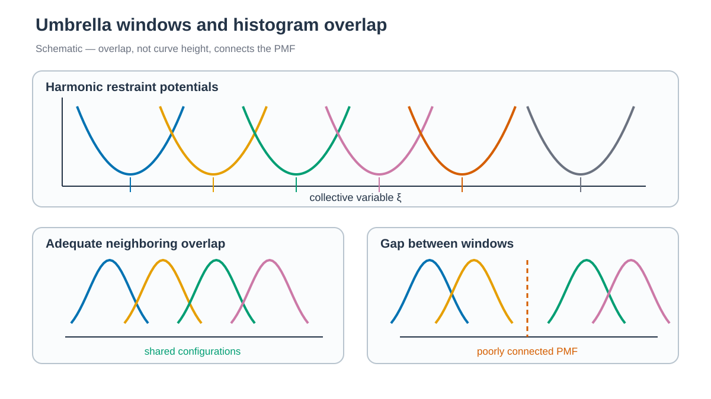

# Ratchet MD and umbrella sampling / Ratchet MD와 US



*인접 window의 histogram이 겹쳐야 CV 구간 사이의 PMF를 연결할 수 있습니다. / Neighboring histograms must overlap to connect the PMF across the CV range.*


## 한국어

Chignolin terminal Cα distance를 CV로 사용합니다.

Umbrella sampling은 하나의 trajectory가 넘기 어려운 reaction-coordinate 영역을
여러 harmonic window로 나누어 sampling합니다.
Window마다 biased distribution을 얻은 뒤 overlap을 확인하고 WHAM 같은 estimator로 unbiased PMF를 복원합니다.
이 예제에서는 ratchet MD가 window 초기 구조만 공급하며 PMF에는 umbrella production만 사용합니다.

1. PLUMED `ABMD`를 이용한 ratchet MD에서 thermal fluctuation으로 end-to-end distance가 증가하는 경로를 생성합니다.
2. Ratchet MD trajectory에서 ordered seed를 추출하고, 모두 동일한 AMBER topology를 사용하는 umbrella window를 실행합니다.

Ratchet MD는 target-directed simulation이지만 constant-velocity pulling과는 다릅니다.
목표 방향의 thermal fluctuation은 허용하고 반대 방향 fluctuation은 ratchet-and-pawl bias로 억제합니다.
Conventional Steered MD는 이 튜토리얼에서는 다루지 않습니다.


### Script 흐름

| 위치 | 역할 |
| --- | --- |
| `download.sh` | 1UAO PDB/mmCIF와 checksum을 저장합니다. |
| `prepare.py` | 첫 NMR model을 선택해 Chignolin PDB를 만듭니다. |
| `prepare.sh` | Ratchet MD와 모든 window가 공유할 ff19SB/TIP3P topology를 만듭니다. |
| `rmd/run.sh` | ABMD pathway를 생성합니다. |
| `rmd/anal.py` | Ordered first-crossing frame을 umbrella seed로 추출합니다. |
| `us/build.sh` | Seed, 공통 topology와 restraint로 19개 window를 만듭니다. |
| `us/run.sh` | Window별 restrained simulation을 실행합니다. |

```bash
cd 1_Simulation/2_US
./download.sh
python3 prepare.py structure/1UAO.raw.pdb structure/chignolin.pdb
./prepare.sh structure/chignolin.pdb

cd rmd
./run.sh
python3 anal.py

cd ../us
./build.sh
./run.sh
```

`download.sh`는 RCSB에서 PDB와 mmCIF를 받고 checksum을 기록합니다.
`prepare.py`는 1UAO의 첫 NMR model을 선택합니다. `prepare.sh`가 만든
ff19SB/TIP3P `system.parm7`을 ratchet MD와 모든 umbrella
window가 공유합니다. Window별 solvation은 하지 않습니다. CV, atom index,
ABMD target, window 범위와 force constant는 chignolin용 설정입니다.

Preparation stage의 output과 restart가 모두 있으면 건너뛰고, 일부만 있으면
해당 stage를 다시 실행합니다. 기존 ratchet 또는 umbrella production output이
있으면 덮어쓰지 않고 시작 전에 중단합니다.

`tleap.in`은 20 Å TIP3P buffer를 추가한 뒤 atom center로 계산한 box에
0.25 Å padding을 둡니다. AmberTools 26에서 초기 density는 약
0.93 g/cm³였고, 0.8 Å 미만의 periodic overlap은 없었습니다. Padding을
제거하거나 box를 더 줄이면 반대편 water가 겹칠 수 있습니다.

- [Ratchet MD와 seed 추출](rmd/README.md)
- [Umbrella window](us/README.md)

Histogram overlap, PMF와 uncertainty는
[`2_Analysis/7_Enhanced_Sampling/`](../../2_Analysis/7_Enhanced_Sampling/README.md)에서
계산합니다.

## English

The terminal Cα distance of chignolin is used as the CV. PLUMED ABMD generates
a ratchet-MD pathway, and ordered frames seed AMBER umbrella windows.

Umbrella sampling partitions a difficult reaction-coordinate range into
harmonically restrained windows. Overlapping biased distributions are later
combined to recover an unbiased PMF. Ratchet MD supplies only starting
structures here; PMF estimation uses umbrella production data.

Ratchet MD belongs broadly to target-directed or steered simulations, but it
is not constant-velocity pulling. The ratchet-and-pawl bias permits motion
toward the target and damps backward fluctuations. This repository does not
provide a separate conventional Steered-MD tutorial.

`download.sh` retrieves the PDB and mmCIF files from RCSB and records their
checksums. `prepare.py` selects the first NMR model. Run
`./prepare.sh structure/chignolin.pdb` to create
one ff19SB/TIP3P topology shared by ratchet MD and every
umbrella window. Seed frames are not resolvated. The CV, atom indices, target,
window range, and restraint strength are specific to chignolin.

A preparation stage is skipped when both its output and restart exist, and an
incomplete pair is rerun. Existing ratchet or umbrella production output is
detected before it can be overwritten.

The tleap build adds a 20 Å TIP3P buffer and defines the periodic box from
atom centers with 0.25 Å padding. With AmberTools 26 this produced an initial
density of about 0.93 g/cm³ without periodic contacts below 0.8 Å. Removing
the padding or shrinking the box further can overlap waters across opposite
box faces.

The root scripts download, prepare, and build one shared ff19SB/TIP3P system.
`rmd/run.sh` generates the pathway, `rmd/anal.py` extracts ordered seeds,
`us/build.sh` creates 19 windows, and `us/run.sh` propagates them.

Histogram overlap, PMF estimation, and uncertainty are handled under
`2_Analysis/7_Enhanced_Sampling/`.

## References / 참고 자료

- [PLUMED 2.10 ABMD](https://www.plumed.org/doc-v2.10/user-doc/html/_a_b_m_d.html)
- [PLUMED 2.10 DISTANCE](https://www.plumed.org/doc-v2.10/user-doc/html/_d_i_s_t_a_n_c_e.html)
- [RCSB PDB 1UAO](https://www.rcsb.org/structure/1UAO)
