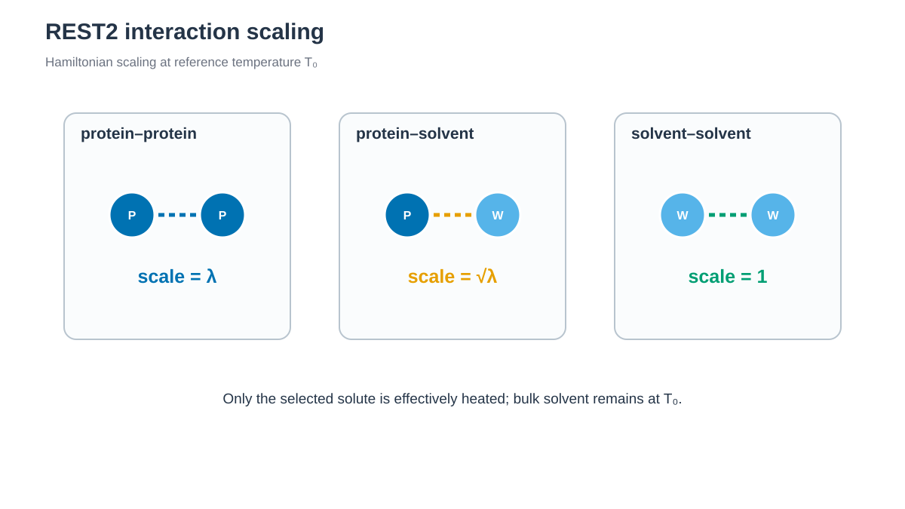

# REST2



*Solute interaction만 단계적으로 scaling하고 bulk solvent interaction은 기준 온도에 유지합니다. / Solute interactions are scaled while bulk-solvent interactions remain at the reference temperature.*


## 한국어

Chignolin을 ff19SB/TIP3P로 만들고 8-replica REST2를 실행합니다. Protein
Hamiltonian만 300–500 K effective temperature에 맞춰 scaling하며 실제 bath
temperature는 300 K입니다. Equilibration은 100 ps, production은 replica당
1 ns이고 교환은 2 ps마다 시도합니다.

REST2는 전체 solvent를 실제로 가열하지 않고 solute–solute interaction을
`λ=T0/Tm`, solute–solvent interaction을 `sqrt(λ)`로 scaling합니다. Solvent–
solvent interaction은 그대로 유지하므로 T-REMD보다 적은 replica로 solute의
effective-temperature ladder를 구성할 수 있습니다.

### Script 역할

| 파일 | 역할 |
| --- | --- |
| `download.sh` | 1UAO PDB/mmCIF를 받고 checksum을 기록합니다. |
| `prepare.py` | 1UAO의 첫 NMR model을 simulation PDB로 정리합니다. |
| `convert_topology.py` | Tleap의 AMBER topology를 GROMACS 형식으로 변환합니다. |
| `mark_hot.py` | Protein atom type에만 `partial_tempering` marker를 붙입니다. |
| `scale_cmap.py` | ff19SB의 residue별 CMAP section을 복원하고 energy grid를 `lambda`로 scaling합니다. |
| `validate_states.py` | State file의 각 row와 λ 관계를 검사하고 잘못된 column을 표시합니다. |
| `build.sh` | 변환·scaling을 호출해 state file의 row 수만큼 topology/TPR를 만들고 scale-one energy를 검사합니다. |
| `compare_energy.py` | 원본과 scale 1.0 rerun potential 차이를 허용 오차와 비교합니다. |
| `completion_helpers.sh` | `run.sh`가 자동으로 불러와 replica별 completion marker를 관리합니다. |
| `run.sh` | 300 K pre-production과 PLUMED-patched GROMACS HREX를 실행합니다. |
| `anal.py` | Exchange, occupancy와 effective-temperature별 구조 지표를 계산합니다. |

### 실행

AMBER 26, ParmEd, `GROMACS 2024.3` 또는 `2024.6`, `PLUMED 2.10`과 `gawk`가
필요합니다. GROMACS는 PLUMED의 GROMACS 2024.3 patch를 적용한 다음
[`gromacs-2024.3-plumed-2.10-hrex-energy.patch`](../patches/gromacs-2024.3-plumed-2.10-hrex-energy.patch)를
추가로 적용하고 외부 MPI로 build합니다. PLUMED 원본 patch는 swapped
coordinate의 energy workload가 누락되어 HREX acceptance를 잘못 계산합니다.
수정된 `mdrun -h`에는 `HREX_WORKLOAD_FIX_1`이 표시되며 `run.sh`가 이를
확인합니다. 적용 command와 검증 범위는 [상위 README](../README.md)에
정리되어 있습니다.

GROMACS 2025 patch와 built-in PLUMED interface는 서로 다른 topology의
Hamiltonian을 교차 평가하는 `-hrex` 경로를 제공하지 않습니다. `-hrex`만
제거하면 scaled topology 사이의 exchange acceptance가 올바르게 계산되지
않습니다.

```bash
python3 -m pip install -r requirements.txt
./download.sh
python3 prepare.py structure/1UAO.raw.pdb structure/chignolin.pdb
./build.sh structure/chignolin.pdb
./run.sh --cpus 48 --gpus 8 --dry-run
./run.sh --cpus 48 --gpus 8
python3 anal.py
```

`build.sh`는 AMBER topology를 ParmEd로 GROMACS 형식으로 바꾼 뒤 protein
atom type에만 `_` marker를 붙입니다. PLUMED `partial_tempering`으로
8개 topology를 만들고, scale 1.0 topology와 원본 topology의 potential
energy를 한 frame rerun으로 비교합니다. 이 Chignolin tutorial의 허용값은
`0.1 kJ/mol`이며 `ENERGY_TOLERANCE_KJ_MOL`로 바꿀 수 있습니다. 이 값은
범용 기준이 아닙니다. System 크기, GROMACS precision, hardware와 병렬 energy
합산 순서가 달라지면 같은 topology에서도 수치 차이가 달라질 수 있습니다.

ff19SB는 residue별 backbone CMAP을 사용합니다. `convert_topology.py`는
ParmEd 변환 중 이 map들이 하나의 `XC` type으로 합쳐지지 않도록 C-alpha
type을 `XC0`, `XC1`처럼 분리합니다. GROMACS 2024.3은
`atomtype-residuetype` CMAP 문법을 지원하지 않으므로 `[ cmaptypes ]`에는
`C N XC0 C N`처럼 atom type만 기록합니다. 고유한 central C-alpha type이
residue별 grid를 구분합니다. `scale_cmap.py`는 PLUMED가 처리하지 않는 CMAP
grid를 각 REST2 state에 맞게 보정합니다. `_` marker는 `[ atoms ]`의
nonbonded type에만 붙이고 CMAP bonded type은 바꾸지 않습니다.

`GROMACS`, `GROMACS_MPI`, `MPI_LAUNCHER`, `MPI_PROCESSES`와
`MPI_OPTIONS`로 executable과 MPI 환경을 지정합니다. `--cpus`는 job에 할당한
총 CPU thread 수이고 `--gpus`는 사용할 GPU 수입니다. CPU thread 수는 replica에
균등하게 나눕니다. GPU 수는 1부터 replica 수까지 지정할 수 있습니다.
Replica별 minimization과 equilibration은 GPU 수만큼 batch로 실행하고 각
process를 `-ntmpi 1`로 제한합니다. HREX production에서는 GROMACS가 노출된
GPU에 MPI rank를 자동 배치하므로 여러 replica가 하나의 GPU를 공유할 수 있습니다.
Production은 1 ns segment 하나이며 일부
replica만 완료된 segment에서는 resume하지 않습니다.
Scheduler는 할당한 GPU만 `CUDA_VISIBLE_DEVICES`에 노출해야 합니다. Script의
`-gpu_id 0,1,...`은 그 안에서 다시 매겨진 logical device ID입니다.

새 system의 `effective_temperature_K`는
[remd-temperature-generator](https://virtualchemistry.org/remd-temperature-generator/)에
hot solute atom 수를 protein atom 수로 넣고 water molecule 수를 0으로 두어
초기 ladder를 만듭니다. 출력 temperature마다 `lambda_pp=T0/Tm`,
`lambda_pw=sqrt(lambda_pp)`를 계산합니다. Water=0은 solvent 자유도를 predictor에서
제외하는 근사이며 REST2 acceptance를 보장하지 않습니다. 짧은 pilot run에서
adjacent acceptance, state 방문과 round trip을 확인한 뒤 ladder를 조정합니다.

기본 `inputs/states.tsv`는 Chignolin의 protein atom 수로 미리 계산한 8-state
file입니다. 다른 system에서는 generator temperature마다
`lambda_pp=300/Tm`, `lambda_pw=sqrt(lambda_pp)`를 계산해 다음 tab-separated
형식으로 저장합니다.

```text
replica<TAB>effective_temperature_K<TAB>lambda_pp<TAB>lambda_pw<TAB>seed
000<TAB>300.000<TAB>1.00000000<TAB>1.00000000<TAB>310001
001<TAB>322.711<TAB>0.92962399<TAB>0.96417010<TAB>317920
```

```bash
./build.sh structure/chignolin.pdb /path/to/states.tsv
./run.sh --cpus 48 --gpus 8 --dry-run
```

Physical bath가 300 K이므로 첫 state는 `000`, 300 K, `lambda_pp=1`,
`lambda_pw=1`이어야 합니다. `build.sh`는 file을 검사해 `work/states.tsv`로
복사하고, `run.sh`는 data row 수를 replica 수와 기본 MPI process 수로
사용합니다.

### 주요 option

| Option | 의미 |
| --- | --- |
| `states.tsv`의 `effective_temperature_K` | 300–500 K ladder와 topology scaling factor를 정의합니다. Bath temperature는 아닙니다. |
| `build.sh INPUT.pdb [states.tsv]` | 첫 argument의 PDB로 topology를 만들고 effective-temperature·scaling file을 선택합니다. State file을 생략하면 Chignolin용 `inputs/states.tsv`를 사용합니다. |
| Protein `_` marker | `partial_tempering`이 scaling할 hot region을 protein atom으로 제한합니다. |
| `ref-t=300` | 모든 replica의 physical thermostat temperature입니다. |
| `-multidir`, `-replex 1000` | 8개 directory를 HREX로 묶고 1,000 steps, 즉 2 ps마다 교환합니다. |
| `constraints=h-bonds`, `dt=0.002` | LINCS로 수소 bond를 고정하고 2 fs timestep을 사용합니다. |
| `--cpus`, `--gpus` | 할당받은 총 CPU thread와 GPU 수입니다. CPU 수는 replica 수로 나누어져야 하며 GPU 수는 1–replica 수 범위입니다. |
| `PREPRODUCTION_GROMACS_OPTIONS` | Replica별 minimization/equilibration에만 추가할 option입니다. Resource option은 script가 설정합니다. |
| `HREX_GROMACS_OPTIONS` | External-MPI HREX production에만 추가할 option입니다. `-ntmpi`를 넣지 않습니다. |
| `ENERGY_TOLERANCE_KJ_MOL` | Scale 1.0 one-frame potential 비교의 절대 tolerance입니다. 이 Chignolin 예제의 기본값은 `0.1 kJ/mol`입니다. |

### Output

- `work/NNN/topol.top`
- `work/NNN/production.001.xtc`
- `work/exchange_summary.tsv`, `replica_visits.tsv`,
  `state_occupancy.tsv`
- `work/structure_by_temperature.tsv`: Rg와 residue 1–10 CA distance

REST2의 높은 effective temperature에서 나타나는 compaction은 mini-protein
folding sampling을 돕기 위해 사용되어 온 method 특성입니다. 짧은 Chignolin
계산만으로 force field 성능이나 수렴을 판단하지 않습니다.

## English

This example runs eight-state REST2 for ff19SB/TIP3P Chignolin. Only protein
interactions are scaled over effective temperatures of 300–500 K; the physical
bath remains at 300 K. Equilibration is 100 ps, production is one 1 ns segment,
and exchanges are attempted every 2 ps.

REST2 scales solute–solute interactions by `lambda=T0/Tm` and solute–solvent
interactions by `sqrt(lambda)`, while solvent–solvent interactions remain
physical. This creates a solute effective-temperature ladder without heating
the full solvent box.

The build converts the AMBER system with ParmEd, marks only protein atom types,
creates scaled topologies with PLUMED `partial_tempering`, and compares the
scale-one and original potential energies. This tutorial requires an external-
MPI build of GROMACS 2024.3 or 2024.6 with the PLUMED 2.10 GROMACS 2024.3 patch
followed by the repository HREX energy correction. The upstream patch omits
the swapped-coordinate energy workload and therefore computes invalid HREX
acceptance. The corrected help output contains `HREX_WORKLOAD_FIX_1`, which
`run.sh` checks before simulation. See the [parent README](../README.md) for
the patch command and validation scope. The GROMACS 2025 patch and built-in
PLUMED interface do not provide this arbitrary-topology `-hrex` path. Removing
only `-hrex` would produce incorrect exchange acceptance between the separately
scaled topologies.

`convert_topology.py` performs the AMBER-to-GROMACS conversion, `mark_hot.py`
marks protein atom types, and `scale_cmap.py` preserves and scales the
residue-specific ff19SB CMAP grids. GROMACS 2024.3 does not support the newer
`atomtype-residuetype` CMAP syntax, so headers use atom types such as
`C N XC0 C N`; the unique central C-alpha type selects each residue-specific
grid. The `_` marker is limited to nonbonded atom types in `[ atoms ]`; CMAP
lookup continues to use the original bonded types. `build.sh`
generates and verifies the states selected by the input file.
`validate_states.py` reports the row and column of an invalid schedule, and
`completion_helpers.sh` keeps marker bookkeeping out of the runner's GROMACS commands.
`run.sh` uses `-multidir -replex 1000`, and `anal.py` summarizes exchange and
structure. All thermostats remain at `ref-t=300`; hydrogen bonds are constrained
for a 2 fs timestep. `ENERGY_TOLERANCE_KJ_MOL` controls the scale-one check.
Run with `--cpus TOTAL --gpus GPU_COUNT`. The CPU count must divide evenly among
the replicas, while `GPU_COUNT` may range from one to the replica count.
Preproduction runs replica batches of at most `GPU_COUNT` processes with
`-ntmpi 1`. During HREX, GROMACS automatically maps replica ranks across the
visible GPU list, so multiple replicas may share one GPU. `HREX_GROMACS_OPTIONS` applies only to external-MPI
production and must not contain `-ntmpi`.
The scheduler must expose only allocated devices through `CUDA_VISIBLE_DEVICES`;
the generated `-gpu_id` values are logical IDs within that visible set.
This Chignolin tutorial uses a fixed absolute tolerance of `0.1 kJ/mol`, which
can be overridden with `ENERGY_TOLERANCE_KJ_MOL`. It is not a universal cutoff:
system size, GROMACS precision, hardware, and parallel energy-reduction order
can change the numerical difference between equivalent topologies.

For a new REST2 system, use the
[remd-temperature-generator](https://virtualchemistry.org/remd-temperature-generator/)
with the hot-solute atom count entered as the protein-atom count and zero water
molecules. Convert each output temperature with `lambda_pp=T0/Tm` and
`lambda_pw=sqrt(lambda_pp)`. This removes solvent degrees of freedom from the
predictor but does not guarantee REST2 acceptance; refine the initial ladder
from adjacent acceptance, state visits, and round trips in a pilot run.

The bundled `inputs/states.tsv` is an eight-state ladder precomputed from the
Chignolin protein-atom count. For another system, write the generator output
as a tab-separated file with `replica`, `effective_temperature_K`,
`lambda_pp`, `lambda_pw`, and `seed`, where `lambda_pp=300/Tm` and
`lambda_pw=sqrt(lambda_pp)`, then run
`./build.sh structure/chignolin.pdb /path/to/states.tsv`. The identity row is `000` at
300 K with both lambdas equal to one. The runner derives the replica count and
default MPI process count from the selected file.

The analysis writes exchange acceptance, state visits, occupancy, radius of
gyration, and terminal Cα distance as TSV files. High-temperature compaction
in REST2 has been used intentionally to assist mini-protein folding sampling;
this short example does not establish convergence or force-field quality.
