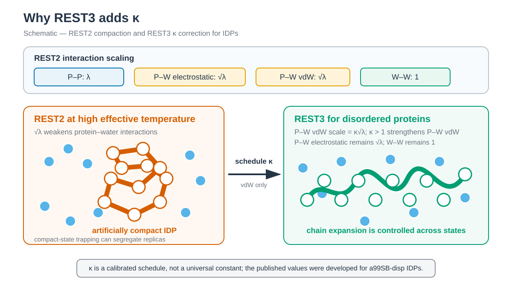

# REST3



*REST3는 REST scaling에 protein–water interaction을 조정하는 kappa schedule을 더합니다. / REST3 adds a kappa schedule that adjusts protein–water interactions.*


## 한국어

Chignolin을 ff19SB/TIP3P로 만들고 8-replica solvent-scaled REST3를
실행합니다. Effective temperature는 geometric ladder로 300–450 K를
사용합니다. `states.tsv`에는
`λpp=T0/Tm`, `λpw=sqrt(T0/Tm)`과 다음 κ를 기록합니다.

REST3는 REST2의 solute scaling에 κ-dependent solute–solvent correction을
추가합니다. 목적은 높은 effective temperature에서 solute가 지나치게 compact해질
수 있는 경향을 조정하는 것입니다. κ는 solvent 자체의 temperature를 바꾸는
값이 아니며 water–water와 ion–water interaction은 physical state에 남겨야 합니다.

| Replica | κ |
| ---: | ---: |
| 0–3 | 1.000 |
| 4 | 1.005 |
| 5 | 1.010 |
| 6 | 1.015 |
| 7 | 1.020 |

### Script 역할

| 파일 | 역할 |
| --- | --- |
| `download.sh` | 1UAO PDB/mmCIF를 받고 checksum을 기록합니다. |
| `prepare.py` | 1UAO의 첫 NMR model을 simulation PDB로 정리합니다. |
| `convert_topology.py` | AMBER topology를 GROMACS base topology로 변환합니다. |
| `generate_rest3.py` | `states.tsv`의 λ·κ와 외부 parser로 8개 REST3 topology를 만듭니다. |
| `scale_cmap.py` | 외부 parser가 생략하는 ff19SB CMAP selector를 복원하고 grid를 `lambda_pp`로 scaling합니다. |
| `verify_rest3.py` | Base identity와 water–water/ion–water Lennard-Jones 보존을 검사합니다. |
| `build.sh` | Conversion, topology generation, TPR build와 검사를 순서대로 호출합니다. |
| `run.sh` | 300 K pre-production과 2 ps 간격 HREX를 실행합니다. |
| `anal.py` | Exchange, occupancy와 state별 Rg/terminal distance를 계산합니다. |

### 실행

AMBER 26, ParmEd, `GROMACS 2025.0`, `PLUMED 2.10.0`과
`repex-topology-parser==0.2.2`가 필요합니다. GROMACS는 PLUMED 2.10.0이
제공하는 GROMACS patch를 적용하고 외부 MPI를 사용해 build합니다.

일반 PLUMED interface만 활성화한 GROMACS에는 `-hrex`가 없습니다. GROMACS
2026.3은 PLUMED 2.10.0의 공식 patch 대상이 아니므로 이 tutorial에서
사용하지 않습니다. GROMACS 2025.0은 PLUMED 2.10.0에서 patch를 공식
제공하는 최신 GROMACS version입니다.

```bash
python3 -m pip install parmed MDAnalysis numpy
./download.sh
python3 prepare.py structure/1UAO.raw.pdb structure/chignolin.pdb
./build.sh
./run.sh --dry-run
./run.sh
python3 anal.py
```

`requirements.txt`에는 외부 dependency version을
`repex-topology-parser==0.2.2`로 고정했습니다. 2026년 8월에 배포된 PyPI
wheel은 parser module을 포함하지 않으므로 설치 성공만으로 준비 여부를
판단하지 않습니다. PyPI의 0.2.2 source archive를 풀고 다음처럼 source file
또는 repository root를 지정합니다.

```bash
export REPEX_TOPOLOGY_PARSER_SOURCE=/path/to/repex_topology_parser-0.2.2
```

`generate_rest3.py`는 protein molecule index 0을 hot molecule로 지정하고
TIP3P oxygen type `OW`에 κ scaling을 적용합니다. 고정 κ를 재현하기 위해
각 target state를 2-state `ssrest3` 변환으로 생성합니다. `build.sh`는
replica 0 topology가 base topology와 byte 단위로 같은지 확인하고
water–water 및 ion–water Lennard-Jones parameter가 보존되는지 검사합니다.

ff19SB의 residue-specific CMAP은 ParmEd 변환 전에 서로 다른 C-alpha
atom type으로 분리하고 GROMACS 2025 형식의 residue selector를 붙입니다.
`repex-topology-parser` 0.2.2는 CMAP section을 생성하지 않으므로
`scale_cmap.py`가 원래 bonded type과 residue selector를 적용한 CMAP을 넣고
energy grid를 `lambda_pp`로 scaling합니다. REST3의 scaled nonbonded atom
type은 CMAP selector에 사용하지 않습니다. `verify_rest3.py`는 이 값도 base
topology와 비교합니다.

Equilibration은 100 ps, production은 1 ns segment 하나이며 교환은 2 ps마다
시도합니다. 실행 환경 변수와 resume 규칙은 REST2 예제와 같습니다.

### 주요 option

| Option | 의미 |
| --- | --- |
| `lambda_pp`, `lambda_pw` | Protein–protein과 protein–water scaling factor입니다. Geometric temperature ladder에서 계산합니다. |
| `kappa` | REST3 solute–solvent correction schedule입니다. 이 예제에서는 1.000–1.020을 사용합니다. |
| `kappa_atom_names=['OW']` | TIP3P oxygen type만 κ scaling 대상으로 지정합니다. Water molecule 전체를 hot molecule로 지정하는 option이 아닙니다. |
| `-replex 1000` | 2 fs timestep에서 2 ps마다 Hamiltonian 교환을 시도합니다. |
| `REPEX_TOPOLOGY_PARSER_SOURCE` | 0.2.2 source parser 위치를 지정합니다. PyPI wheel만으로 module을 찾지 못할 때 필요합니다. |

### 해석 범위

이 κ schedule은 a99SB-disp를 사용한 IDP 계산에서 보정된 published
schedule을 8개 state에 적용한 것입니다. ff19SB/TIP3P Chignolin에 검증된
parameter가 아닙니다. REST2의 높은 effective temperature에서 나타나는
compaction은 mini-protein folding을 돕기 위해 의도적으로 사용된 특성이므로,
이 예제는 Chignolin에서 REST3가 REST2보다 우수하다고 가정하지 않습니다.

분석은 exchange acceptance, state 방문, occupancy, Rg와 residue 1–10 CA
distance를 TSV로 저장합니다.

- [REST3 원 논문](https://pmc.ncbi.nlm.nih.gov/articles/PMC10795075/)
- [repex-topology-parser](https://github.com/koreyr/repex_topology_parser)

## English

This example runs eight-state solvent-scaled REST3 for ff19SB/TIP3P Chignolin.
It uses a geometric 300–450 K effective-temperature ladder and the fixed kappa
schedule shown above. Protein molecule 0 is hot, and TIP3P oxygen type `OW`
is the solvent-scaling target.

REST3 adds a kappa-dependent solute–solvent correction to REST2 scaling to
adjust excessive high-effective-temperature compaction. Kappa does not heat
the solvent; water–water and ion–water interactions must remain physical.

The build uses `repex-topology-parser==0.2.2`, verifies byte identity of the
base topology, and checks that water–water and ion–water Lennard-Jones
interactions are preserved. Equilibration is 100 ps; production is one 1 ns
segment with exchanges every 2 ps.

The PyPI wheel inspected in August 2026 does not contain the parser module.
Use the 0.2.2 source archive and point `REPEX_TOPOLOGY_PARSER_SOURCE` to its
root or `src/repex_topology_parser.py`.

`convert_topology.py` creates the base topology, `generate_rest3.py` applies
the `states.tsv` lambda/kappa schedule, and `scale_cmap.py` restores and scales
the residue-specific ff19SB CMAP section with GROMACS 2025 residue selectors;
parser 0.2.2 omits this section. CMAP selectors retain the original bonded
types while only their grids are scaled. `verify_rest3.py` checks base, CMAP, and
solvent invariants, `run.sh` performs HREX with `-replex 1000`, and `anal.py`
summarizes exchange and structure. `kappa_atom_names=['OW']` targets the TIP3P
oxygen type. The physical thermostat remains at 300 K.

This tutorial requires an external-MPI build of `GROMACS 2025.0` patched with
the GROMACS patch supplied by `PLUMED 2.10.0`. GROMACS 2026.3 is not an
official patch target for that PLUMED release and is not supported here.
GROMACS 2025.0 is the latest GROMACS version for which PLUMED 2.10.0 officially
supplies a patch.

The published kappa schedule was calibrated for a99SB-disp IDPs, not validated
for ff19SB/TIP3P Chignolin. REST2 compaction at high effective temperature was
designed to aid mini-protein folding, so this example does not claim that REST3
is superior for Chignolin. Analysis outputs exchange, occupancy, Rg, and
terminal-distance TSV files.
