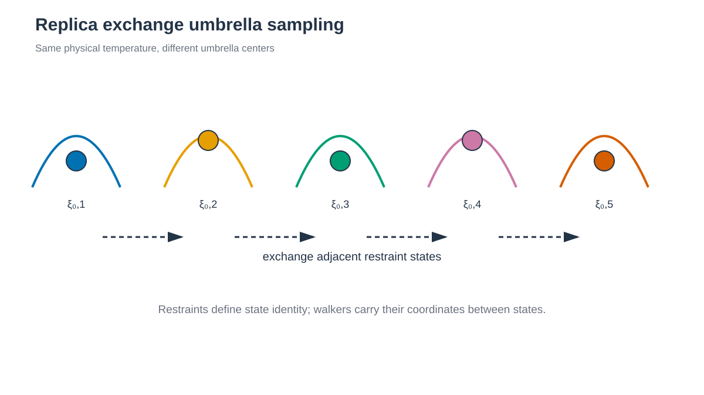

# Replica Exchange Umbrella Sampling



*Walker는 같은 온도에서 인접 restraint center를 교환합니다. / Walkers exchange neighboring restraint centers at the same temperature.*


## 한국어

Chignolin의 residue 1과 10 Cα distance를 CV로 사용하는 REUS 예제입니다.
6–24 Å를 1 Å 간격으로 나눈 19개 window를 같은 온도에서 교환합니다.
`rk2=rk3=10 kcal mol⁻¹ Å⁻²`이며, heating 200 ps, equilibration 100 ps,
production은 window당 1 ns입니다. 교환은 1 ps마다 시도합니다.

REUS는 umbrella restraint가 다른 Hamiltonian 사이에서 configuration을
교환합니다. 일반 US가 각 window 안에서만 움직이는 것과 달리, accepted
exchange를 통해 한 walker가 여러 CV 영역을 방문할 수 있습니다. Restraint를
제거한 PMF 계산에는 각 frame이 어느 window state에서 생성됐는지 추적해야 합니다.

### Script 역할

| 파일 | 역할 |
| --- | --- |
| `download.sh` | 1UAO PDB/mmCIF를 받고 checksum을 기록합니다. |
| `prepare.py` | 1UAO의 첫 NMR model을 simulation PDB로 정리합니다. |
| `make_restraints.py` | Topology에서 terminal Cα index를 찾아 19개 `distance.RST`를 만듭니다. |
| `build.sh` | 공통 topology와 `states.tsv`를 replica directory에 배치합니다. |
| `run.sh` | Window별 pre-production과 `pmemd.cuda.MPI -rem 3` exchange를 실행합니다. |
| `anal.py` | Exchange, window 방문, occupancy와 sampled distance 범위를 요약합니다. |

### 실행

AMBER 26, ParmEd와 19개 MPI process가 필요합니다.

```bash
python3 -m pip install -r requirements.txt
./download.sh
python3 prepare.py structure/1UAO.raw.pdb structure/chignolin.pdb
./build.sh
./run.sh --dry-run
./run.sh
python3 anal.py
```

`make_restraints.py`는 ff19SB/TIP3P topology에서 `:1@CA`와
`:10@CA`의 atom index를 찾습니다. 각 window의 `distance.RST`에 실제
index와 restraint center를 기록하므로 다른 system에 적용할 때 selection과
window 범위를 먼저 바꿉니다.

기본 engine은 단일-window stage에 `pmemd.cuda`, replica exchange에
`pmemd.cuda.MPI -rem 3`입니다. `AMBER_ENGINE`,
`AMBER_MPI_ENGINE`, `MPI_LAUNCHER`, `MPI_PROCESSES`,
`MPI_OPTIONS`와 `AMBER_OPTIONS`로 실행 환경을 지정합니다.

Production은 1 ns segment 하나입니다. 모든 window가 완료된 마지막
segment에서만 이어서 실행합니다.

### 주요 option

| Option | 의미 |
| --- | --- |
| `-rem 3` | AMBER Hamiltonian REMD mode로 window restraint state를 교환합니다. |
| `iat`, `r2=r3` | Terminal Cα atom pair와 window center를 정의합니다. |
| `rk2=rk3=10.0` | 각 harmonic window의 force constant(kcal mol⁻¹ Å⁻²)입니다. |
| `nmropt=1`, `DISANG` | AMBER NMR-style restraint input을 활성화합니다. |
| `nstlim=500`, `numexchg=1000` | AMBER REMD 의미에 따라 500 steps마다 1,000회 교환하여 1 ns segment를 만듭니다. |
| `DUMPFREQ=500`, `DUMPAVE` | 2 fs timestep 기준 1 ps마다 restraint coordinate를 기록합니다. |
| `MPI_PROCESSES=19` | Window 수와 MPI rank 수를 같게 설정합니다. |

### Output

- `work/NNN/production.001.nc` … `production.010.nc`
- `work/exchange_summary.tsv`, `replica_visits.tsv`,
  `window_occupancy.tsv`
- `work/restraint_sampling.tsv`

Window overlap과 PMF는
[umbrella-sampling analysis](../../../2_Analysis/7_Enhanced_Sampling/README.md)에서
계산합니다.

## English

This REUS example exchanges 19 windows along the Chignolin residue 1–10 Cα
distance. Centers span 6–24 Å at 1 Å spacing, with
`rk2=rk3=10 kcal mol⁻¹ Å⁻²`. Heating is 200 ps, equilibration is 100 ps,
production is one 1 ns segment per window, and exchanges are attempted every
1 ps.

REUS exchanges configurations among Hamiltonians with different umbrella
centers. Accepted swaps allow a walker to visit multiple CV regions, but PMF
analysis must retain the window state associated with each sampled frame.

The build resolves the two Cα atom indices from the ff19SB/TIP3P topology and
writes one restraint per window. The run uses `pmemd.cuda` for individual
stages and `pmemd.cuda.MPI -rem 3` for exchange. Partial segments are not
silently resumed.

`make_restraints.py` resolves `iat` and writes `r2=r3` centers with
`rk2=rk3=10.0`. `nmropt=1`/`DISANG` activate the restraint; `nstlim=500` and
`numexchg=1000` attempt exchange every 1 ps for a 1 ns segment. `DUMPAVE` records the restraint coordinate at
the same interval. `MPI_PROCESSES` must equal the 19 windows.

Analysis writes acceptance, state visits, window occupancy, and sampled
restraint-distance ranges as TSV files. Use the linked analysis tutorial for
overlap and PMF calculation.
