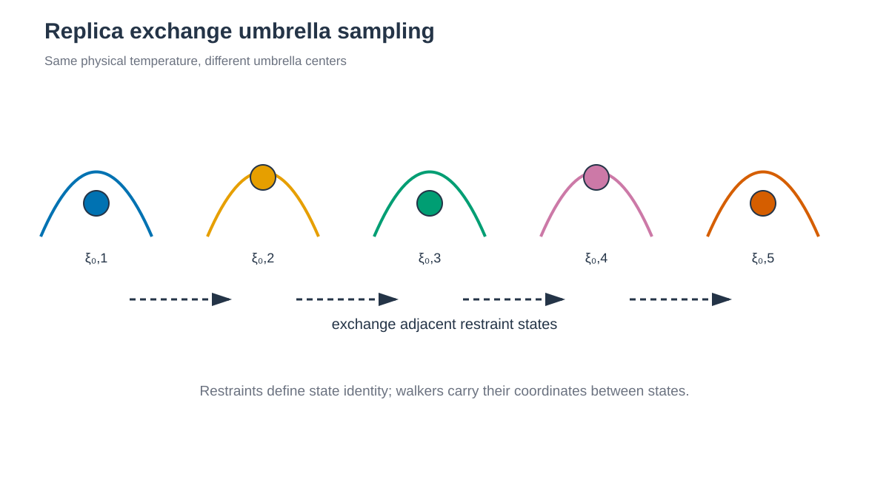

# Replica Exchange Umbrella Sampling



*CV 위의 각 umbrella center가 하나의 Hamiltonian state를 정의합니다. Accepted exchange는 state 정의를 유지한 채 인접 state의 configuration을 교환합니다. / Each umbrella center on the CV defines a Hamiltonian state. An accepted exchange swaps configurations between neighboring states without changing the state definitions.*


## 한국어

최소 2개·짝수 replica만 지원합니다. `build.sh`와 `run.sh`는 홀수 schedule을 자동 조정하지 않고 거부합니다. `run.sh --dry-run`도 실제 state table의 count를 검사합니다. 기존 홀수 결과는 새 work directory에서 다시 준비합니다.

기본 center는 6–24 Å 양 끝을 포함하는 20개이며 spacing은 `18/19 ≈ 0.947368 Å`입니다. State table과 restraint center는 소수점 8자리로 기록합니다.

`run.sh`는 minimization, heating과 equilibration을 각 replica directory에서 실행합니다. `DISANG=distance.RST`와 `DUMPAVE=restraint.<stage>.dat`도 그 directory에서 읽고 저장합니다. Production groupfile은 tutorial directory에서 사용하는 `work/<replica>/...` 경로를 유지합니다.

Chignolin의 residue 1과 10 Cα distance를 CV로 사용하는 REUS 예제입니다.
6–24 Å 양 끝을 포함하는 20개 window를 같은 온도에서 교환합니다.
`rk2=rk3=10 kcal mol⁻¹ Å⁻²`이며, heating 200 ps, equilibration 100 ps,
production은 window당 1 ns입니다. 교환은 1 ps마다 시도합니다.

REUS는 umbrella restraint가 다른 Hamiltonian 사이에서 configuration을
교환합니다. 일반 US가 각 window 안에서만 움직이는 것과 달리, accepted
exchange를 통해 한 walker가 여러 CV 영역을 방문할 수 있습니다. Restraint를
제거한 PMF 계산에는 각 frame이 어느 window state에서 생성됐는지 추적해야 합니다.

Reaction coordinate 위에서 선택한 각 point `ξᵢ`는 단순한 sampling 위치가
아니라 restraint center와 force constant로 정의된 umbrella state입니다. 각
replica는 한 state의 Hamiltonian으로 MD를 진행합니다. Exchange가 accept되면
인접 state에 배정된 configuration이 서로 바뀌지만 `ξᵢ`와 force constant는
그 state에 그대로 남습니다. 이 과정을 반복하면 같은 walker가 state ladder를
따라 이동하며 서로 떨어진 CV 영역을 방문합니다. 인접 window의 분포가 겹치지
않으면 exchange와 PMF 연결이 모두 나빠집니다.

### Script 역할

| 파일 | 역할 |
| --- | --- |
| `download.sh` | 1UAO PDB/mmCIF를 받고 checksum을 기록합니다. |
| `prepare.py` | 1UAO의 첫 NMR model을 simulation PDB로 정리합니다. |
| `make_restraints.py` | Topology에서 terminal Cα index를 찾아 20개 `distance.RST`를 만듭니다. |
| `build.sh` | 공통 topology와 `states.tsv`를 replica directory에 배치합니다. |
| `run.sh` | Window별 pre-production과 `pmemd.cuda.MPI -rem 3` exchange를 실행합니다. |
| `anal.py` | Exchange, window 방문, occupancy와 sampled distance 범위를 요약합니다. |

### 실행

AMBER 26, ParmEd와 20개 MPI process가 필요합니다.

```bash
python3 -m pip install -r requirements.txt
./download.sh
python3 prepare.py structure/1UAO.raw.pdb structure/chignolin.pdb
./build.sh structure/chignolin.pdb
./run.sh
python3 anal.py
```

`make_restraints.py`는 ff19SB/OPC topology에서 `:1@CA`와
`:10@CA`의 atom index를 찾습니다. 각 window의 `distance.RST`에 실제
index와 restraint center를 기록하므로 다른 system에 적용할 때 selection과
window 범위를 먼저 바꿉니다.

기본 engine은 단일-window stage에 `pmemd.cuda`, replica exchange에
`pmemd.cuda.MPI -rem 3`입니다. `AMBER_ENGINE`,
`AMBER_MPI_ENGINE`과 `MPI_LAUNCHER`로 executable을 지정합니다.

Production은 1 ns입니다. Preparation output이 모든 window에 있으면 해당
stage를 건너뛰고, 실패하거나 일부만 있으면 기존 결과를 보존하고 중단합니다. Production output은
덮어쓰지 않습니다.

### 주요 option

| Option | 의미 |
| --- | --- |
| `-rem 3` | AMBER Hamiltonian REMD mode로 window restraint state를 교환합니다. |
| `iat`, `r2=r3` | Terminal Cα atom pair와 window center를 정의합니다. |
| `rk2=rk3=10.0` | 각 harmonic window의 force constant(kcal mol⁻¹ Å⁻²)입니다. |
| `nmropt=1`, `DISANG` | AMBER NMR-style restraint input을 활성화합니다. |
| `nstlim=500`, `numexchg=1000` | AMBER REMD 의미에 따라 500 steps마다 1,000회 교환하여 총 1 ns를 계산합니다. |
| `DUMPFREQ=500`, `DUMPAVE` | 2 fs timestep 기준 1 ps마다 restraint coordinate를 기록합니다. |

### Output

- `work/NNN/production.nc`
- `work/exchange_summary.tsv`, `replica_visits.tsv`,
  `window_occupancy.tsv`
- `work/restraint_sampling.tsv`

Window overlap과 PMF는
[umbrella-sampling analysis](../../../2_Analysis/7_Enhanced_Sampling/README.md)에서
계산합니다.

Build는 기존 topology/restart file이 있으면 input을 변경하기 전에 중단하고 파일을 보존합니다. 새 build 전에는 기존 `work/`를 다른 위치에 보관하거나 별도 tutorial 사본을 사용합니다.

`download.sh`는 모든 asset과 `SHA256SUMS`를 staging에서 확인한 뒤 `helpers/publish_download.py`로 게시합니다. Transfer, checksum 또는 일반 publication 실패에서는 기존 파일을 보존하며, 관련 없는 preparation 파일도 유지합니다. `structure/.download.pending`가 남으면 prepare/build와 새 download가 거부됩니다. 보존된 staging과 marker를 점검하고, marker만 삭제해 이전 파일과 새 파일을 섞어 사용하지 않습니다.

### Exchange 진단

`round_trips`는 처음 도달한 endpoint에서 반대 endpoint를 방문한 뒤 처음 endpoint로 돌아온 cycle 수입니다. 편도 이동과 같은 endpoint의 반복 방문은 왕복으로 세지 않습니다.

REUS/GaREUS parser는 AMBER H-REMD의 `# exchange N` block을 읽습니다. 1-based replica 번호와 `Success`의 `T/F`를 해석하고, 서로를 기록한 두 partner row를 pair당 한 번 처리합니다. `state_a=... state_b=... accepted=...` 형식은 0-based index를 사용하며 한 line이 한 exchange event입니다.

## English

Only even replica counts of at least two are supported. `build.sh` and `run.sh` reject odd schedules without adjusting them. `run.sh --dry-run` checks the actual state-table count too. Prepare a new work directory for results built with an odd schedule.

The default has 20 centers including both 6 and 24 Å, spaced by `18/19 ≈ 0.947368 Å`. State tables and restraint centers use eight decimal places.

`run.sh` executes minimization, heating, and equilibration inside each replica directory. It reads `DISANG=distance.RST` and writes `DUMPAVE=restraint.<stage>.dat` there. The production groupfile retains its `work/<replica>/...` paths relative to the tutorial directory.

This REUS example exchanges 20 windows along the Chignolin residue 1–10 Cα
distance. Centers span 6–24 Å at 18/19 Å spacing, with
`rk2=rk3=10 kcal mol⁻¹ Å⁻²`. Heating is 200 ps, equilibration is 100 ps,
production is 1 ns per window, and exchanges are attempted every
1 ps.

REUS exchanges configurations among Hamiltonians with different umbrella
centers. Accepted swaps allow a walker to visit multiple CV regions, but PMF
analysis must retain the window state associated with each sampled frame.

Each selected point `ξᵢ` on the reaction coordinate is an umbrella state defined
by its restraint center and force constant, rather than just a sampling
location. A replica propagates under one state Hamiltonian. When a neighboring
exchange is accepted, the configurations assigned to the two states are
swapped, while the centers and force constants remain attached to their states.
Repeated swaps let a walker diffuse across the state ladder. Poor overlap
between neighboring window distributions reduces both exchange acceptance and
the connectivity of the reconstructed PMF.

Run the build as `./build.sh structure/chignolin.pdb`. It resolves the two Cα
atom indices from the ff19SB/OPC topology and writes one restraint per window.
The run uses `pmemd.cuda` for individual
stages and `pmemd.cuda.MPI -rem 3` for exchange. Complete preparation stages
are skipped; partial window sets are preserved and rejected. Production is not overwritten.

`make_restraints.py` resolves `iat` and writes `r2=r3` centers with
`rk2=rk3=10.0`. `nmropt=1`/`DISANG` activate the restraint; `nstlim=500` and
`numexchg=1000` attempt exchange every 1 ps for a 1 ns run. `DUMPAVE` records the restraint coordinate at
the same interval. The runner launches 20 MPI processes.

Analysis writes acceptance, state visits, window occupancy, and sampled
restraint-distance ranges as TSV files. Window trajectories are written to
`work/NNN/production.nc`. Use the linked analysis tutorial for overlap and
PMF calculation.

Build stops before changing inputs when topology/restart files already exist, preserving those files. Preserve the existing `work/` elsewhere or use a separate tutorial copy before a new build.

### 동시 실행과 input 변경

Build와 run은 `work.writers/` registry를 공유합니다. 같은 output/state를 쓰는 작업은 동시에 실행하지 않습니다. `prepare.py`가 있는 경우 structure를 생성하는 작업도 input을 읽는 build와 충돌하면 거부합니다.

Run은 재사용할 결과의 input을 SHA256으로 비교합니다. Topology, 최초 coordinate file, stage input, predecessor restart와 restraint가 바뀌거나 기존 결과에 identity 기록이 없으면 파일을 보존하고 거부합니다. 이 tutorial은 고정 경로를 사용하므로 변경된 계산은 새 directory에 tutorial을 복사해 시작합니다.

정상 종료, command 실패와 INT/TERM에서는 자식 process의 종료를 확인한 뒤 자기 lock만 해제합니다. SIGKILL이나 node 장애로 남은 lock은 자동 삭제하지 않습니다. Error에 표시된 lock과 `owner.json`의 host, PID, command, scope를 확인하고 scheduler와 해당 host에서 모든 writer와 자식 process가 종료됐는지 확인한 뒤 그 lock directory만 수동 제거합니다. PID가 로컬에서 보이지 않는다는 이유만으로 제거하지 않습니다. `.gate/`도 같은 확인이 필요합니다.

지원하는 `--dry-run`과 `--help`는 보호나 identity 파일을 생성하지 않습니다. 진행 중인 work를 이동하거나 identity를 수정해 재사용하지 않습니다. 보호는 로컬 filesystem과 로컬 자식 process로 검증했으며 network filesystem, remote MPI와 다른 node의 writer 종료는 미검증입니다.

### Concurrent runs and input changes

Build and run share the `work.writers/` registry and reject concurrent writers to the same output/state. Where present, `prepare.py` also rejects structure writes that overlap an active build reader.

Run compares inputs for result reuse with SHA256. Changed topology, initial coordinates, stage input, predecessor restart or restraint, and results without identity records, are preserved and rejected. This tutorial uses fixed paths; start changed calculations in a new tutorial copy.

Normal exit, command failure and INT/TERM release only the owned lock after child termination is verified. Locks left by SIGKILL or node failure are retained. Inspect the reported lock and its `owner.json` host, PID, command and scopes; confirm through the scheduler and owning host that all writers and children stopped before manually removing only that lock directory. A PID missing locally is not sufficient. Apply the same checks to `.gate/`.

Supported `--dry-run` and `--help` do not create writer or identity files. Do not move active work trees or edit identities to reuse results. Protection was tested on a local filesystem with local child processes; network filesystems, remote MPI and termination of writers on other nodes remain unverified.

### Stage 완료 판정 / Stage completion

Input identity는 입력이 같은지 확인하며 engine의 성공 종료를 증명하지 않습니다.
Runner가 engine의 성공 종료와 필수 output을 확인한 뒤 만든 완료 증거가 있어야
stage를 재사용합니다. Output이 남았지만 완료 증거가 없거나 필수 output이
누락·비어 있으면 기존 결과를 보존하고 중단합니다. 기존 결과를 소급 인증하지
않습니다. 새 계산은 생성된 `work/`를 포함하지 않는 새 tutorial copy에서 시작합니다.
`ntwx=0`인 AMBER stage는 trajectory를 완료 조건으로 요구하지 않습니다.
지원되는 continuation은 기존 restart/state 전달 방식을 따릅니다.

Input identity checks unchanged inputs; it does not prove a successful engine exit.
A stage is reused only with completion evidence written after a successful engine
exit and required-output checks. Outputs without that evidence, or missing/empty
required outputs, are preserved and rejected. Existing results are not certified
retroactively. Start a new tutorial copy without generated `work/` directories for
a new calculation. AMBER stages with `ntwx=0` do not require a trajectory for
completion. Supported continuation retains its existing restart/state handoff.

`download.sh` validates every asset and `SHA256SUMS` in staging before publishing through `helpers/publish_download.py`. Transfer, checksum and ordinary publication failures preserve existing files, including unrelated preparation files. A retained `structure/.download.pending` blocks source readers and new downloads. Inspect the retained staging and marker; deleting only the marker can expose a mixed generation.

### Exchange diagnostics

`round_trips` counts complete cycles from the first endpoint reached, through the opposite endpoint, and back to the starting endpoint. One-way movement and repeated visits to the same endpoint do not count as round trips.

The REUS/GaREUS parser reads AMBER H-REMD `# exchange N` blocks, converts 1-based replica indices and `T/F` success values, and counts the two reciprocal partner rows once per pair. The explicit `state_a=... state_b=... accepted=...` format uses 0-based indices and one exchange event per line.
