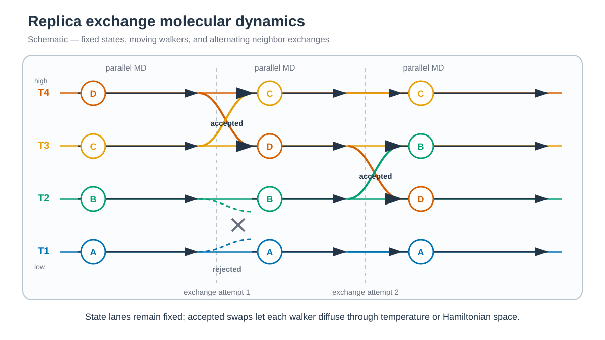

# Replica-exchange simulations / Replica exchange 시뮬레이션



*각 가로 lane은 고정된 temperature/state이고 원은 walker identity입니다. 가로 화살표는 병렬 MD, 교차 화살표는 accepted exchange, X 표시는 rejected exchange를 나타냅니다. / Each horizontal lane is a fixed temperature/state and each circle is a walker identity. Horizontal arrows show parallel MD, crossed arrows show accepted exchanges, and X marks a rejected exchange. Figure concept adapted from [Zhang et al.](https://pmc.ncbi.nlm.nih.gov/articles/PMC6484850/).*


## 한국어

다섯 예제 모두 Chignolin(PDB 1UAO)을 ff19SB/TIP3P로 만들며 다른 tutorial의
output을 사용하지 않습니다.

Replica exchange는 서로 다른 thermodynamic state 또는 Hamiltonian을 병렬로
계산하고 주기적으로 state 교환을 시도합니다. Metropolis criterion을 만족하는
교환은 각 replica가 barrier를 우회하도록 돕지만, replica 수·state 간격·교환
빈도와 round trip을 함께 점검해야 합니다.

| 순서 | Method | Replica/state | Engine |
| ---: | --- | ---: | --- |
| 3.1 | [T-REMD](3.1_REMD/README.md) | 기본 20 temperatures | `pmemd.cuda.MPI -rem 1` |
| 3.2 | [REST2](3.2_REST2/README.md) | 기본 8 effective temperatures | GROMACS/PLUMED HREX |
| 3.3 | [REST3](3.3_REST3/README.md) | 기본 8 λ/κ states | GROMACS/PLUMED HREX |
| 3.4 | [REUS](3.4_REUS/README.md) | 19 distance windows | `pmemd.cuda.MPI -rem 3` |
| 3.5 | [GaREUS](3.5_GaREUS/README.md) | 20 distance windows | `pmemd.cuda.MPI -rem 3` |

REST2와 REST3는 `GROMACS 2024.3` 또는 `2024.6`에 PLUMED 2.10의
GROMACS 2024.3 patch와 이 repository의 HREX energy correction을 차례로
적용하고 외부 MPI로 build합니다. PLUMED 2.10.0, 2.10.1과 현재 v2.10
branch의 원본 patch는 swapped coordinate의 energy workload를 준비하지 않아
exchange energy를 잘못 계산합니다. 일반 PLUMED interface와 GROMACS 2025
patch에는 서로 다른 scaled topology를 교차 평가하는 `-hrex` 경로가 없습니다.

PLUMED patch를 적용한 GROMACS source root에서 correction을 적용합니다.

```bash
plumed patch -p
patch -p1 < /path/to/MD_simulation/1_Simulation/3_REMD/patches/gromacs-2024.3-plumed-2.10-hrex-energy.patch
```

수정된 `mdrun -h`에는 `HREX_WORKLOAD_FIX_1`이 표시됩니다. REST2와 REST3
`run.sh`는 이 marker가 없는 executable을 계산 전에 거부합니다. Patch는
GROMACS 2024.3과 2024.6 source에 적용되며 GROMACS 2024.6 CPU source
compilation까지 확인했습니다. Corrected HREX의 실제 GPU/external-MPI 실행
결과는 별도로 확인해야 합니다.

각 폴더에서 다음 순서로 실행합니다.

```bash
./download.sh
python3 prepare.py structure/1UAO.raw.pdb structure/chignolin.pdb
./build.sh structure/chignolin.pdb
./run.sh
python3 anal.py
```

공통으로 `download.sh`는 source structure를 받고, `prepare.py`는 첫 NMR model을
정리합니다. `build.sh`는 topology와 replica별 input을 만들며, `run.sh`는
pre-production과 replica exchange를 실행합니다. `anal.py`는 exchange log에서
acceptance, state 방문, occupancy와 round trip을 계산합니다. REST2/REST3에는
scaled topology를 만드는 추가 helper가 있습니다.

Production은 replica당 1 ns를 한 번 실행합니다. T-REMD, REUS와 GaREUS는
state 수만큼 MPI rank를 사용합니다. REST2/REST3는 아래 resource argument와
최소 executable environment variable만 제공합니다.

REST2/REST3는 `run.sh --cpus N --gpus N`으로 할당 resource를 받습니다.
Replica별 preproduction은 GPU별로 병렬 실행하면서 한 process를
`-ntmpi 1`로 제한하고, production은 replica당 external-MPI rank 하나를
사용합니다.

Minimization, heating과 equilibration은 모든 replica의 main output과 restart가
있으면 건너뜁니다. 일부 replica만 incomplete하면 해당 stage를 모든 replica에서
다시 실행합니다. Production/exchange output은 덮어쓰지 않습니다.

Exchange acceptance, state 방문과 occupancy는 `anal.py`에서 계산합니다.
REUS/GaREUS PMF처럼 더 긴 후처리는
[analysis tutorial](../../2_Analysis/7_Enhanced_Sampling/README.md)에서
다룹니다.

새 system의 T-REMD temperature ladder는
[remd-temperature-generator](https://virtualchemistry.org/remd-temperature-generator/)로
설계합니다. REST2는 hot solute atom 수를 protein atom 수로 넣고 water
molecule 수를 0으로 둔 결과를 initial effective-temperature ladder로
사용합니다. 두 경우 모두 production 전 짧은 pilot run에서 adjacent acceptance와
round trip을 확인합니다. REST3의 κ-dependent solute–water scaling은 generator에
포함되지 않으므로 REST2 ladder를 출발점으로만 사용하고 별도로 검증합니다.

REST2와 REST3의 `inputs/temperatures.txt`에는 Chignolin용 기본 ladder가 들어
있으며 `build.sh`가 lambda와 seed를 포함한 `work/states.tsv`를 생성합니다.
REST3는 temperature와 별도로 `inputs/kappa.txt`도 읽습니다. REUS와 GaREUS는
`inputs/states.tsv`를 사용합니다. 다른 system과 schedule은
`3_Templates/3_REMD/`에서 구성합니다. State 수가 replica 수가 됩니다.

## English

All five examples independently build ff19SB/TIP3P Chignolin. They cover
20-temperature T-REMD, eight-state REST2, eight-state REST3, 19-window REUS,
and 20-window GaREUS with the engines listed in the table above.

Replica exchange propagates parallel thermodynamic states or Hamiltonians and
periodically proposes state swaps using a Metropolis criterion. Useful mixing
depends on state spacing, exchange acceptance, state visits, and round trips,
not on exchange attempts alone.

REST2 and REST3 require an external-MPI build of GROMACS 2024.3 or 2024.6 with
both the PLUMED 2.10 GROMACS 2024.3 patch and the repository correction shown
above. The unmodified patch in PLUMED 2.10.0, 2.10.1, and the current v2.10
branch does not prepare the swapped-coordinate energy workload, so it computes
an invalid exchange energy. The corrected `mdrun -h` output contains
`HREX_WORKLOAD_FIX_1`; both REST runners reject an executable without this
marker. Patch application has been checked against GROMACS 2024.3 and 2024.6
source, including CPU compilation of the corrected GROMACS 2024.6 `md.cpp`.
The corrected GPU/external-MPI HREX run still requires external runtime
validation. The standard PLUMED interface and GROMACS 2025 patch do not provide
the required arbitrary-topology `-hrex` path.

Use `download.sh`, `prepare.py`, `build.sh`, `run.sh`, and `anal.py` in order.
Production is one 1 ns run per replica. T-REMD, REUS, and GaREUS use one MPI
rank per state; REST2/REST3 expose only their resource arguments and minimal
executable settings.

REST2/REST3 accept allocated resources through `run.sh --cpus N --gpus N`.
Per-replica preproduction runs concurrently across GPUs with `-ntmpi 1` per
process, while production uses one external-MPI rank per replica.

Minimization, heating, and equilibration are skipped when all replicas have
their main output and restart. If any replica is incomplete, that stage is
rerun across all replicas. Existing production/exchange output is protected.

In every folder, download and preparation handle the source structure, build
creates topology/state inputs, run performs pre-production and exchange, and
analysis parses exchange and occupancy statistics. REST2/REST3 add topology-
scaling helpers documented in their local READMEs.

Use the [remd-temperature-generator](https://virtualchemistry.org/remd-temperature-generator/)
for a new system's T-REMD ladder. For REST2, enter the hot-solute atom count as
the protein atom count and set the water-molecule count to zero; treat the
result as an initial effective-temperature ladder and verify adjacent
acceptance and round trips in a pilot run. REST3 adds kappa-dependent
solute-water scaling that the predictor does not model, so the REST2 ladder is
only a starting point for REST3 validation.

REST2 and REST3 store their precomputed Chignolin ladders in
`inputs/temperatures.txt`; each `build.sh` generates `work/states.tsv` with
lambdas and seeds. REST3 also reads a separate `inputs/kappa.txt`. REUS and
GaREUS use `inputs/states.tsv` directly. Configure a different system or ladder
under `3_Templates/3_REMD/`. The state count sets the replica count.
