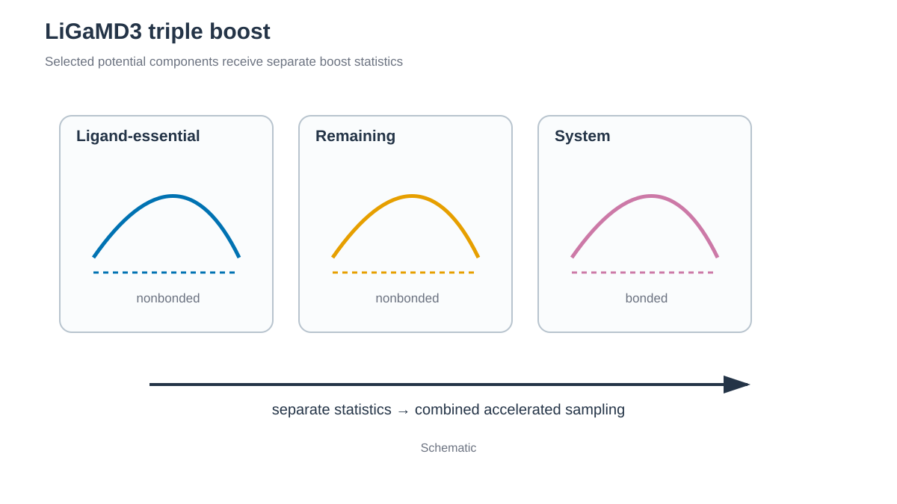

# Trypsin–benzamidine LiGaMD3



*첫 boost는 ligand dissociation, 두 번째는 rebinding, 세 번째는 receptor와 ligand의 conformational change를 촉진합니다. / The first boost promotes ligand dissociation, the second facilitates rebinding, and the third promotes receptor and ligand conformational changes.*


## 한국어

PDB 3PTB의 trypsin–benzamidine complex를 ff19SB/GAFF2/TIP3P로 build하고
LiGaMD3 triple boost를 적용합니다. BEN에는 AM1-BCC charge를 사용합니다.

LiGaMD3는 ligand essential nonbonded interaction, 나머지 nonbonded interaction과
system bonded potential을 세 component로 나누어 가속합니다. Ligand의
binding/unbinding barrier뿐 아니라 receptor와 ligand의 flexibility를 함께
sampling하려는 구성입니다. Triple boost를 정확히 분리하려면 ligand mask와
receptor atom range가 최종 topology와 일치해야 합니다.

Potential energy는 다음 세 component로 나뉩니다.

```text
V_L = V_LL,nonbonded + V_PL,nonbonded
V_D = V_system,nonbonded - V_L
V_B = V_system,bond + V_system,angle + V_system,dihedral
ΔV_total = ΔV_L + ΔV_D + ΔV_B
```

`V_L`은 BEN 내부의 self nonbonded와 BEN–trypsin nonbonded interaction을
포함합니다. 이 항을 boost하면 binding pocket에서 ligand를 붙잡는 electrostatic과
van der Waals barrier가 완만해져 dissociation sampling이 촉진됩니다. `V_D`는
protein–protein, protein–environment, ligand–environment와
environment–environment를 포함하는 나머지 nonbonded potential이며 ligand의
diffusion과 rebinding을 돕습니다. `V_B`는 전체 system의 bond, angle과 dihedral
potential로 receptor와 ligand의 internal conformational change를 가속합니다.
세 boost는 각자 potential statistics와 threshold를 사용한 뒤 합산됩니다.

### Script 역할

| 파일 | 역할 |
| --- | --- |
| `download.sh` | 3PTB PDB/mmCIF와 BEN ideal SDF를 저장합니다. |
| `prepare.py` | Protein/BEN/Ca2+, 6개 disulfide와 Asp189 metadata를 준비합니다. |
| `protonate_benzamidine.py` | RCSB neutral SDF를 BEN(+1)로 바꾸는 내부 helper입니다. |
| `build.sh` | BEN GAFF2/AM1-BCC parameter, solvated topology와 generated GaMD input을 만듭니다. |
| `render_inputs.py` | Final topology에서 BEN 앞 receptor atom 범위를 찾아 template marker를 치환합니다. |
| `run.sh` | Conventional stage, triple-boost preparation과 production을 실행합니다. |
| `anal.py` | `gamd.log`의 두 boost-energy column과 그 합의 통계를 저장합니다. |

~~~bash
cd 1_Simulation/4_GaMD/4.2_LiGaMD3
./download.sh
python3 prepare.py structure/3PTB.raw.pdb structure/complex.pdb
./build.sh structure/complex.pdb structure/BEN_ideal.sdf
./run.sh --allow-unverified
python3 anal.py
~~~

`build.sh`는 최종 topology에서 BEN 앞의 receptor atom 범위를 계산하고
`work/inputs/`에 `bgpro2atm`과 `edpro2atm`이 채워진 input을 생성합니다.
기본 charge가 +1이면 RCSB neutral SDF의 imine N에 H 하나와 formal charge를
추가한 뒤 GAFF2/AM1-BCC를 적용합니다.
`igamd=28`은 ligand essential nonbonded, 나머지 nonbonded와 system bonded
potential에 세 boost를 적용합니다. Preparation stage의 핵심 output이 모두
있으면 건너뛰고, 일부만 있으면 해당 stage를 다시 실행합니다. Production
output은 덮어쓰지 않습니다.
Amber 26의 LiGaMD3 `gamd.log`는 세 물리적 boost를 각각 별도 column으로
기록하지 않습니다. 기존 형식의 `Boost-Energy-Potential`과
`Boost-Energy-Dihedral` 두 aggregate column을 기록합니다. `anal.py`는 두 값을
읽어 각각의 통계와 합계인 frame별 total boost `ΔV`를 저장합니다. 기본
production log의 103줄은 header 3줄과 GaMD record 100개입니다.

### 주요 option

| Option | 의미 |
| --- | --- |
| `igamd=28` | LiGaMD3 triple-boost mode를 선택합니다. |
| `iEP=2`, `iED=iEB=1` | Amber 26 예제처럼 첫 boost는 upper-bound threshold, 나머지 두 boost는 lower-bound threshold를 사용합니다. |
| `sigma0P`, `sigma0D`, `sigma0B=6.0` | 세 boost component의 target standard deviation 상한(kcal/mol)입니다. |
| `timask1=':BEN'`, `scmask1=':BEN'` | Selective interaction의 ligand를 BEN residue로 지정합니다. |
| `bgpro2atm`, `edpro2atm` | Final topology에서 계산한 receptor atom 범위입니다. 직접 고정하지 않고 generated input을 확인합니다. |
| `ntave=50000` | Triple-boost statistics averaging interval이며 2 fs 기준 100 ps입니다. |
| `ntcmd*`, `nteb*` | Initial conventional statistics와 GaMD equilibration schedule입니다. `*prep`과 전체 step 값을 독립 구간처럼 더하지 않습니다. |
| BEN net charge `+1` | AM1-BCC parameterization에 사용하는 고정 charge입니다. |
| `--allow-unverified` | Amber26 GPU 검증 전 실제 실행을 의도적으로 opt-in합니다. |
| `ntr=1`, `-ref minimize.rst7` | Heating restraint의 reference로 minimization restart를 사용합니다. |

Amber26의 LiGaMD3 동작은 아직 실제 GPU에서 검증하지 않았습니다. 위 opt-in은
이 상태를 확인하기 위한 것이며 호환성을 보장하지 않습니다. GaMD parameter와
state, 기록된 total boost, `gamd-restart.dat`, DV/DL output과 짧은
continuation을 확인하기 전에는 결과를 해석하지 않습니다. 1 ns는 binding
thermodynamics나 kinetics 계산 길이가 아닙니다.

Amber 26 manual은 LiGaMD3를 serial GPU `pmemd.cuda` 전용으로 설명합니다.
`AMBER_ENGINE`을 `pmemd`, `sander` 또는 MPI executable로 바꾸면 `run.sh`가
계산 전에 중단합니다.

## English

PDB 3PTB is built with ff19SB, GAFF2/AM1-BCC, and TIP3P for an experimental
Amber26 LiGaMD3 workflow. `build.sh` resolves the receptor atom range from the
final topology and writes complete inputs under `work/inputs/`.
The fixed tutorial preserves the GaMD preparation state used by production.

LiGaMD3 separates ligand-essential nonbonded, remaining nonbonded, and bonded
potentials into three boosts. `prepare.py` validates the complex metadata,
`build.sh` parameterizes BEN and builds the system, `render_inputs.py` derives
the receptor range from the final topology, and `run.sh` performs the stages.
Amber 26 does not write the three physical LiGaMD3 boosts as separate columns
in `gamd.log`. It retains the legacy aggregate `Boost-Energy-Potential` and
`Boost-Energy-Dihedral` columns. `anal.py` reports both logged values and their
sum as the per-frame total boost `ΔV`. The default 103-line production log
contains three header lines and 100 records.
The default +1 ligand path first adds one imine-N hydrogen and a formal charge
to the neutral RCSB SDF, then applies GAFF2/AM1-BCC.

The energy partition is
`V_L = V_LL,nonbonded + V_PL,nonbonded`,
`V_D = V_system,nonbonded - V_L`, and
`V_B = V_system,bond + V_system,angle + V_system,dihedral`.
The first component contains BEN self-nonbonded and BEN–trypsin interactions
and promotes ligand dissociation. The second contains the remaining
protein, ligand–environment, and environment nonbonded terms and facilitates
diffusion and rebinding. The third accelerates internal conformational changes
through all-system bonded terms. Each component has separate statistics and a
separate boost, and the applied total is
`ΔV_total = ΔV_L + ΔV_D + ΔV_B`.

`igamd=28` with `iEP=2` and `iED=iEB=1` follows the Amber 26 example: the
first boost uses the upper-bound threshold and the other boosts use lower-bound
thresholds.
`sigma0P/D/B=6.0` limit component fluctuations; `timask1`/`scmask1` select
`:BEN`; `bgpro2atm`/`edpro2atm` delimit receptor atoms. `ntave=50000` is a
100 ps averaging interval. The `ntcmd*`/`nteb*` values define overlapping
conventional-statistics and GaMD-equilibration schedules. BEN is parameterized
with a fixed net charge of +1, and actual runs remain gated by
`run.sh --allow-unverified`.
Heating passes `minimize.rst7` to `-ref` for the `ntr=1` positional restraint.

Amber 26 documents LiGaMD3 only for serial GPU `pmemd.cuda`; `run.sh` rejects
CPU and MPI engine overrides.

Preparation stages are skipped only when their primary output and restart both
exist; incomplete pairs are rerun. Existing production output is protected.
Use `3_Templates/4_GaMD/4.2_LiGaMD3` for system-specific production settings.

Actual execution requires `run.sh --allow-unverified` until a short Amber26
GPU run confirms the GaMD parameters and state, logged total boost, restart
state, and continuation behavior. The 1 ns example is not a binding
thermodynamics or kinetics calculation.

## References / 참고 자료

- [RCSB PDB 3PTB](https://www.rcsb.org/structure/3PTB)
- [LiGaMD3](https://doi.org/10.1021/acs.jctc.4c00502)
