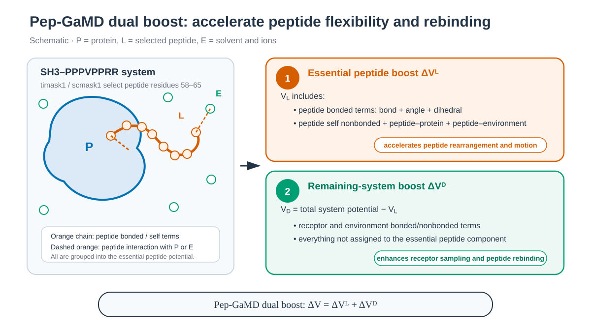

# SH3–peptide Pep-GaMD

*Peptide-essential potential과 나머지 system potential을 나누어 가속합니다. / Peptide-essential and remaining-system potentials are accelerated separately.*

## 한국어

PDB 1CKB의 C-crk N-terminal SH3 domain과 resolved SOS peptide PPPVPPRR를
ff19SB/TIP3P로 build합니다. PDB entity에는 peptide 10 residues가 기록되어
있지만 coordinate가 존재하는 8 residues만 사용합니다.

Pep-GaMD는 peptide essential potential과 나머지 system potential을 분리해
dual boost를 적용합니다. Flexible peptide의 내부 rearrangement와 receptor에서의
이동을 가속하는 것이 목적입니다. Peptide selection이 receptor residue를 포함하면
다른 Hamiltonian이 되므로 sequence와 generated mask를 build 단계에서 검사합니다.

### Script 역할

| 파일 | 역할 |
| --- | --- |
| `download.sh` | 1CKB PDB/mmCIF와 checksum을 저장합니다. |
| `prepare.py` | Chain A receptor와 resolved chain B PPPVPPRR를 정리하고 residue metadata를 만듭니다. |
| `build.sh` | ff19SB/TIP3P topology를 만들고 peptide mask renderer를 호출합니다. |
| `render_inputs.py` | Metadata의 residue 58–65를 `timask1`/`scmask1`에 기록합니다. |
| `run.sh` | Conventional stage, Pep-GaMD preparation과 production segment 하나를 실행합니다. |
| `anal.py` | 두 boost component와 total boost의 segment별 통계를 저장합니다. |

~~~bash
cd 1_Simulation/4_GaMD/4.3_Pep-GaMD
./download.sh
python3 prepare.py structure/1CKB.raw.pdb structure/sh3-peptide.pdb
./build.sh structure/sh3-peptide.pdb
./run.sh --dry-run
./run.sh
python3 anal.py
~~~

`prepare.py`는 chain A 57 residues와 chain B의 PPPVPPRR sequence를 검사합니다.
`build.sh`는 생성된 residue 범위로 `timask1`과 `scmask1`을 채웁니다.
`igamd=15`는 peptide potential과 나머지 system potential에 dual boost를
적용합니다. 완료된 segment의 MD restart와 `*.gamd.rst` state snapshot은
한 쌍으로 이어집니다.

### 주요 option

| Option | 의미 |
| --- | --- |
| `igamd=15` | Peptide-selective dual-boost mode를 선택합니다. |
| `iEP=1`, `iED=1` | Peptide essential potential과 나머지 potential에 lower-bound threshold를 사용합니다. |
| `timask1`, `scmask1=':58-65'` | Prepared topology의 resolved PPPVPPRR peptide를 선택합니다. Generated input에서 확인합니다. |
| `sigma0P=sigma0D=6.0` | 두 boost component의 target standard deviation 상한(kcal/mol)입니다. |
| `ntcmd*`, `nteb*`, `ntave=50000` | Initial conventional statistics와 GaMD equilibration schedule, 100 ps averaging interval을 정의합니다. `*prep`과 전체 step 값을 독립 구간처럼 더하지 않습니다. |
| `WORK_DIR`, `RANDOM_SEED` | Independent run의 output/state와 heating velocity를 분리합니다. |

Amber 26 manual은 Pep-GaMD를 serial GPU `pmemd.cuda` 전용으로 설명합니다.
`AMBER_ENGINE`을 CPU 또는 MPI executable로 바꾸면 `run.sh`가 계산 전에
중단합니다.

1 ns에서 peptide dissociation·rebinding, binding free energy 또는 kinetics가
수렴할 것으로 기대하지 않습니다. Independent run은 다른 `WORK_DIR`와
`RANDOM_SEED`를 사용합니다.

## English

PDB 1CKB supplies the C-crk N-terminal SH3 domain and the eight resolved
PPPVPPRR peptide residues. The PDB entity contains ten peptide residues, but
only residues with coordinates are retained. The generated peptide range is
used for the `igamd=15` dual boost.
Each completed production segment retains paired MD and GaMD state snapshots.

Pep-GaMD separates peptide-essential and remaining-system potentials to
accelerate flexible peptide rearrangement and motion. `prepare.py` validates
the resolved PPPVPPRR sequence, `build.sh` creates the system,
`render_inputs.py` inserts the peptide mask, `run.sh` performs preparation and
production, and `anal.py` reports both boost components.

`igamd=15` with `iEP=iED=1` selects lower-bound peptide dual boost.
Generated `timask1`/`scmask1=':58-65'` identify the resolved peptide;
`sigma0P/D=6.0` limit boost fluctuations. The `ntcmd*`/`nteb*` controls define
overlapping conventional-statistics and GaMD-equilibration schedules rather
than four durations to sum; `ntave=50000` gives a 100 ps average.
Amber 26 documents Pep-GaMD only for serial GPU `pmemd.cuda`; `run.sh` rejects
CPU and MPI engine overrides.
`WORK_DIR` and `RANDOM_SEED` values define independent runs.

The 1 ns example demonstrates preparation, restart, and reweighting data flow;
it cannot establish peptide binding thermodynamics or kinetics. Use separate
`WORK_DIR` values and positive `RANDOM_SEED` values for independent runs.

## References / 참고 자료

- [RCSB PDB 1CKB](https://www.rcsb.org/structure/1CKB)
- [Pep-GaMD](https://pmc.ncbi.nlm.nih.gov/articles/PMC7575327/)
