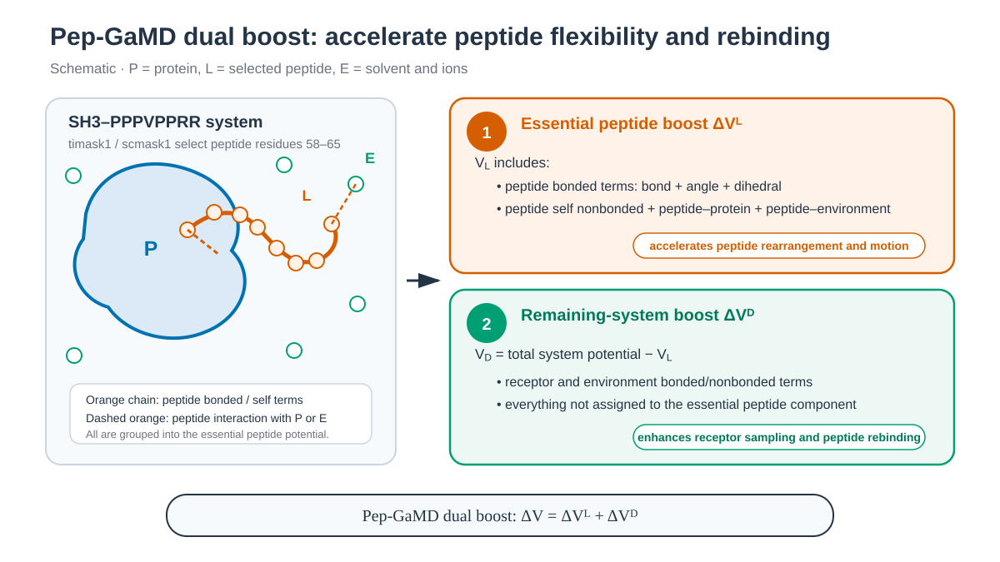

# SH3–peptide Pep-GaMD



*첫 boost는 peptide의 internal rearrangement와 receptor/environment interaction을 가속하고, 두 번째 boost는 나머지 system의 sampling과 peptide rebinding을 돕습니다. / The first boost accelerates peptide rearrangement and its interactions with the receptor and environment; the second enhances the remaining system and peptide rebinding.*


## 한국어

PDB 1CKB의 C-crk N-terminal SH3 domain과 resolved SOS peptide PPPVPPRR를
ff19SB/OPC로 build합니다. PDB entity에는 peptide 10 residues가 기록되어
있지만 coordinate가 존재하는 8 residues만 사용합니다.

Pep-GaMD는 peptide essential potential과 나머지 system potential을 분리해
dual boost를 적용합니다. Flexible peptide의 내부 rearrangement와 receptor에서의
이동을 가속하는 것이 목적입니다. Peptide selection이 receptor residue를 포함하면
다른 Hamiltonian이 되므로 sequence와 generated mask를 build 단계에서 검사합니다.

이 예제의 `igamd=15`는 다음 energy partition을 사용합니다.

```text
V_L = peptide bonded + peptide self nonbonded
      + peptide-protein nonbonded + peptide-environment nonbonded
V_D = V_system,total - V_L
ΔV_total = ΔV_L + ΔV_D
```

`V_L`에는 peptide의 bond, angle과 dihedral뿐 아니라 peptide 내부 nonbonded와
protein·solvent와의 nonbonded interaction도 포함됩니다. 따라서 flexible peptide의
internal rearrangement와 binding/unbinding motion을 함께 가속합니다. `V_D`는
essential peptide component를 제외한 receptor와 environment potential입니다.
두 번째 boost는 receptor conformational sampling과 peptide rebinding을 돕습니다.
`timask1`과 `scmask1`은 단순한 analysis selection이 아니라 이 두 potential의
경계를 정하므로 generated `:58-65` mask를 확인해야 합니다.

### Script 역할

| 파일 | 역할 |
| --- | --- |
| `download.sh` | 1CKB PDB/mmCIF와 checksum을 저장합니다. |
| `prepare.py` | Chain A receptor와 resolved chain B PPPVPPRR를 정리하고 residue metadata를 만듭니다. |
| `build.sh` | ff19SB/OPC topology를 만들고 peptide mask renderer를 호출합니다. |
| `render_inputs.py` | Metadata의 residue 58–65를 `timask1`/`scmask1`에 기록합니다. |
| `run.sh` | Conventional stage, Pep-GaMD preparation과 production을 실행합니다. |
| `anal.py` | 두 boost component와 total boost의 통계를 저장합니다. |

~~~bash
cd 1_Simulation/4_GaMD/4.3_Pep-GaMD
./download.sh
python3 prepare.py structure/1CKB.raw.pdb structure/sh3-peptide.pdb
./build.sh structure/sh3-peptide.pdb
./run.sh
python3 anal.py
~~~

`prepare.py`는 chain A 57 residues와 chain B의 PPPVPPRR sequence를 검사합니다.
`build.sh`는 생성된 residue 범위로 `timask1`과 `scmask1`을 채웁니다.
`igamd=15`는 peptide potential과 나머지 system potential에 dual boost를
적용합니다. Preparation stage의 핵심 output과 성공 완료 증거가 모두 있으면 건너뛰고, 완료 증거가 없거나 필수 output이 누락되면 기존 결과를 보존하고 중단합니다. Production output은 덮어쓰지 않습니다.

### 주요 option

| Option | 의미 |
| --- | --- |
| `igamd=15` | Peptide-selective dual-boost mode를 선택합니다. |
| `iEP=1`, `iED=1` | Peptide essential potential과 나머지 potential에 lower-bound threshold를 사용합니다. |
| `timask1`, `scmask1=':58-65'` | Prepared topology의 resolved PPPVPPRR peptide를 선택합니다. Generated input에서 확인합니다. |
| `sigma0P=sigma0D=6.0` | 두 boost component의 target standard deviation 상한(kcal/mol)입니다. |
| `ntcmd*`, `nteb*`, `ntave=50000` | Initial conventional statistics와 GaMD equilibration schedule, 100 ps averaging interval을 정의합니다. `*prep`과 전체 step 값을 독립 구간처럼 더하지 않습니다. |
| Heating seed `43001` | 이 고정 example의 initial velocity seed입니다. |
| `ntr=1`, `-ref minimize.rst7` | Heating restraint의 reference로 minimization restart를 사용합니다. |

Amber 26 manual은 Pep-GaMD를 serial GPU `pmemd.cuda` 전용으로 설명합니다.
`AMBER_ENGINE`을 CPU 또는 MPI executable로 바꾸면 `run.sh`가 계산 전에
중단합니다.

1 ns에서 peptide dissociation·rebinding, binding free energy 또는 kinetics가
수렴할 것으로 기대하지 않습니다. System별 설정과 independent run은
`3_Templates/4_GaMD/4.3_Pep-GaMD`에서 구성합니다.

Build는 기존 topology/restart file이 있으면 input을 변경하기 전에 중단하고 파일을 보존합니다. 새 build 전에는 기존 `work/`를 다른 위치에 보관하거나 별도 tutorial 사본을 사용합니다.

## English

PDB 1CKB supplies the C-crk N-terminal SH3 domain and the eight resolved
PPPVPPRR peptide residues. The PDB entity contains ten peptide residues, but
only residues with coordinates are retained. The generated peptide range is
used for the `igamd=15` dual boost.
The fixed tutorial preserves the GaMD preparation state used by production.

Pep-GaMD separates peptide-essential and remaining-system potentials to
accelerate flexible peptide rearrangement and motion. `prepare.py` validates
the resolved PPPVPPRR sequence, `build.sh` creates the system,
`render_inputs.py` inserts the peptide mask, `run.sh` performs preparation and
production, and `anal.py` reports both boost components.

For `igamd=15`, the essential component contains peptide bond, angle, and
dihedral terms, peptide self-nonbonded energy, and peptide interactions with
the protein and environment. The remaining component is the total system
potential minus this essential peptide potential. The first boost therefore
accelerates both internal peptide rearrangement and binding/unbinding motion;
the second enhances receptor/environment sampling and facilitates rebinding.
The applied total is `ΔV_total = ΔV_L + ΔV_D`. Because `timask1` and `scmask1`
define this energy boundary rather than an analysis-only selection, the
generated `:58-65` mask must match the resolved peptide.

`igamd=15` with `iEP=iED=1` selects lower-bound peptide dual boost.
Generated `timask1`/`scmask1=':58-65'` identify the resolved peptide;
`sigma0P/D=6.0` limit boost fluctuations. The `ntcmd*`/`nteb*` controls define
overlapping conventional-statistics and GaMD-equilibration schedules rather
than four durations to sum; `ntave=50000` gives a 100 ps average.
Heating passes `minimize.rst7` to `-ref` for the `ntr=1` positional restraint.
Amber 26 documents Pep-GaMD only for serial GPU `pmemd.cuda`; `run.sh` rejects
CPU and MPI engine overrides.
The fixed heating seed is `43001`.

The 1 ns example demonstrates preparation, restart, and reweighting data flow;
it cannot establish peptide binding thermodynamics or kinetics. Preparation
stages are reused only with successful completion evidence and all required outputs;
partial results are preserved and rejected, and existing production output is protected. Use
`3_Templates/4_GaMD/4.3_Pep-GaMD` for independent runs.

## References / 참고 자료

- [RCSB PDB 1CKB](https://www.rcsb.org/structure/1CKB)
- [Pep-GaMD](https://pmc.ncbi.nlm.nih.gov/articles/PMC7575327/)

Build stops before changing inputs when topology/restart files already exist, preserving those files. Preserve the existing `work/` elsewhere or use a separate tutorial copy before a new build.

### 동시 실행과 input 변경

Build와 run은 `work.writers/` registry를 공유합니다. 같은 output/state를 쓰는 작업은 동시에 실행하지 않습니다. `prepare.py`가 있는 경우 structure를 생성하는 작업도 input을 읽는 build와 충돌하면 거부합니다.

Run은 재사용할 결과의 input을 SHA256으로 비교합니다. Topology, 최초 coordinate file, stage input, predecessor restart와 restraint가 바뀌거나 기존 결과에 identity 기록이 없으면 파일을 보존하고 거부합니다. 이 tutorial은 고정 경로를 사용하므로 변경된 계산은 새 directory에 tutorial을 복사해 시작합니다.

정상 종료, command 실패와 INT/TERM에서는 자식 process의 종료를 확인한 뒤 자기 lock만 해제합니다. SIGKILL이나 node 장애로 남은 lock은 자동 삭제하지 않습니다. Error에 표시된 lock과 `owner.json`의 host, PID, command, scope를 확인하고 scheduler와 해당 host에서 모든 writer와 자식 process가 종료됐는지 확인한 뒤 그 lock directory만 수동 제거합니다. PID가 로컬에서 보이지 않는다는 이유만으로 제거하지 않습니다. `.gate/`도 같은 확인이 필요합니다.

지원하는 `--dry-run`과 `--help`는 보호나 identity 파일을 생성하지 않습니다. 진행 중인 work를 이동하거나 identity를 수정해 재사용하지 않습니다. 보호는 로컬 filesystem과 로컬 자식 process로 검증했으며 network filesystem, remote MPI와 다른 node의 writer 종료는 미검증입니다.

### Concurrent runs and input changes

Build and run share the `work.writers/` registry and reject concurrent writers to the same output/state. Where present, `prepare.py` also rejects structure writes that overlap an active build reader.

Run compares inputs for result reuse with SHA256. Changed topology, initial coordinates, stage input, predecessor restart or restraint, and results without identity records, are preserved and rejected. This tutorial uses fixed paths; start changed calculations in a new tutorial copy.

Normal exit, command failure and INT/TERM release only the owned lock after child termination is verified. Locks left by SIGKILL or node failure are retained. Inspect the reported lock and its `owner.json` host, PID, command and scopes; confirm through the scheduler and owning host that all writers and children stopped before manually removing only that lock directory. A PID missing locally is not sufficient. Apply the same checks to `.gate/`.

Supported `--dry-run` and `--help` do not create writer or identity files. Do not move active work trees or edit identities to reuse results. Protection was tested on a local filesystem with local child processes; network filesystems, remote MPI and termination of writers on other nodes remain unverified.

### Stage 완료 판정 / Stage completion

Input identity는 입력이 같은지 확인하며 engine의 성공 종료를 증명하지 않습니다.
Runner가 engine의 성공 종료와 필수 output을 확인한 뒤 만든 완료 증거가 있어야
stage를 재사용합니다. Output이 남았지만 완료 증거가 없거나 필수 output이
누락·비어 있으면 기존 결과를 보존하고 중단합니다. 기존 결과를 소급 인증하지
않습니다. 새 계산은 생성된 `work/`를 포함하지 않는 새 tutorial copy에서 시작합니다.
`ntwx=0`인 AMBER stage는 trajectory를 완료 조건으로 요구하지 않습니다.
지원되는 continuation은 기존 restart/state 전달 방식을 따릅니다.

Input identity checks unchanged inputs; it does not prove a successful engine exit.
A stage is reused only with completion evidence written after a successful engine
exit and required-output checks. Outputs without that evidence, or missing/empty
required outputs, are preserved and rejected. Existing results are not certified
retroactively. Start a new tutorial copy without generated `work/` directories for
a new calculation. AMBER stages with `ntwx=0` do not require a trajectory for
completion. Supported continuation retains its existing restart/state handoff.

Production은 시작 증거도 보존합니다. Engine이 output 없이 mutable GaMD state만
바꾸고 실패해도 preparation state를 복사해 그 실패 상태를 덮어쓰지 않습니다.

Production also retains an attempt record. If the engine changes only mutable GaMD
state before failing, retry does not overwrite that state with the prepared state.
