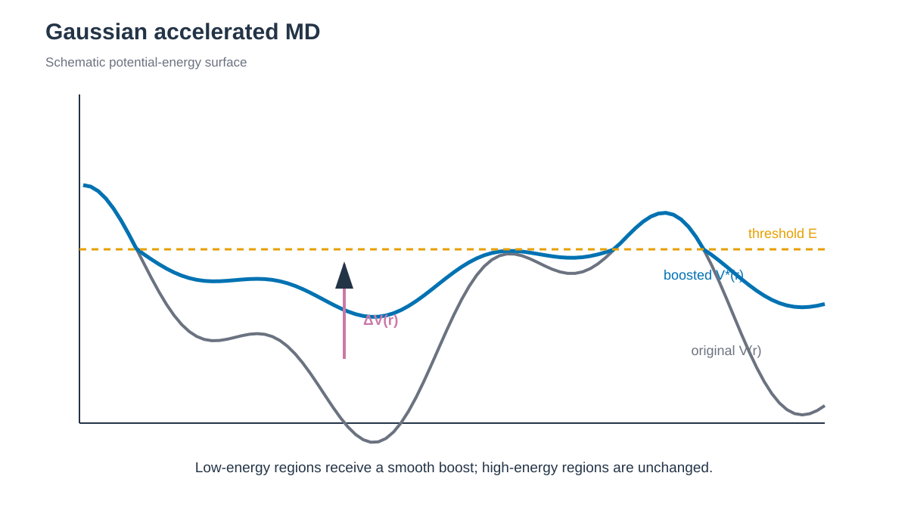

# Gaussian accelerated MD / Gaussian 가속 MD

*Threshold 아래의 low-energy region에 smooth boost를 더해 barrier crossing을 촉진합니다. / A smooth boost is added below the threshold to facilitate barrier crossing.*

## 한국어

세 method는 각각 Chignolin, trypsin–benzamidine와 SH3–peptide system을
독립적으로 build합니다. 4 ns 동안 boost 통계를 준비한 뒤 1 ns production을
실행합니다. Parameter preparation에서 만든 GaMD state를 production이 이어받습니다.

Minimization, heating과 conventional equilibration은 main output과 restart가
모두 있으면 건너뜁니다. 둘 중 일부만 있으면 해당 stage를 다시 실행합니다.
GaMD parameter preparation은 GaMD state도 함께 확인하며, production output은
덮어쓰지 않습니다.

GaMD는 potential energy가 threshold보다 낮을 때 smooth harmonic boost를 더해
energy barrier를 낮춥니다. 특정 CV를 미리 정하지 않는 대신 boost distribution이
Gaussian에 가까워야 낮은 차수의 cumulant expansion으로 원래 ensemble을
reweight할 수 있습니다. `sigma0`를 크게 하면 acceleration은 커질 수 있지만
reweighting variance도 증가합니다.

- [4.1 GaMD](4.1_GaMD/README.md)
- [4.2 LiGaMD3](4.2_LiGaMD3/README.md)
- [4.3 Pep-GaMD](4.3_Pep-GaMD/README.md)

세 폴더는 같은 역할 이름을 사용합니다. `download.sh`와 `prepare.py`가 source
structure를 정리하고, `build.sh`가 force field와 system별 generated input을
만듭니다. `run.sh`는 conventional preparation, GaMD parameter preparation과
고정된 production을 실행합니다. `anal.py`는 GaMD log의 component별 범위,
평균, 표준편차, anharmonicity와 frame 수를 진단합니다.

## English

The three independent examples use Chignolin, trypsin–benzamidine, and an
SH3–peptide complex. Each prepares boost statistics for 4 ns and runs one 1 ns
production calculation. Production continues from the saved GaMD preparation
state.

Minimization, heating, and conventional equilibration are skipped when both the
main output and restart exist. Incomplete pairs are rerun. GaMD parameter
preparation also checks its GaMD state, and existing production output is never
overwritten.

GaMD adds a smooth harmonic boost below an energy threshold to reduce barriers
without choosing a CV. Cumulant reweighting relies on a sufficiently narrow,
approximately Gaussian boost distribution; increasing `sigma0` can improve
acceleration while degrading reweighting quality.

Each folder uses download/prepare for source structures, build for topology and
generated inputs, run for conventional and GaMD stages, and analysis for
component-wise boost ranges, moments, anharmonicity, and frame counts.
