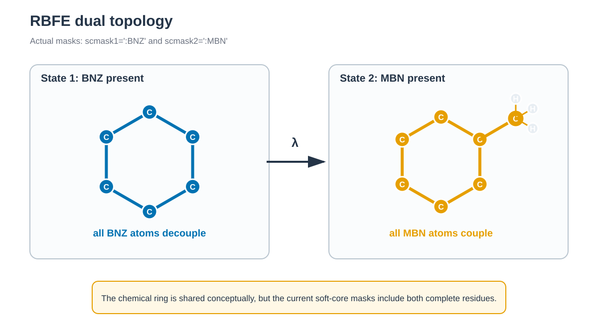

# T4 lysozyme RBFE / T4 lysozyme RBFE



*현재 mask는 공통 ring만이 아니라 BNZ와 MBN residue 전체를 각각 decouple하고 couple합니다. / The current masks decouple and couple the complete BNZ and MBN residues, not only the shared ring.*


## 한국어

T4 lysozyme L99A에서 benzene을 toluene으로 바꿉니다. 같은 transformation을
protein complex와 물에서 각각 계산하고 두 값의 차이로 `ΔΔG_bind`를 구합니다.
두 ligand는 중성이므로 이 예제에는 net-charge correction이 없습니다.

### Script 역할

| 파일 | 역할 | 주요 output |
| --- | --- | --- |
| `download.sh` | 4W53 PDB/mmCIF와 ligand SDF download | `structure/` |
| `prepare.py` | Protein과 bound BNZ/MBN coordinate 분리 | `protein.pdb`, `bound_*.pdb` |
| `build.sh` | GAFF2/AM1-BCC parameter와 complex 및 solvent topology 생성 | `work/build/`, `states.tsv` |
| `generate_inputs.py` | 22개 window input 생성; `build.sh`가 호출 | `work/complex/`, `work/solvent/` |
| `run.sh` | Minimization, heating, equilibration, production 실행 | Window별 restart, trajectory, log |
| `anal.py` | MBAR energy 추출, FE-ToolKit 실행과 두 environment 조합 | `free_energy.tsv`, `overlap_matrix.tsv` |

```bash
./download.sh
python3 prepare.py structure/4W53.raw.pdb structure/protein.pdb
./build.sh structure/protein.pdb
./run.sh --dry-run
./run.sh
python3 anal.py
```

### 주요 option

Complex와 solvent environment는 각각 lambda 0.0–1.0의 11개 window를 사용합니다.
`timask1`/`timask2`는 BNZ와 MBN end state를, `scmask1`/`scmask2`는 soft-core
대상을 지정합니다. 각 window는 200 ps heating, 100 ps NPT equilibration과
1 ns production segment 하나를 실행합니다. 완성된 stage는 건너뜁니다.
중단된 minimization, heating 또는 equilibration의 partial output은 해당 stage를
시작하기 전에 삭제합니다. Production partial output은 자동으로 삭제하지 않고
중단합니다. 정상 종료는 engine이 exit status 0을 반환하고 필수 output이 모두
생성된 뒤 `.<stage>.complete` marker를 기록했는지로 판별합니다. Marker가 없으면
필수 output이 모두 있어도 partial stage로 처리합니다.

Solvent environment는 `solvatebox system TIP3PBOX 20.0`을 사용합니다. 가장 짧은
box dimension도 `cut=10 Å`의 GPU neighbor list에 필요한 공간을 갖도록 ligand와
box edge 사이에 20 Å buffer를 둡니다. Complex environment는 protein 때문에
box가 충분히 크므로 12 Å buffer를 유지합니다.

Soft-core interaction은 Amber 26의 `aces26=1` 형식을 사용합니다.
`gti_sc_cc_energy_terms='ele,vdw,ele14,vdw14'`는 soft-core와 common region
사이의 nonbonded term을 lambda에 따라 바꿉니다. 이 형식은 `pmemd.cuda`에서
실행하며 `run.sh`는 다른 engine override를 거부합니다. Minimization의
`ntmin=2`는 `ifsc=1`에서 요구되는 steepest-descent algorithm을 사용합니다.

Production의 `ifmbar=1`과 `mbar_lambda`는 각 saved configuration의 potential
energy를 11개 state에서 평가합니다. 이 계산은 현재 window의 dynamics를
바꾸지 않고 MBAR에 필요한 full energy matrix를 mdout에 추가합니다.

`anal.py`는 AmberTools 26의 `edgembar-amber2dats.py`로 matrix를 추출한 뒤
`edgembar --mode=MBAR`를 실행합니다. FE-ToolKit의 automatic equilibration,
correlated-sample stride와 20회 bootstrap을 사용합니다. 각 window에 존재하는
`production.NNN.out`을 번호순으로 모두 읽으므로 production을 추가 segment로
연장해도 같은 command로 분석합니다. 주요 output은 다음과 같습니다.

| Output | 내용 |
| --- | --- |
| `work/free_energy.tsv` | Complex, solvent와 `ΔΔG_bind`; MBAR uncertainty 포함 |
| `work/mbar_diagnostics.tsv` | State별 sample 수, 제거한 equilibration과 stride |
| `work/overlap_matrix.tsv` | Lambda state 사이의 MBAR overlap |
| `work/mbar/rbfe_report.html` | FE-ToolKit convergence report |

`complex_delta_g`와 `solvent_delta_g`는 같은 방향의 transformation입니다.
`relative_binding_delta_delta_g`는 complex와 solvent 계산의 차이입니다. 최종 값보다 먼저 인접
state의 overlap과 report의 equilibration warning을 확인합니다.

참고: [RCSB PDB 4W53](https://www.rcsb.org/structure/4W53)

## English

This example transforms benzene into toluene in the T4 lysozyme L99A cavity and
repeats the same transformation in water. Their difference gives the relative
binding free energy. Both ligands are neutral, so no net-charge correction is
needed.

Run `download.sh`, `prepare.py`, `build.sh`, `run.sh`, and `anal.py` in that
order. The complex and solvent environments each contain eleven lambda windows. AMBER
soft-core masks define the two ligand end states. Every window uses 200 ps of
heating, 100 ps of NPT equilibration, and one 1 ns production segment. Completed
stages are skipped. Partial minimization, heating, or equilibration output is
removed before that stage is restarted. Partial production output is preserved
and stops the workflow. A stage is complete only after the engine exits with
status 0, every required output is present, and `.<stage>.complete` is written.
Outputs without this marker are treated as partial even when every file exists.

The solvent environment uses a 20 Å solute-to-box-edge buffer so its shortest
dimension is large enough for the GPU neighbor list with the 10 Å cutoff. The
protein complex retains its 12 Å buffer because that box is already larger.

The inputs use the Amber 26 `aces26=1` soft-core format and scale
`ele,vdw,ele14,vdw14` interactions between soft-core and common regions.
`run.sh` therefore requires `pmemd.cuda`. Minimization uses `ntmin=2` because
`ifsc=1` requires the steepest-descent algorithm. `ifmbar=1` evaluates every saved
configuration at all eleven lambda states without changing its propagation.

`anal.py` extracts the cross-state energy matrix and runs the AmberTools 26
FE-ToolKit in MBAR mode. It writes free energies with bootstrap uncertainties,
per-state sampling diagnostics, an overlap matrix, and an HTML convergence
report. It combines every `production.NNN.out` present in each window; the
default run creates `production.001.out`, while additional numbered segments
require no analysis-code change. Inspect neighboring-state overlap and
equilibration warnings before interpreting the final value.
