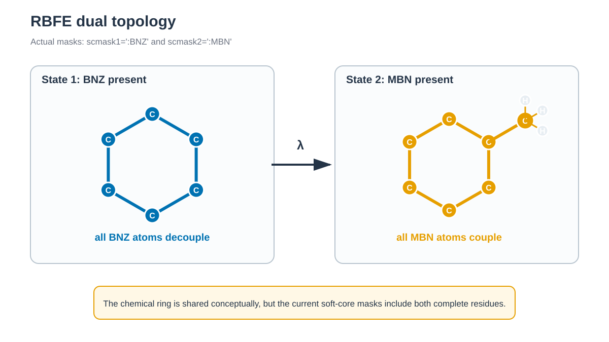

# T4 lysozyme RBFE / T4 lysozyme RBFE



*현재 mask는 공통 ring만이 아니라 BNZ와 MBN residue 전체를 각각 decouple하고 couple합니다. / The current masks decouple and couple the complete BNZ and MBN residues, not only the shared ring.*


## 한국어

T4 lysozyme L99A에서 benzene을 toluene으로 바꿉니다. 같은 transformation을
protein complex와 물에서 각각 계산하고 두 값의 차이로 `ΔΔG_bind`를 구합니다.
두 ligand는 중성이므로 이 예제에는 net-charge correction이 없습니다.

### Script 역할

| 파일 | 역할 | 주요 output |
| --- | --- | --- |
| `download.sh` | 4W53 PDB/mmCIF와 ligand SDF download | `structure/` |
| `prepare.py` | Protein과 bound BNZ/MBN coordinate 분리 | `protein.pdb`, `bound_*.pdb` |
| `build.sh` | GAFF2/AM1-BCC parameter와 complex 및 solvent topology 생성 | `work/build/`, `states.tsv` |
| `generate_inputs.py` | 22개 window input 생성; `build.sh`가 호출 | `work/complex/`, `work/solvent/` |
| `run.sh` | Minimization, heating, equilibration, production 실행 | Window별 restart, trajectory, log |
| `anal.py` | Cross-state energy 추출, FE-ToolKit MBAR/BAR 실행과 두 environment 조합 | `free_energy.tsv`, `overlap_matrix.tsv` |

```bash
./download.sh
python3 prepare.py structure/4W53.raw.pdb structure/protein.pdb
./build.sh structure/protein.pdb
./run.sh
python3 anal.py
```

### 주요 option

Complex와 solvent environment는 각각 lambda 0.0–1.0의 11개 window를 사용합니다.
`timask1`/`timask2`는 BNZ와 MBN end state를, `scmask1`/`scmask2`는 soft-core
대상을 지정합니다. 각 window는 200 ps heating, 100 ps NPT equilibration과
1 ns production을 실행합니다. Minimization, heating과 equilibration은
input identity가 일치하고 `*.out`, `*.rst7`, `*.info`와 해당 stage의
trajectory가 모두 있으면 건너뜁니다. 일부 output만 남으면 파일을 보존하고
중단합니다. 어느 window든 production output이 있으면 덮어쓰지 않고
계산 전에 중단합니다.

Solvent environment는 `solvatebox system OPCBOX 20.0`을 사용합니다. 가장 짧은
box dimension도 `cut=10 Å`의 GPU neighbor list에 필요한 공간을 갖도록 ligand와
box edge 사이에 20 Å buffer를 둡니다. Complex environment는 protein 때문에
box가 충분히 크므로 12 Å buffer를 유지합니다.

Soft-core interaction은 Amber 26의 `aces26=1` 형식을 사용합니다.
`gti_sc_cc_energy_terms='ele,vdw,ele14,vdw14'`는 soft-core와 common region
사이의 nonbonded term을 lambda에 따라 바꿉니다. 이 형식은 `pmemd.cuda`에서
실행하며 `run.sh`는 다른 engine override를 거부합니다. Minimization의
`ntmin=2`는 `ifsc=1`에서 요구되는 steepest-descent algorithm을 사용합니다.

Production의 `ifmbar=1`과 `mbar_lambda`는 각 saved configuration의 potential
energy를 11개 state에서 평가합니다. 이 계산은 현재 window의 dynamics를
바꾸지 않고 cross-state energy를 mdout에 추가합니다.

`anal.py`는 AmberTools 26의 `edgembar-amber2dats.py`로 matrix를 추출한 뒤
full matrix가 있으면 MBAR를 사용합니다. 먼 lambda state의 energy가 수치 범위를
벗어나 mdout에 `********`로 기록되면 extractor는 해당 window의 현재 state와
인접 state energy만 저장합니다. 이 경우 모든 인접 pair가 있으면 BAR로
전환하며 임의의 energy로 `********`를 대체하지 않습니다. Complex와 solvent는
각각 사용 가능한 estimator를 선택하고 `free_energy.tsv`에 이를 기록합니다.

FE-ToolKit의 automatic equilibration, correlated-sample stride와 20회
bootstrap을 사용합니다. 각 window의 `production.out`을 읽습니다. 더 긴 계산과
segment 구성은 `3_Templates/5_FEP/5.1_RBFE`에서 설정합니다. 주요 output은
다음과 같습니다.

| Output | 내용 |
| --- | --- |
| `work/free_energy.tsv` | Complex, solvent와 `ΔΔG_bind`; MBAR/BAR estimator와 uncertainty 포함 |
| `work/mbar_diagnostics.tsv` | State별 sample 수, 제거한 equilibration과 stride |
| `work/overlap_matrix.tsv` | Lambda state 사이의 overlap |
| `work/mbar/rbfe_report.html` | FE-ToolKit convergence report |

`complex_delta_g`와 `solvent_delta_g`는 같은 방향의 transformation입니다.
`relative_binding_delta_delta_g`는 complex와 solvent 계산의 차이입니다. 최종 값보다 먼저 인접
state의 overlap과 report의 equilibration warning을 확인합니다.

참고: [RCSB PDB 4W53](https://www.rcsb.org/structure/4W53)

Build는 기존 topology/restart file이 있으면 input을 변경하기 전에 중단하고 파일을 보존합니다. 새 build 전에는 기존 `work/`를 다른 위치에 보관하거나 별도 tutorial 사본을 사용합니다.

### Analysis 결과 저장

`anal.py`는 새 extracted energy, report와 최종 TSV를 temporary generation에서
계산합니다. Extraction, estimator, TSV 또는 HTML 생성이 실패하면 기존
`mbar/`, `free_energy.tsv`, `mbar_diagnostics.tsv`, `overlap_matrix.tsv`를 유지합니다.
실패한 command의 최근 log 내용은 stderr에 출력합니다.

자동 호출되는 `helpers/result_generation.py`가 이 파일들을 검증하고 게시합니다.
완료 기록은 `work/.analysis-generation.json`입니다. 여러 파일의 게시 도중
중단되면 `work/.analysis.pending`이 consumer와 재실행을 차단합니다. 실행 process가
종료됐는지 확인한 뒤 marker에 적힌 previous/new directory를 보존하고 검사합니다.
Marker만 삭제하거나 파일을 개별적으로 섞지 않습니다.

외부 script에서 결과를 읽기 전에는 다음 검사를 사용합니다. 별도 `WORK_DIR`을
사용했다면 `work`를 그 경로로 바꿉니다.

```bash
python3 helpers/result_generation.py work
```

공개 analysis entry는 자동으로 `helpers/writer_guard.py`를 호출해 같은 output의 동시 writer를 거부합니다. Engine 실행부터 결과 게시까지 보호하며, signal 종료 시 child가 멈춘 뒤 lock을 해제합니다. Lock을 임의로 삭제해 실행을 재개하지 않습니다.

`download.sh`는 모든 asset과 `SHA256SUMS`를 staging에서 확인한 뒤 `helpers/publish_download.py`로 게시합니다. Transfer, checksum 또는 일반 publication 실패에서는 기존 파일을 보존하며, 관련 없는 preparation 파일도 유지합니다. `structure/.download.pending`가 남으면 prepare/build와 새 download가 거부됩니다. 보존된 staging과 marker를 점검하고, marker만 삭제해 이전 파일과 새 파일을 섞어 사용하지 않습니다.

## English

This example transforms benzene into toluene in the T4 lysozyme L99A cavity and
repeats the same transformation in water. Their difference gives the relative
binding free energy. Both ligands are neutral, so no net-charge correction is
needed.

Run `download.sh`, `prepare.py`, `build.sh`, `run.sh`, and `anal.py` in that
order. The complex and solvent environments each contain eleven lambda windows. AMBER
soft-core masks define the two ligand end states. Every window uses 200 ps of
heating, 100 ps of NPT equilibration, and one 1 ns production run.
Minimization, heating, and equilibration are skipped when input identities match
and their `*.out`, `*.rst7`, `*.info`, and applicable trajectory files are complete.
Partial outputs are preserved and rejected. Existing production output
in any window stops the workflow before it can be overwritten.

The solvent environment uses a 20 Å solute-to-box-edge buffer so its shortest
dimension is large enough for the GPU neighbor list with the 10 Å cutoff. The
protein complex retains its 12 Å buffer because that box is already larger.

The inputs use the Amber 26 `aces26=1` soft-core format and scale
`ele,vdw,ele14,vdw14` interactions between soft-core and common regions.
`run.sh` therefore requires `pmemd.cuda`. Minimization uses `ntmin=2` because
`ifsc=1` requires the steepest-descent algorithm. `ifmbar=1` evaluates every saved
configuration at all eleven lambda states without changing its propagation.

`anal.py` extracts the cross-state energy matrix and runs the AmberTools 26
FE-ToolKit. A complete matrix is analyzed with MBAR. If an energy at a distant
lambda state overflows to `********`, the extractor retains current- and
adjacent-state energies. The analysis then uses BAR when every adjacent pair is
available; it does not replace undefined energies with arbitrary values. The
complex and solvent estimators are selected independently and recorded in
`free_energy.tsv`.

The analysis writes bootstrap uncertainties, per-state sampling diagnostics,
an overlap matrix, and an HTML convergence report from each window's
`production.out`. Use `3_Templates/5_FEP/5.1_RBFE` for longer or segmented
calculations. Inspect neighboring-state overlap and equilibration warnings
before interpreting the final value.

Build stops before changing inputs when topology/restart files already exist, preserving those files. Preserve the existing `work/` elsewhere or use a separate tutorial copy before a new build.

### 동시 실행과 input 변경

Build와 run은 `work.writers/` registry를 공유합니다. 같은 output/state를 쓰는 작업은 동시에 실행하지 않습니다. `prepare.py`가 있는 경우 structure를 생성하는 작업도 input을 읽는 build와 충돌하면 거부합니다.

Run은 재사용할 결과의 input을 SHA256으로 비교합니다. Topology, 최초 coordinate file, stage input, predecessor restart와 restraint가 바뀌거나 기존 결과에 identity 기록이 없으면 파일을 보존하고 거부합니다. 이 tutorial은 고정 경로를 사용하므로 변경된 계산은 새 directory에 tutorial을 복사해 시작합니다.

정상 종료, command 실패와 INT/TERM에서는 자식 process의 종료를 확인한 뒤 자기 lock만 해제합니다. SIGKILL이나 node 장애로 남은 lock은 자동 삭제하지 않습니다. Error에 표시된 lock과 `owner.json`의 host, PID, command, scope를 확인하고 scheduler와 해당 host에서 모든 writer와 자식 process가 종료됐는지 확인한 뒤 그 lock directory만 수동 제거합니다. PID가 로컬에서 보이지 않는다는 이유만으로 제거하지 않습니다. `.gate/`도 같은 확인이 필요합니다.

지원하는 `--dry-run`과 `--help`는 보호나 identity 파일을 생성하지 않습니다. 진행 중인 work를 이동하거나 identity를 수정해 재사용하지 않습니다. 보호는 로컬 filesystem과 로컬 자식 process로 검증했으며 network filesystem, remote MPI와 다른 node의 writer 종료는 미검증입니다.

### Concurrent runs and input changes

Build and run share the `work.writers/` registry and reject concurrent writers to the same output/state. Where present, `prepare.py` also rejects structure writes that overlap an active build reader.

Run compares inputs for result reuse with SHA256. Changed topology, initial coordinates, stage input, predecessor restart or restraint, and results without identity records, are preserved and rejected. This tutorial uses fixed paths; start changed calculations in a new tutorial copy.

Normal exit, command failure and INT/TERM release only the owned lock after child termination is verified. Locks left by SIGKILL or node failure are retained. Inspect the reported lock and its `owner.json` host, PID, command and scopes; confirm through the scheduler and owning host that all writers and children stopped before manually removing only that lock directory. A PID missing locally is not sufficient. Apply the same checks to `.gate/`.

Supported `--dry-run` and `--help` do not create writer or identity files. Do not move active work trees or edit identities to reuse results. Protection was tested on a local filesystem with local child processes; network filesystems, remote MPI and termination of writers on other nodes remain unverified.

### Stage 완료 판정 / Stage completion

Input identity는 입력이 같은지 확인하며 engine의 성공 종료를 증명하지 않습니다.
Runner가 engine의 성공 종료와 필수 output을 확인한 뒤 만든 완료 증거가 있어야
stage를 재사용합니다. Output이 남았지만 완료 증거가 없거나 필수 output이
누락·비어 있으면 기존 결과를 보존하고 중단합니다. 기존 결과를 소급 인증하지
않습니다. 새 계산은 생성된 `work/`를 포함하지 않는 새 tutorial copy에서 시작합니다.
`ntwx=0`인 AMBER stage는 trajectory를 완료 조건으로 요구하지 않습니다.
지원되는 continuation은 기존 restart/state 전달 방식을 따릅니다.

Input identity checks unchanged inputs; it does not prove a successful engine exit.
A stage is reused only with completion evidence written after a successful engine
exit and required-output checks. Outputs without that evidence, or missing/empty
required outputs, are preserved and rejected. Existing results are not certified
retroactively. Start a new tutorial copy without generated `work/` directories for
a new calculation. AMBER stages with `ntwx=0` do not require a trajectory for
completion. Supported continuation retains its existing restart/state handoff.

### Analysis result storage

`anal.py` calculates new extracted energies, reports, and final TSV files in a
temporary generation. Extraction, estimation, TSV, or HTML failure preserves
the previous `mbar/`, `free_energy.tsv`, `mbar_diagnostics.tsv`, and
`overlap_matrix.tsv`. Recent failed-command log lines are printed to stderr.

The automatically called `helpers/result_generation.py` validates and publishes
this group, recording completion in `work/.analysis-generation.json`. If multiple
file publication is interrupted, `work/.analysis.pending` blocks consumers and
reruns. Check that the process has ended, then preserve and inspect the
previous/new directories listed there. Do not remove only the marker or mix
individual files.

Before reading results in an external script, run the check below. Replace
`work` with your `WORK_DIR` if using another directory.

```bash
python3 helpers/result_generation.py work
```

Public analysis entries automatically use `helpers/writer_guard.py` to reject concurrent writers to the same output. Protection covers engine execution through publication, and signal cleanup drains children before releasing the lock. Do not delete a lock to force a retry.

`download.sh` validates every asset and `SHA256SUMS` in staging before publishing through `helpers/publish_download.py`. Transfer, checksum and ordinary publication failures preserve existing files, including unrelated preparation files. A retained `structure/.download.pending` blocks source readers and new downloads. Inspect the retained staging and marker; deleting only the marker can expose a mixed generation.
