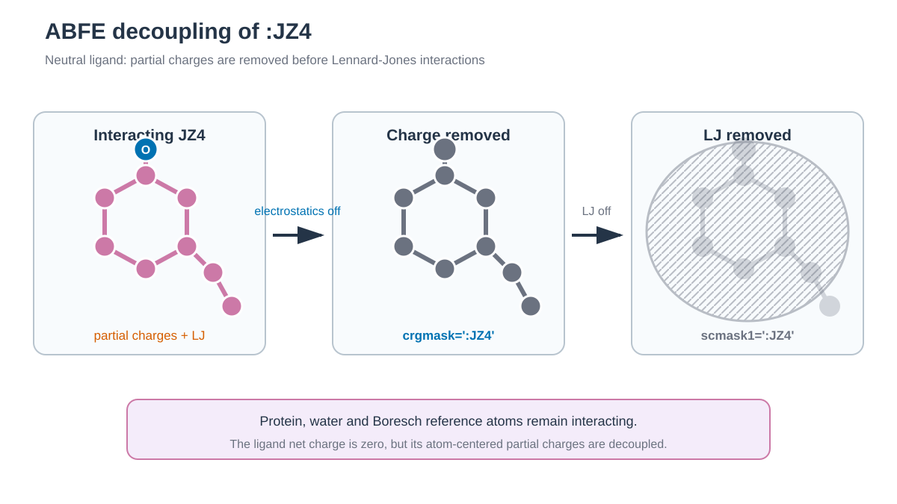

# T4 lysozyme–JZ4 ABFE / T4 lysozyme–JZ4 ABFE



*JZ4 전체에서 partial charge를 먼저 제거한 뒤 zero-charge topology에서 Lennard-Jones interaction을 제거합니다. / Partial charges are removed from all JZ4 atoms before Lennard-Jones interactions are removed from the zero-charge topology.*


## 한국어

PDB 3HTB의 JZ4를 T4 lysozyme complex와 물에서 단계적으로 decouple합니다. Complex
계산에서는 ligand가 binding site를 벗어나지 않도록 Boresch restraint 6개를
먼저 연결합니다. Restraint, electrostatic, van der Waals contribution과
standard-state correction을 thermodynamic cycle의 부호에 맞춰 합칩니다.

### Script 역할

| 파일 | 역할 | 주요 output |
| --- | --- | --- |
| `download.sh` | 3HTB와 JZ4 ideal SDF download | `structure/` |
| `prepare.py` | T4 lysozyme와 JZ4를 선택하고 anchor metadata 기록 | `complex.pdb`, `preparation.tsv` |
| `build.sh` | JZ4 parameter, 원본/zero-charge topology와 65개 window 생성 | `work/build/`, `states.tsv` |
| `generate_inputs.py` | Topology에서 restraint atom 번호와 input 생성 | `restraints.tsv`, `work/windows/` |
| `run.sh` | Window별 MD와 1 ns production 실행 | Restart, trajectory, AMBER output |
| `anal.py` | MBAR leg 계산과 standard-state correction 조합 | `free_energy.tsv`, `overlap_matrix.tsv` |

```bash
./download.sh
python3 prepare.py structure/3HTB.raw.pdb structure/complex.pdb
./build.sh structure/complex.pdb structure/JZ4_ideal.sdf
./run.sh --dry-run
./run.sh
python3 anal.py
```

### 주요 option

JZ4는 GAFF2/AM1-BCC net charge 0으로 parameterize합니다. Protein은 ff19SB,
물은 TIP3P를 사용합니다. `generate_inputs.py`는 GLN102 `CG-CB-CA`와 JZ4
`C7-C8-C9`를 anchor로 선택하고 실제 topology atom 번호와 초기 restraint
geometry를 `restraints.tsv`에 기록합니다.

Restraint·charge stage는 11개 lambda state를 사용합니다. LJ stage는 endpoint
근처를 촘촘히 나눈 16개 state를 사용합니다. `icfe`와 `clambda`가 alchemical
state를 정하고 `ifsc`/`scmask1`이 LJ endpoint의 singularity를 피합니다.
`ifmbar=1`은 각 configuration의 potential energy를 해당 stage의 모든 lambda에서
평가합니다. 이 full energy matrix가 MBAR의 input입니다.

Restraint stage는 λ=0의 unrestrained complex에서 λ=1의 restrained complex로
진행합니다. 모든 window는 같은 full-strength `DISANG` file을 사용하고,
`gti_nmropt=1`이 restraint energy를 lambda에 따라 scaling합니다. 따라서
restraint stage도 MBAR로 분석할 수 있습니다. 이 값을 binding cycle에 넣을 때는
부호를 바꿉니다. AMBER의 `rk2`/`rk3`는 `U=rk(x-x0)^2`의 계수이므로 Boresch
analytic correction에서는 `K=2×rk`로 변환합니다. `standard_state_correction`은
decoupled ligand의 restraint를 풀어 1 M 상태로 옮기는 항이며 보통 음수입니다.

Charge stage는 원래 topology와 `crgmask=':JZ4'`를 사용합니다. JZ4의 net
charge는 0이지만 atom별 partial charge interaction은 이 stage에서 제거합니다.
LJ stage는 JZ4 charge를 0으로 만든 `complex_uncharged.parm7` 또는
`solvent_uncharged.parm7`을 사용하고 `crgmask`를 다시 적용하지 않습니다.
Soft-core input은 `aces26=1`과 명시적인 SC/CC nonbonded term 목록을 사용하며
`pmemd.cuda`에서 실행합니다.

JZ4의 net charge가 0이므로 ligand decoupling은 system의 net charge를 바꾸지
않습니다. `free_energy.tsv`의 leading PME net-charge correction은 0으로
기록됩니다. Restraint geometry와 window overlap을 바꾸었다면 thermodynamic
cycle과 standard-state correction을 다시 검토합니다.

`anal.py`는 AmberTools 26의 `edgembar-amber2dats.py`와
`edgembar --mode=MBAR`를 실행합니다. FE-ToolKit의 automatic equilibration,
correlated-sample stride와 20회 bootstrap을 사용합니다.

| Output | 내용 |
| --- | --- |
| `work/free_energy.tsv` | Stage별 MBAR 값, analytic correction과 최종 `ΔG°bind` |
| `work/mbar_diagnostics.tsv` | State별 sample 수, 제거한 equilibration과 stride |
| `work/overlap_matrix.tsv` | Stage별 lambda overlap |
| `work/mbar/abfe_report.html` | FE-ToolKit convergence report |

`gti_nmropt=1` restraint MBAR와 ACES26 MBAR energy matrix는 Amber 26
`pmemd.cuda` desktop short run으로 아직 검증하지 않았습니다. 실행 전 mdout에
각 lambda의 `MBAR Energy analysis` block이 모두 기록되는지 확인합니다.

## English

This restrained double-decoupling example removes JZ4 interactions in the
3HTB T4 lysozyme complex and in bulk water. Six Boresch coordinates retain the
bound pose while electrostatic and Lennard-Jones interactions are decoupled.

Run the five public entry points in the order shown above. `build.sh` uses
ff19SB, GAFF2/AM1-BCC, and TIP3P, writes original and zero-JZ4-charge topologies,
then creates 65 windows. Restraint and charge
stages use eleven lambda states; the soft-core LJ stages use sixteen states with
additional endpoint spacing. Each window contains 200 ps heating, 1 ns
equilibration, and one 1 ns production segment.
JZ4 is parameterized with a net charge of zero. The protein anchors are GLN102
`CG-CB-CA`, and the ligand anchors are JZ4 `C7-C8-C9`.

The restraint stage uses one full-strength `DISANG` definition in every window.
`gti_nmropt=1` scales that restraint from the unrestrained to the restrained
state and `ifmbar=1` records its cross-state energies. The charge stage uses
`crgmask=':JZ4'` with the original topology. Although JZ4 is net neutral, this
stage removes its atom-centered partial-charge interactions. The LJ stage uses
the zero-JZ4-charge topology without applying `crgmask` a second time.
Soft-core interactions use the Amber 26 `aces26=1` format and require
`pmemd.cuda`.

`anal.py` uses the AmberTools 26 FE-ToolKit MBAR estimator for all five sampled
stages. It then adds the analytical standard-state term. The leading PME
net-charge correction is zero because JZ4 is neutral. Outputs include bootstrap uncertainty,
per-state sampling diagnostics, stage overlap matrices, and an HTML convergence
report. The short windows and approximate correction are suitable for learning
the workflow, not for claiming a converged experimental binding affinity.

The restraint leg runs from an unrestrained to a restrained bound complex, so
its MBAR contribution enters the binding cycle with the opposite sign. AMBER uses
`U=rk(x-x0)^2`; the analytical Boresch expression therefore uses `K=2*rk`.
The `gti_nmropt=1` restraint-MBAR combination still requires an Amber 26
`pmemd.cuda` desktop smoke test.
