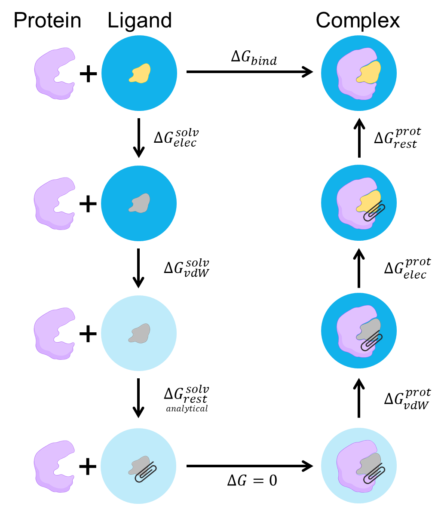

# T4 lysozyme–JZ4 ABFE / T4 lysozyme–JZ4 ABFE

<p align="center">
  
</p>

*Solvent와 restrained complex에서 charge와 LJ interaction을 각각 제거하는 두 decoupling 계산을 restraint correction과 연결해 physical binding cycle을 닫습니다. / Two decoupling calculations remove charge and LJ interactions in solvent and in the restrained complex, and restraint corrections close the physical binding cycle.*


## 한국어

PDB 3HTB의 JZ4를 T4 lysozyme complex와 물에서 단계적으로 decouple합니다.
Complex 계산에서는 ligand가 binding site를 벗어나지 않도록 Boresch restraint 6개를 먼저 연결합니다.
Restraint, electrostatic, van der Waals contribution과
standard-state correction을 thermodynamic cycle에 따라 계산합니다.

그림의 alchemical path는 물에서 interacting JZ4를 먼저 decouple한 뒤, interaction이
없는 ligand를 1 M reference에서 binding pose의 위치와 방향으로 restraint합니다.
이 standard-state restraint 항은 Boresch 식으로 계산하므로 별도 simulation을 하지
않습니다. 다음으로 binding site에서 restraint를 유지한 채 JZ4의 charge와 LJ
interaction을 다시 연결하고, 마지막으로 fully interacting complex의 restraint를
풉니다. 시작과 끝이 각각 solvated ligand와 bound complex이므로 이 우회 경로의
free-energy 합은 physical standard binding free energy와 같습니다.

```text
ΔG°bind = ΔGsolvent,charge + ΔGsolvent,LJ
          - ΔGcomplex,charge - ΔGcomplex,LJ
          + ΔGrestraint - ΔG°release
```

실제 simulation은 solvent와 complex에서 모두 `interacting → charge off → LJ off`
방향으로 수행합니다. Cycle 그림의 complex leg는 이를 반대로 지나가므로 complex
decoupling 두 항에 minus sign이 붙습니다. `ΔGrestraint`는 restrained bound
complex에서 restraint를 제거하는 sampled 값입니다. `ΔG°release`는 decoupled
ligand의 Boresch restraint를 풀어 1 M 상태로 보내는 analytic 값이므로 cycle에서는
그 역방향인 `-ΔG°release`가 들어갑니다.

### Script 역할

| 파일 | 역할 | 주요 output |
| --- | --- | --- |
| `download.sh` | 3HTB와 JZ4 ideal SDF download | `structure/` |
| `prepare.py` | T4 lysozyme와 JZ4를 선택하고 anchor metadata 기록 | `complex.pdb`, `preparation.tsv` |
| `build.sh` | JZ4 parameter, 원본/zero-charge topology와 65개 window 생성 | `work/build/`, `states.tsv` |
| `generate_inputs.py` | Topology에서 restraint atom 번호와 input 생성 | `restraints.tsv`, `work/restraint/`, `work/charge/`, `work/vdw/` |
| `run.sh` | Window별 MD와 1 ns production 실행 | Restart, trajectory, AMBER output |
| `anal.py` | Stage별 MBAR 계산과 standard-state correction 조합 | `free_energy.tsv`, `overlap_matrix.tsv` |

```bash
./download.sh
python3 prepare.py structure/3HTB.raw.pdb structure/complex.pdb
./build.sh structure/complex.pdb structure/JZ4_ideal.sdf
./run.sh --dry-run
./run.sh
python3 anal.py
```

### 주요 option

JZ4는 GAFF2/AM1-BCC net charge 0으로 parameterize합니다. Protein은 ff19SB,
물은 TIP3P를 사용합니다. `generate_inputs.py`는 GLN102 `CG-CB-CA`와 JZ4
`C7-C8-C9`를 anchor로 선택하고 실제 topology atom 번호와 초기 restraint
geometry를 `restraints.tsv`에 기록합니다. Torsion reference는 Amber와 같은
ParmEd dihedral convention으로 계산합니다.

Restraint·charge stage는 11개 lambda state를 사용합니다. LJ stage는 endpoint
근처를 촘촘히 나눈 16개 state를 사용합니다. `icfe`와 `clambda`가 alchemical
state를 정하고 `ifsc`/`scmask1`이 LJ endpoint의 singularity를 피합니다.
`ifmbar=1`은 각 configuration의 potential energy를 해당 stage의 모든 lambda에서
평가합니다. 이 full energy matrix가 MBAR의 input입니다.

Restraint와 charge stage는 atom을 생성하거나 제거하지 않는 non-softcore
transformation입니다. PMEMD가 두 endpoint의 대응 atom을 구성할 수 있도록
`timask1=timask2=':JZ4'`를 사용합니다. Restraint stage는 `gti_nmropt=1`, charge
stage는 `crgmask=':JZ4'`로 실제로 scaling할 energy term을 지정합니다.
`timask1=':JZ4', timask2=''`인 비대칭 unique-atom mask는 `ifsc=1`인 LJ
decoupling에만 사용합니다.

Window는 `work/restraint/complex/`, `work/charge/{complex,solvent}/`와
`work/vdw/{complex,solvent}/`에 생성됩니다. 각 directory 아래의 `000`부터
시작하는 번호가 lambda window입니다.

Solvent topology는 ligand와 box edge 사이에 20 Å buffer를 둡니다. 이는
`cut=10 Å`를 사용하는 `pmemd.cuda`가 작은 solvent box를 거부하지 않도록 가장
짧은 box dimension을 늘립니다. 완성된 stage는 건너뜁니다. 중단된 minimization,
heating 또는 equilibration의 partial output은 삭제한 뒤 해당 stage를 다시
실행합니다. Production partial output은 보존하고 중단합니다. 정상 종료는 engine
exit status, 필수 output과 `.<stage>.complete` marker를 모두 사용해 판별합니다.
Marker가 없는 output은 파일이 모두 있어도 partial stage로 처리합니다.

Restraint stage는 λ=0의 restrained complex에서 λ=1의 unrestrained complex로
진행합니다. 모든 window는 같은 full-strength `DISANG` file을 사용하고,
`gti_nmropt=1`이 restraint energy를 lambda에 따라 제거합니다. Complex
minimization에도 같은 `DISANG` restraint를 적용해 heating 전에 anchor geometry가
흐트러지지 않게 합니다. Restraint stage에서 계산한 제거값은 같은 방향으로
binding cycle에 더합니다. AMBER의 `rk2`/`rk3`는 `U=rk(x-x0)^2`의 계수이므로 Boresch
analytic correction에서는 `K=2×rk`로 변환합니다. `standard_state_correction`은
decoupled ligand의 restraint를 풀어 1 M 상태로 옮기는 항이며 보통 음수입니다.
이 함수가 반환한 release free energy는 binding cycle에서 뺍니다.

Charge stage는 원래 topology와 `crgmask=':JZ4'`를 사용합니다. JZ4의 net
charge는 0이지만 atom별 partial charge interaction은 이 stage에서 제거합니다.
LJ stage는 JZ4 charge를 0으로 만든 `complex_uncharged.parm7` 또는
`solvent_uncharged.parm7`을 사용하고 `crgmask`를 다시 적용하지 않습니다.
Soft-core input은 `aces26=1`과 명시적인 SC/CC nonbonded term 목록을 사용하며
`pmemd.cuda`에서 실행합니다.

JZ4의 net charge가 0이므로 ligand decoupling은 system의 net charge를 바꾸지
않습니다. `free_energy.tsv`의 leading PME net-charge correction은 0으로
기록됩니다. Restraint geometry와 window overlap을 바꾸었다면 thermodynamic
cycle과 standard-state correction을 다시 검토합니다.

`anal.py`는 AmberTools 26의 `edgembar-amber2dats.py`와
`edgembar --mode=AUTO`를 실행합니다. Full cross-state energy matrix가 있으면
MBAR를 사용하고, 없으면 모든 adjacent pair가 기록된 stage에 BAR를 사용합니다.
사용한 estimator는 `free_energy.tsv`에 stage별로 기록합니다. FE-ToolKit의
automatic equilibration, correlated-sample stride와 20회 bootstrap을 사용합니다.
각 window에 존재하는
`production.NNN.out`을 번호순으로 모두 읽으므로 production을 추가 segment로
연장해도 analysis code를 수정하지 않습니다.

| Output | 내용 |
| --- | --- |
| `work/free_energy.tsv` | Stage별 MBAR/BAR 값, analytic correction과 최종 `ΔG°bind` |
| `work/mbar_diagnostics.tsv` | State별 sample 수, 제거한 equilibration과 stride |
| `work/overlap_matrix.tsv` | Stage별 lambda overlap |
| `work/mbar/abfe_report.html` | FE-ToolKit convergence report |

`gti_nmropt=1` restraint MBAR와 ACES26 MBAR energy matrix는 Amber 26
`pmemd.cuda` desktop short run으로 아직 검증하지 않았습니다. 실행 전 mdout에
각 lambda의 `MBAR Energy analysis` block이 모두 기록되는지 확인합니다.

## English

This restrained double-decoupling example removes JZ4 interactions in the
3HTB T4 lysozyme complex and in bulk water. Six Boresch coordinates retain the
bound pose while electrostatic and Lennard-Jones interactions are decoupled.
The restraint, electrostatic, van der Waals, and standard-state contributions
are combined according to the thermodynamic cycle.

The alchemical path first decouples interacting JZ4 in water. The noninteracting
ligand is then placed at the bound position and orientation through the
analytical Boresch standard-state term, without a separate simulation. JZ4 is
coupled in the binding site while the restraint remains active, and the
restraint is finally released from the fully interacting complex. Because the
path connects solvated ligand and bound complex, its sum equals the physical
standard binding free energy:

```text
ΔG°bind = ΔGsolvent,charge + ΔGsolvent,LJ
          - ΔGcomplex,charge - ΔGcomplex,LJ
          + ΔGrestraint - ΔG°release
```

Both simulated decoupling legs run from interacting to charge-off to LJ-off.
The cycle traverses the complex leg in reverse, which gives the two complex
terms their minus signs. `ΔGrestraint` is the sampled release of the restraint
from the interacting bound complex. `ΔG°release` analytically releases the
decoupled restrained ligand to the 1 M state, so the reverse traversal enters
the cycle as `-ΔG°release`.

Run the five public entry points in the order shown above. `build.sh` uses
ff19SB, GAFF2/AM1-BCC, and TIP3P, writes original and zero-JZ4-charge topologies,
then creates 65 windows. Restraint and charge
stages use eleven lambda states; the soft-core LJ stages use sixteen states with
additional endpoint spacing. Each window contains 200 ps heating, 100 ps
equilibration, and one 1 ns production segment.
JZ4 is parameterized with a net charge of zero. The protein anchors are GLN102
`CG-CB-CA`, and the ligand anchors are JZ4 `C7-C8-C9`.

The restraint and charge stages do not create or remove atoms. Their
non-softcore inputs use `timask1=timask2=':JZ4'` so PMEMD has a nonempty,
one-to-one endpoint mapping. `gti_nmropt=1` defines the changing restraint
term, while `crgmask=':JZ4'` defines charge removal. Only the soft-core LJ
stage uses the asymmetric unique-atom masks `timask1=':JZ4'` and
`timask2=''`.

The solvent topology uses a 20 Å solute-to-box-edge buffer to keep the shortest
box dimension out of the `pmemd.cuda` small-box guard with the 10 Å cutoff.
Completed stages are skipped. Partial minimization, heating, or equilibration
output is removed before restarting that stage. Partial production output is
preserved and stops the workflow. Completion requires a zero engine exit status,
all required outputs, and a `.<stage>.complete` marker. Outputs without the
marker are partial even when every expected file is present.

The restraint stage uses one full-strength `DISANG` definition in every window.
`gti_nmropt=1` removes that restraint from the restrained state at lambda zero
to the unrestrained state at lambda one, and `ifmbar=1` records its cross-state
energies. Complex minimization uses the same `DISANG` restraints so heating
does not start from displaced anchor geometry. Torsion references follow the
Amber/ParmEd dihedral convention. The charge stage uses
`crgmask=':JZ4'` with the original topology. Although JZ4 is net neutral, this
stage removes its atom-centered partial-charge interactions. The LJ stage uses
the zero-JZ4-charge topology without applying `crgmask` a second time.
Soft-core interactions use the Amber 26 `aces26=1` format and require
`pmemd.cuda`.

`anal.py` uses FE-ToolKit MBAR when a stage has the full cross-state energy
matrix and falls back to adjacent-state BAR when all neighboring pairs are
available. The selected estimator is recorded for each stage in
`free_energy.tsv`. It combines every `production.NNN.out` present in each window; the
default run creates `production.001.out`, while additional numbered segments
require no analysis-code change. It then adds the analytical standard-state term. The leading PME
net-charge correction is zero because JZ4 is neutral. Outputs include bootstrap uncertainty,
per-state sampling diagnostics, stage overlap matrices, and an HTML convergence
report. The short windows and approximate correction are suitable for learning
the workflow, not for claiming a converged experimental binding affinity.

The restraint stage runs from a restrained to an unrestrained bound complex.
Its sampled removal free energy enters the binding cycle with the same sign,
while the negative analytical standard-state release term is subtracted. AMBER uses
`U=rk(x-x0)^2`; the analytical Boresch expression therefore uses `K=2*rk`.
The `gti_nmropt=1` restraint-MBAR combination still requires an Amber 26
`pmemd.cuda` desktop smoke test.
