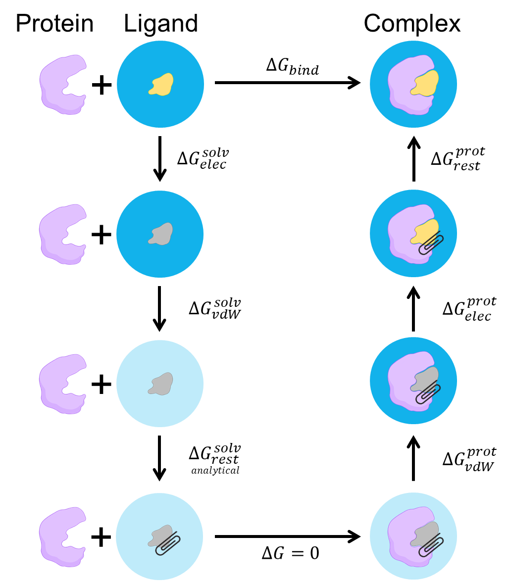

# T4 lysozyme–JZ4 ABFE / T4 lysozyme–JZ4 ABFE

<p align="center">
  
</p>

*Solvent와 restrained complex에서 charge와 LJ interaction을 각각 제거하는 두 decoupling 계산을 restraint correction과 연결해 physical binding cycle을 닫습니다. / Two decoupling calculations remove charge and LJ interactions in solvent and in the restrained complex, and restraint corrections close the physical binding cycle.*


## 한국어

PDB 3HTB의 JZ4를 T4 lysozyme complex와 물에서 단계적으로 decouple합니다.
Complex 계산에서는 ligand가 binding site를 벗어나지 않도록 Boresch restraint 6개를 먼저 연결합니다.
Restraint, electrostatic, van der Waals contribution과
standard-state correction을 thermodynamic cycle에 따라 계산합니다.

그림의 alchemical path는 물에서 interacting JZ4를 먼저 decouple한 뒤, interaction이
없는 ligand를 1 M reference에서 binding pose의 위치와 방향으로 restraint합니다.
이 standard-state restraint 항은 Boresch 식으로 계산하므로 별도 simulation을 하지
않습니다. 다음으로 binding site에서 restraint를 유지한 채 JZ4의 charge와 LJ
interaction을 다시 연결하고, 마지막으로 fully interacting complex의 restraint를
풉니다. 시작과 끝이 각각 solvated ligand와 bound complex이므로 이 우회 경로의
free-energy 합은 physical standard binding free energy와 같습니다.

```text
ΔG°bind = ΔGsolvent,charge + ΔGsolvent,LJ
          - ΔGcomplex,charge - ΔGcomplex,LJ
          + ΔGrestraint - ΔG°release
```

실제 simulation은 solvent와 complex에서 모두 `interacting → charge off → LJ off`
방향으로 수행합니다. Cycle 그림의 complex leg는 이를 반대로 지나가므로 complex
decoupling 두 항에 minus sign이 붙습니다. `ΔGrestraint`는 restrained bound
complex에서 restraint를 제거하는 sampled 값입니다. `ΔG°release`는 decoupled
ligand의 Boresch restraint를 풀어 1 M 상태로 보내는 analytic 값이므로 cycle에서는
그 역방향인 `-ΔG°release`가 들어갑니다.

### Script 역할

| 파일 | 역할 | 주요 output |
| --- | --- | --- |
| `download.sh` | 3HTB와 JZ4 ideal SDF download | `structure/` |
| `prepare.py` | T4 lysozyme와 JZ4를 선택하고 anchor metadata 기록 | `complex.pdb`, `preparation.tsv` |
| `build.sh` | JZ4 parameter, 원본/zero-charge topology와 65개 window 생성 | `work/build/`, `states.tsv` |
| `generate_inputs.py` | Topology에서 restraint atom 번호와 input 생성 | `restraints.tsv`, `work/restraint/`, `work/charge/`, `work/vdw/` |
| `run.sh` | Window별 MD와 1 ns production 실행 | Restart, trajectory, AMBER output |
| `anal.py` | Stage별 MBAR 계산과 standard-state correction 조합 | `free_energy.tsv`, `overlap_matrix.tsv` |

```bash
./download.sh
python3 prepare.py structure/3HTB.raw.pdb structure/complex.pdb
./build.sh structure/complex.pdb structure/JZ4_ideal.sdf
./run.sh
python3 anal.py
```

### 주요 option

JZ4는 GAFF2/AM1-BCC net charge 0으로 parameterize합니다. Protein은 ff19SB,
물은 OPC를 사용합니다. `generate_inputs.py`는 GLN102 `CG-CB-CA`와 JZ4
`C7-C8-C9`를 anchor로 선택하고 실제 topology atom 번호와 초기 restraint
geometry를 `restraints.tsv`에 기록합니다. Torsion reference는 Amber와 같은
ParmEd dihedral convention으로 계산합니다.

Restraint·charge stage는 11개 lambda state를 사용합니다. LJ stage는 endpoint
근처를 촘촘히 나눈 16개 state를 사용합니다. `icfe`와 `clambda`가 alchemical
state를 정하고 `ifsc`/`scmask1`이 LJ endpoint의 singularity를 피합니다.
`ifmbar=1`은 각 configuration의 potential energy를 해당 stage의 모든 lambda에서
평가합니다. 이 full energy matrix가 MBAR의 input입니다.

Restraint와 charge stage는 atom을 생성하거나 제거하지 않는 non-softcore
transformation입니다. PMEMD가 두 endpoint의 대응 atom을 구성할 수 있도록
`timask1=timask2=':JZ4'`를 사용합니다. Restraint stage는 `gti_nmropt=1`, charge
stage는 `crgmask=':JZ4'`로 실제로 scaling할 energy term을 지정합니다.
`timask1=':JZ4', timask2=''`인 비대칭 unique-atom mask는 `ifsc=1`인 LJ
decoupling에만 사용합니다.

Window는 `work/restraint/complex/`, `work/charge/{complex,solvent}/`와
`work/vdw/{complex,solvent}/`에 생성됩니다. 각 directory 아래의 `000`부터
시작하는 번호가 lambda window입니다.

Solvent topology는 ligand와 box edge 사이에 20 Å buffer를 둡니다. 이는
`cut=10 Å`를 사용하는 `pmemd.cuda`가 작은 solvent box를 거부하지 않도록 가장
짧은 box dimension을 늘립니다. Minimization, heating과 equilibration은
input identity가 일치하고 `*.out`, `*.rst7`, `*.info`와 해당 stage의
trajectory가 모두 있으면 건너뜁니다. 일부 output만 남으면 파일을 보존하고
중단합니다. 어느 window든 production output이 있으면 덮어쓰지 않고
계산 전에 중단합니다.

Restraint stage는 λ=0의 restrained complex에서 λ=1의 unrestrained complex로
진행합니다. 모든 window는 같은 full-strength `DISANG` file을 사용하고,
`gti_nmropt=1`이 restraint energy를 lambda에 따라 제거합니다. Complex
minimization에도 같은 `DISANG` restraint를 적용해 heating 전에 anchor geometry가
흐트러지지 않게 합니다. Restraint stage에서 계산한 제거값은 같은 방향으로
binding cycle에 더합니다. AMBER의 `rk2`/`rk3`는 `U=rk(x-x0)^2`의 계수이므로 Boresch
analytic correction에서는 `K=2×rk`로 변환합니다. `standard_state_correction`은
decoupled ligand의 restraint를 풀어 1 M 상태로 옮기는 항이며 보통 음수입니다.
이 함수가 반환한 release free energy는 binding cycle에서 뺍니다.

Charge stage는 원래 topology와 `crgmask=':JZ4'`를 사용합니다. JZ4의 net
charge는 0이지만 atom별 partial charge interaction은 이 stage에서 제거합니다.
LJ stage는 JZ4 charge를 0으로 만든 `complex_uncharged.parm7` 또는
`solvent_uncharged.parm7`을 사용하고 `crgmask`를 다시 적용하지 않습니다.
Soft-core input은 `aces26=1`과 명시적인 SC/CC nonbonded term 목록을 사용하며
`pmemd.cuda`에서 실행합니다.

JZ4의 net charge가 0이므로 ligand decoupling은 system의 net charge를 바꾸지
않습니다. `free_energy.tsv`의 leading PME net-charge correction은 0으로
기록됩니다. Restraint geometry와 window overlap을 바꾸었다면 thermodynamic
cycle과 standard-state correction을 다시 검토합니다.

`anal.py`는 AmberTools 26의 `edgembar-amber2dats.py`와
`edgembar --mode=AUTO`를 실행합니다. Full cross-state energy matrix가 있으면
MBAR를 사용하고, 없으면 모든 adjacent pair가 기록된 stage에 BAR를 사용합니다.
사용한 estimator는 `free_energy.tsv`에 stage별로 기록합니다. FE-ToolKit의
automatic equilibration, correlated-sample stride와 20회 bootstrap을 사용합니다.
각 window의 `production.out`을 읽습니다. 더 긴 계산과 segment 구성은
`3_Templates/5_FEP/5.2_ABFE`에서 설정합니다.

| Output | 내용 |
| --- | --- |
| `work/free_energy.tsv` | Stage별 MBAR/BAR 값, analytic correction과 최종 `ΔG°bind` |
| `work/mbar_diagnostics.tsv` | State별 sample 수, 제거한 equilibration과 stride |
| `work/overlap_matrix.tsv` | Stage별 lambda overlap |
| `work/mbar/abfe_report.html` | FE-ToolKit convergence report |

`gti_nmropt=1` restraint MBAR와 ACES26 MBAR energy matrix는 Amber 26
`pmemd.cuda` desktop short run으로 아직 검증하지 않았습니다. 실행 전 mdout에
각 lambda의 `MBAR Energy analysis` block이 모두 기록되는지 확인합니다.

Build는 기존 topology/restart file이 있으면 input을 변경하기 전에 중단하고 파일을 보존합니다. 새 build 전에는 기존 `work/`를 다른 위치에 보관하거나 별도 tutorial 사본을 사용합니다.

### Analysis 결과 저장

`anal.py`는 새 extracted energy, report와 최종 TSV를 temporary generation에서
계산합니다. Extraction, estimator, TSV 또는 HTML 생성이 실패하면 기존
`mbar/`, `free_energy.tsv`, `mbar_diagnostics.tsv`, `overlap_matrix.tsv`를 유지합니다.
실패한 command의 최근 log 내용은 stderr에 출력합니다.

자동 호출되는 `helpers/result_generation.py`가 이 파일들을 검증하고 게시합니다.
완료 기록은 `work/.analysis-generation.json`입니다. 여러 파일의 게시 도중
중단되면 `work/.analysis.pending`이 consumer와 재실행을 차단합니다. 실행 process가
종료됐는지 확인한 뒤 marker에 적힌 previous/new directory를 보존하고 검사합니다.
Marker만 삭제하거나 파일을 개별적으로 섞지 않습니다.

외부 script에서 결과를 읽기 전에는 다음 검사를 사용합니다. 별도 `WORK_DIR`을
사용했다면 `work`를 그 경로로 바꿉니다.

```bash
python3 helpers/result_generation.py work
```

## English

This restrained double-decoupling example removes JZ4 interactions in the
3HTB T4 lysozyme complex and in bulk water. Six Boresch coordinates retain the
bound pose while electrostatic and Lennard-Jones interactions are decoupled.
The restraint, electrostatic, van der Waals, and standard-state contributions
are combined according to the thermodynamic cycle.

The alchemical path first decouples interacting JZ4 in water. The noninteracting
ligand is then placed at the bound position and orientation through the
analytical Boresch standard-state term, without a separate simulation. JZ4 is
coupled in the binding site while the restraint remains active, and the
restraint is finally released from the fully interacting complex. Because the
path connects solvated ligand and bound complex, its sum equals the physical
standard binding free energy:

```text
ΔG°bind = ΔGsolvent,charge + ΔGsolvent,LJ
          - ΔGcomplex,charge - ΔGcomplex,LJ
          + ΔGrestraint - ΔG°release
```

Both simulated decoupling legs run from interacting to charge-off to LJ-off.
The cycle traverses the complex leg in reverse, which gives the two complex
terms their minus signs. `ΔGrestraint` is the sampled release of the restraint
from the interacting bound complex. `ΔG°release` analytically releases the
decoupled restrained ligand to the 1 M state, so the reverse traversal enters
the cycle as `-ΔG°release`.

Run the five public entry points in the order shown above. `build.sh` uses
ff19SB, GAFF2/AM1-BCC, and OPC, writes original and zero-JZ4-charge topologies,
then creates 65 windows. Restraint and charge
stages use eleven lambda states; the soft-core LJ stages use sixteen states with
additional endpoint spacing. Each window contains 200 ps heating, 100 ps
equilibration, and one 1 ns production run.
JZ4 is parameterized with a net charge of zero. The protein anchors are GLN102
`CG-CB-CA`, and the ligand anchors are JZ4 `C7-C8-C9`.

The restraint and charge stages do not create or remove atoms. Their
non-softcore inputs use `timask1=timask2=':JZ4'` so PMEMD has a nonempty,
one-to-one endpoint mapping. `gti_nmropt=1` defines the changing restraint
term, while `crgmask=':JZ4'` defines charge removal. Only the soft-core LJ
stage uses the asymmetric unique-atom masks `timask1=':JZ4'` and
`timask2=''`.

The solvent topology uses a 20 Å solute-to-box-edge buffer to keep the shortest
box dimension out of the `pmemd.cuda` small-box guard with the 10 Å cutoff.
Minimization, heating, and equilibration are skipped when input identities match
and their `*.out`, `*.rst7`, `*.info`, and applicable trajectory files are complete.
Partial outputs are preserved and rejected. Existing production output
in any window stops the workflow before it can be overwritten.

The restraint stage uses one full-strength `DISANG` definition in every window.
`gti_nmropt=1` removes that restraint from the restrained state at lambda zero
to the unrestrained state at lambda one, and `ifmbar=1` records its cross-state
energies. Complex minimization uses the same `DISANG` restraints so heating
does not start from displaced anchor geometry. Torsion references follow the
Amber/ParmEd dihedral convention. The charge stage uses
`crgmask=':JZ4'` with the original topology. Although JZ4 is net neutral, this
stage removes its atom-centered partial-charge interactions. The LJ stage uses
the zero-JZ4-charge topology without applying `crgmask` a second time.
Soft-core interactions use the Amber 26 `aces26=1` format and require
`pmemd.cuda`.

`anal.py` uses FE-ToolKit MBAR when a stage has the full cross-state energy
matrix and falls back to adjacent-state BAR when all neighboring pairs are
available. The selected estimator is recorded for each stage in
`free_energy.tsv`. It reads `production.out` from each window and then adds the
analytical standard-state term. Use `3_Templates/5_FEP/5.2_ABFE` for longer or
segmented calculations. The leading PME
net-charge correction is zero because JZ4 is neutral. Outputs include bootstrap uncertainty,
per-state sampling diagnostics, stage overlap matrices, and an HTML convergence
report. The short windows and approximate correction are suitable for learning
the workflow, not for claiming a converged experimental binding affinity.

The restraint stage runs from a restrained to an unrestrained bound complex.
Its sampled removal free energy enters the binding cycle with the same sign,
while the negative analytical standard-state release term is subtracted. AMBER uses
`U=rk(x-x0)^2`; the analytical Boresch expression therefore uses `K=2*rk`.
The `gti_nmropt=1` restraint-MBAR combination still requires an Amber 26
`pmemd.cuda` desktop smoke test.

Build stops before changing inputs when topology/restart files already exist, preserving those files. Preserve the existing `work/` elsewhere or use a separate tutorial copy before a new build.

### 동시 실행과 input 변경

Build와 run은 `work.writers/` registry를 공유합니다. 같은 output/state를 쓰는 작업은 동시에 실행하지 않습니다. `prepare.py`가 있는 경우 structure를 생성하는 작업도 input을 읽는 build와 충돌하면 거부합니다.

Run은 재사용할 결과의 input을 SHA256으로 비교합니다. Topology, 최초 coordinate file, stage input, predecessor restart와 restraint가 바뀌거나 기존 결과에 identity 기록이 없으면 파일을 보존하고 거부합니다. 이 tutorial은 고정 경로를 사용하므로 변경된 계산은 새 directory에 tutorial을 복사해 시작합니다.

정상 종료, command 실패와 INT/TERM에서는 자식 process의 종료를 확인한 뒤 자기 lock만 해제합니다. SIGKILL이나 node 장애로 남은 lock은 자동 삭제하지 않습니다. Error에 표시된 lock과 `owner.json`의 host, PID, command, scope를 확인하고 scheduler와 해당 host에서 모든 writer와 자식 process가 종료됐는지 확인한 뒤 그 lock directory만 수동 제거합니다. PID가 로컬에서 보이지 않는다는 이유만으로 제거하지 않습니다. `.gate/`도 같은 확인이 필요합니다.

지원하는 `--dry-run`과 `--help`는 보호나 identity 파일을 생성하지 않습니다. 진행 중인 work를 이동하거나 identity를 수정해 재사용하지 않습니다. 보호는 로컬 filesystem과 로컬 자식 process로 검증했으며 network filesystem, remote MPI와 다른 node의 writer 종료는 미검증입니다.

### Concurrent runs and input changes

Build and run share the `work.writers/` registry and reject concurrent writers to the same output/state. Where present, `prepare.py` also rejects structure writes that overlap an active build reader.

Run compares inputs for result reuse with SHA256. Changed topology, initial coordinates, stage input, predecessor restart or restraint, and results without identity records, are preserved and rejected. This tutorial uses fixed paths; start changed calculations in a new tutorial copy.

Normal exit, command failure and INT/TERM release only the owned lock after child termination is verified. Locks left by SIGKILL or node failure are retained. Inspect the reported lock and its `owner.json` host, PID, command and scopes; confirm through the scheduler and owning host that all writers and children stopped before manually removing only that lock directory. A PID missing locally is not sufficient. Apply the same checks to `.gate/`.

Supported `--dry-run` and `--help` do not create writer or identity files. Do not move active work trees or edit identities to reuse results. Protection was tested on a local filesystem with local child processes; network filesystems, remote MPI and termination of writers on other nodes remain unverified.

### Stage 완료 판정 / Stage completion

Input identity는 입력이 같은지 확인하며 engine의 성공 종료를 증명하지 않습니다.
Runner가 engine의 성공 종료와 필수 output을 확인한 뒤 만든 완료 증거가 있어야
stage를 재사용합니다. Output이 남았지만 완료 증거가 없거나 필수 output이
누락·비어 있으면 기존 결과를 보존하고 중단합니다. 기존 결과를 소급 인증하지
않습니다. 새 계산은 생성된 `work/`를 포함하지 않는 새 tutorial copy에서 시작합니다.
`ntwx=0`인 AMBER stage는 trajectory를 완료 조건으로 요구하지 않습니다.
지원되는 continuation은 기존 restart/state 전달 방식을 따릅니다.

Input identity checks unchanged inputs; it does not prove a successful engine exit.
A stage is reused only with completion evidence written after a successful engine
exit and required-output checks. Outputs without that evidence, or missing/empty
required outputs, are preserved and rejected. Existing results are not certified
retroactively. Start a new tutorial copy without generated `work/` directories for
a new calculation. AMBER stages with `ntwx=0` do not require a trajectory for
completion. Supported continuation retains its existing restart/state handoff.

### Analysis result storage

`anal.py` calculates new extracted energies, reports, and final TSV files in a
temporary generation. Extraction, estimation, TSV, or HTML failure preserves
the previous `mbar/`, `free_energy.tsv`, `mbar_diagnostics.tsv`, and
`overlap_matrix.tsv`. Recent failed-command log lines are printed to stderr.

The automatically called `helpers/result_generation.py` validates and publishes
this group, recording completion in `work/.analysis-generation.json`. If multiple
file publication is interrupted, `work/.analysis.pending` blocks consumers and
reruns. Check that the process has ended, then preserve and inspect the
previous/new directories listed there. Do not remove only the marker or mix
individual files.

Before reading results in an external script, run the check below. Replace
`work` with your `WORK_DIR` if using another directory.

```bash
python3 helpers/result_generation.py work
```
