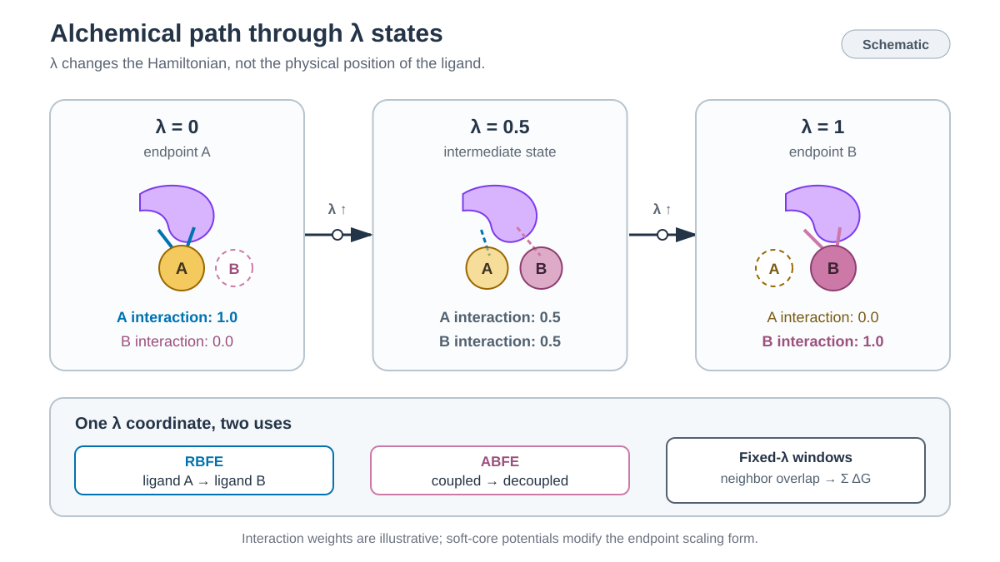

# Free-energy perturbation



*각 lambda window에서 서로 다른 Hamiltonian을 sampling하고 인접 state의 free-energy 차이를 합산합니다. / Each lambda window samples a different Hamiltonian, and adjacent-state free-energy differences are accumulated.*


## 한국어

Alchemical calculation은 실제 결합·해리 경로 대신 lambda에 따라 Hamiltonian의
interaction을 단계적으로 바꿉니다. Lambda는 simulation time이나 ligand의 물리적
이동 거리가 아니라 두 endpoint 사이의 alchemical state를 나타냅니다.
인접한 lambda state가 비슷한 configuration을 sampling해야 state 사이의 free-energy 차이를 계산할 수 있습니다.

| Tutorial | 계산 | System |
| --- | --- | --- |
| [5.1 RBFE](5.1_RBFE/) | 두 ligand의 상대 결합 자유에너지 | T4 lysozyme L99A, benzene → toluene |
| [5.2 ABFE](5.2_ABFE/) | 한 ligand의 표준 결합 자유에너지 | T4 lysozyme–JZ4, PDB 3HTB |

두 예제 모두 AMBER가 각 configuration을 모든 lambda state에서 다시 평가하도록
`ifmbar=1`을 사용합니다. `anal.py`는 AmberTools 26 FE-ToolKit의
`edgembar-amber2dats.py`와 `edgembar --mode=MBAR`로 Gibbs free energy,
bootstrap uncertainty와 state overlap을 계산합니다. Window당 2 ns는 실행 가능한
tutorial 기본값이며 수렴된 연구 결과를 보장하지 않습니다.

MBAR analysis에는 AmberTools 26의 `edgembar`가 필요합니다.

```bash
conda activate ambertools26
command -v edgembar-amber2dats.py
command -v edgembar
```

ACES26 cross-state energy와 ABFE restraint scaling은 Amber 26
`pmemd.cuda` short run으로 아직 검증하지 않았습니다. 두 tutorial의 입력은
실제 GPU mdout에 모든 lambda의 `MBAR Energy analysis` block이 기록되는지
확인한 뒤 사용합니다.

## English

Alchemical calculations scale Hamiltonian interactions across lambda states
instead of sampling a physical binding or unbinding path. Lambda is an
alchemical state coordinate, not simulation time or ligand displacement.
Neighboring lambda states must sample overlapping configurations for reliable
free-energy estimates.

The RBFE example transforms benzene into toluene in T4 lysozyme L99A. The ABFE
example applies a restrained double-decoupling cycle to JZ4 bound to T4
lysozyme L99A/M102Q. Both collect the full cross-state energy matrix with AMBER `ifmbar=1`
and use the AmberTools 26 FE-ToolKit MBAR estimator. Two nanoseconds of
production per window is a tutorial-scale default.

The ACES26 cross-state matrix and restrained ABFE path still require a short
Amber 26 `pmemd.cuda` validation run. Confirm that the GPU mdout contains the
`MBAR Energy analysis` block for every lambda before interpreting either cycle.
