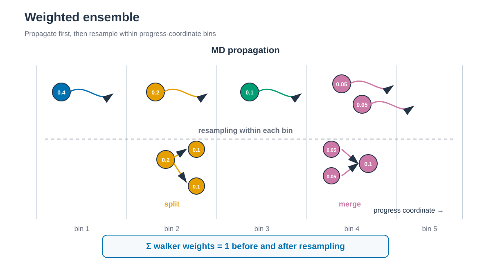

# Weighted ensemble

*Walker를 bin 안에서 split하거나 merge해도 statistical weight의 합은 보존됩니다. / Splitting or merging walkers within bins preserves total statistical weight.*

## 한국어

Weighted ensemble은 짧은 trajectory segment를 여러 개 전파한 뒤 progress
coordinate bin에서 walker를 split하거나 merge합니다. WESTPA가 walker weight와
resampling을 관리하고 MD engine은 각 segment의 dynamics만 계산합니다.

- [WESTPA + AMBER](6.1_WESTPA_AMBER/): Explicit-solvent Chignolin Cα RMSD sampling

이 예제는 WESTPA–AMBER 연결, restart 전달, weight 보존과 weighted bin
occupancy 분석을 다룹니다. Partially unfolded target은 학습용 정의이며 target
도달 횟수를 folding 또는 unfolding rate로 해석하지 않습니다.

## English

Weighted ensemble propagates many short trajectory segments and resamples
walkers across progress-coordinate bins. WESTPA owns the weights and resampling;
AMBER supplies unbiased segment dynamics. The Chignolin example uses Cα RMSD
to teach propagation, restart handling, resampling, and weighted diagnostics;
it does not estimate a folding or unfolding rate.
