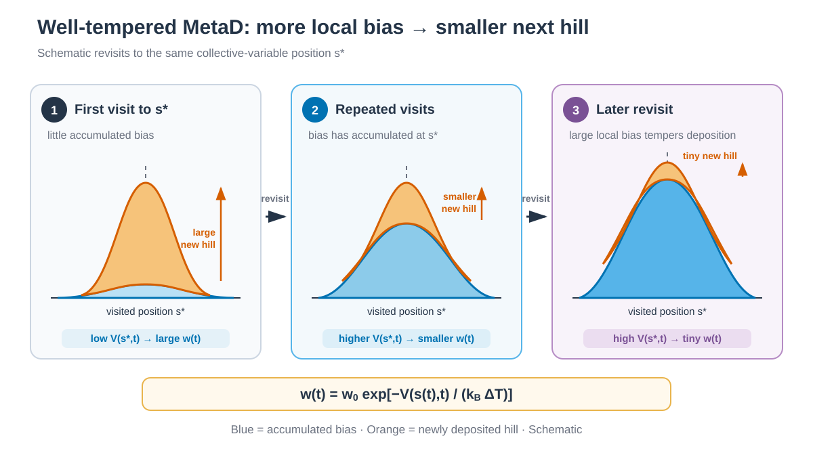

# Well-Tempered Metadynamics



*같은 CV 위치를 다시 방문하면 accumulated bias는 커지고 그 위에 추가되는 새 hill은 작아집니다. / Revisiting the same CV position increases its accumulated bias and reduces the next deposited hill.*


## 한국어

Alanine dipeptide의 φ와 ψ torsion에 well-tempered MetaD bias를 적용합니다.
방문한 위치에 Gaussian을 쌓되, 현재 위치 `s(t)`의 accumulated bias
`V(s(t),t)`가 클수록 새 hill의 height를 지수적으로 낮춥니다. 따라서 hill이
simulation time에 따라 모든 위치에서 일률적으로 작아지는 것이 아닙니다.

### 실행

```bash
cd 1_Simulation/7_MetaD/7.1_WT-MetaD
./build.sh structure/alanine-dipeptide.pdb
./run.sh
python3 anal.py
```

`AMBER_ENGINE`과 `PLUMED`로 executable을 지정할 수 있습니다. 고정 seed와
system별 production 설정을 바꾸려면 `3_Templates/7_MetaD/7.1_WT-MetaD`를
사용합니다.

### Script 역할

| File | 역할 |
|---|---|
| `build.sh` | Argument로 받은 capped alanine PDB에서 ff19SB/TIP3P solvent box와 topology를 생성합니다. |
| `check_topology.py` | build가 끝날 때 CV atom 번호와 atom 이름을 확인합니다. |
| `run.sh` | minimization, 200 ps heating, 100 ps NPT equilibration과 1 ns production을 실행합니다. Production output은 `work/`에 저장합니다. |
| `anal.py` | φ/ψ 및 bias 범위를 기록하고 1 ns 누적 `HILLS`로 FES를 만듭니다. |

### 주요 option

`PACE=500`은 2 fs timestep에서 1 ps마다 Gaussian을 추가합니다. `HEIGHT=1.2`의
PLUMED 기본 energy unit은 kJ/mol이며 `SIGMA=0.2`의 단위는 radian입니다.
`BIASFACTOR=10`은 well-tempered tempering 정도를 정합니다. `GRID_MIN/MAX`는
periodic torsion의 -π–π 범위를 덮고 `CALC_RCT`가 reweighting용 offset을 계산합니다.

LEaP가 만든 초기 solvent box는 NPT equilibration에서 수축할 수 있습니다.
`equilibrate.in.template`의 `skinnb=5.0 Å`는 실제 `cut=10 Å`를 바꾸지 않고
GPU nonbonded pair-list의 여유 폭을 늘립니다. 따라서 100 ps equilibration을
`pmemd.cuda`에서 한 번에 실행할 때 box 변화로 인한 grid-cell 중단 가능성을
낮춥니다. 더 큰 system에 이 값을 그대로 사용하지 말고
`2 × (cut + skinnb)`가 shortest box dimension보다 작은지 확인합니다.

Production은 `work/`에서 1 ns를 실행합니다. Minimization, heating과
equilibration은 `*.out`과 `*.rst7`이 모두 있으면 건너뛰고, 일부만 있으면
다시 실행합니다. Production output이 있으면 덮어쓰지 않고 중단합니다.
`HILLS`는 bias를 복원하는
기록이며 `COLVAR`를 대신하지 않습니다.

1 ns는 workflow 학습용 길이입니다. φ/ψ 공간의 수렴이나 정량 free energy를
입증하지 않습니다. Keyword는 PLUMED 2.10
[`METAD`](https://www.plumed.org/doc-v2.10/user-doc/html/_m_e_t_a_d.html)를
기준으로 작성했습니다.

PLUMED가 없는 분석 환경에서는 `python3 anal.py --skip-fes`로 diagnostic TSV만
생성할 수 있습니다. FES 비교는 sampling 진행 상황을 보는 용도이며 수렴 판정은
별도의 반복 계산과 오차 분석이 필요합니다.

## English

This example biases the φ and ψ torsions of alanine dipeptide with
well-tempered metadynamics. The next hill is exponentially tempered by the
accumulated bias at the current position `s(t)`; hill height does not decrease
uniformly everywhere as a function of simulation time. `PACE=500` deposits a Gaussian every 1 ps,
`HEIGHT=1.2` is in kJ/mol, `SIGMA=0.2` is in radians, and `BIASFACTOR=10`
controls tempering. The -π to π grid supports `CALC_RCT`.

The LEaP solvent box can contract during NPT equilibration. The
`skinnb=5.0 Å` setting in `equilibrate.in.template` increases the GPU
nonbonded pair-list margin without changing the physical `cut=10 Å` cutoff.
This reduces grid-cell failures during a single 100 ps `pmemd.cuda` run.
For another system, confirm that `2 × (cut + skinnb)` remains smaller than
the shortest box dimension before reusing this value.

`build.sh structure/alanine-dipeptide.pdb` creates and validates the
ff19SB/TIP3P system from the supplied PDB. `run.sh` performs
minimization, 200 ps heating, 100 ps NPT equilibration, and one 1 ns production
run. Its restart, trajectory, `COLVAR`, and
`HILLS` files are written directly under `work/`. `anal.py` reports
sampled torsion and bias ranges. The 1 ns run demonstrates the workflow and is
not evidence of converged free energies.
