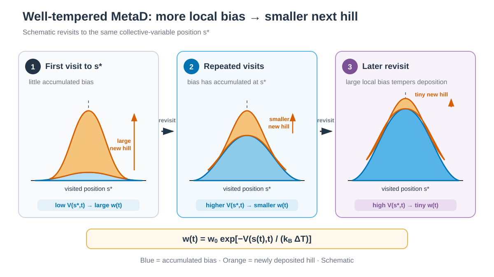

# Well-Tempered Metadynamics



*같은 CV 위치를 다시 방문하면 accumulated bias는 커지고 그 위에 추가되는 새 hill은 작아집니다. / Revisiting the same CV position increases its accumulated bias and reduces the next deposited hill.*


## 한국어

Alanine dipeptide의 φ와 ψ torsion에 well-tempered MetaD bias를 적용합니다.
방문한 위치에 Gaussian을 쌓되, 현재 위치 `s(t)`의 accumulated bias
`V(s(t),t)`가 클수록 새 hill의 height를 지수적으로 낮춥니다. 따라서 hill이
simulation time에 따라 모든 위치에서 일률적으로 작아지는 것이 아닙니다.

### 실행

```bash
cd 1_Simulation/7_MetaD/7.1_WT-MetaD
./build.sh structure/alanine-dipeptide.pdb
./run.sh
python3 anal.py
```

`AMBER_ENGINE`과 `PLUMED`로 executable을 지정할 수 있습니다. 고정 seed와
system별 production 설정을 바꾸려면 `3_Templates/7_MetaD/7.1_WT-MetaD`를
사용합니다.

### Script 역할

| File | 역할 |
|---|---|
| `build.sh` | Argument로 받은 capped alanine PDB에서 ff19SB/OPC solvent box와 topology를 생성합니다. |
| `check_topology.py` | build가 끝날 때 CV atom 번호와 atom 이름을 확인합니다. |
| `run.sh` | minimization, 200 ps heating, 100 ps NPT equilibration과 1 ns production을 실행합니다. Production output은 `work/`에 저장합니다. |
| `anal.py` | φ/ψ 및 bias 범위를 기록하고 1 ns 누적 `HILLS`로 FES를 만듭니다. |

### 주요 option

`PACE=500`은 2 fs timestep에서 1 ps마다 Gaussian을 추가합니다. `HEIGHT=1.2`의
PLUMED 기본 energy unit은 kJ/mol이며 `SIGMA=0.2`의 단위는 radian입니다.
`BIASFACTOR=10`은 well-tempered tempering 정도를 정합니다. `GRID_MIN/MAX`는
periodic torsion의 -π–π 범위를 덮고 `CALC_RCT`가 reweighting용 offset을 계산합니다.

LEaP가 만든 초기 solvent box는 NPT equilibration에서 수축할 수 있습니다.
`equilibrate.in.template`의 `skinnb=5.0 Å`는 실제 `cut=10 Å`를 바꾸지 않고
GPU nonbonded pair-list의 여유 폭을 늘립니다. 따라서 100 ps equilibration을
`pmemd.cuda`에서 한 번에 실행할 때 box 변화로 인한 grid-cell 중단 가능성을
낮춥니다. 더 큰 system에 이 값을 그대로 사용하지 말고
`2 × (cut + skinnb)`가 shortest box dimension보다 작은지 확인합니다.

Production은 `work/`에서 1 ns를 실행합니다. Minimization, heating과
equilibration은 `*.out`과 `*.rst7`이 모두 있고 성공 완료 증거가 있으면 건너뛰고, 실패하거나 일부만 있으면 기존 결과를 보존하고 중단합니다. Production output이 있으면 덮어쓰지 않고 중단합니다.
`HILLS`는 bias를 복원하는
기록이며 `COLVAR`를 대신하지 않습니다.

1 ns는 workflow 학습용 길이입니다. φ/ψ 공간의 수렴이나 정량 free energy를
입증하지 않습니다. Keyword는 PLUMED 2.10
[`METAD`](https://www.plumed.org/doc-v2.10/user-doc/html/_m_e_t_a_d.html)를
기준으로 작성했습니다.

PLUMED가 없는 분석 환경에서는 `python3 anal.py --skip-fes`로 diagnostic TSV만
생성할 수 있습니다. FES 비교는 sampling 진행 상황을 보는 용도이며 수렴 판정은
별도의 반복 계산과 오차 분석이 필요합니다.

Build는 기존 topology/restart file이 있으면 input을 변경하기 전에 중단하고 파일을 보존합니다. 새 build 전에는 기존 `work/`를 다른 위치에 보관하거나 별도 tutorial 사본을 사용합니다.

### Analysis 결과 저장

`anal.py`는 diagnostic TSV와 새 FES를 별도 temporary generation에서 만들고
확인한 뒤 `work/analysis/`을 교체합니다. `sum_hills`가 exit 0을 반환해도
새 `fes.dat`이 없거나 비어 있으면 실패로 처리하고 이전 결과를 유지합니다.
`--skip-fes`의 새 결과에는 과거 FES를 포함하지 않습니다.

자동 호출되는 `helpers/result_generation.py`가 완료한 output hash를
`analysis/.generation.json`에 기록합니다. 게시가 중단되어
`work/.analysis.pending`이 남으면 재실행을 거부합니다. 실행 process가 종료됐는지
확인한 뒤 marker의 previous/new directory를 보존하고 검사합니다.

Analysis는 COLVAR의 column 수, field name과 finite 값을 확인합니다. 같은 header의 반복은 허용하지만 header 변경, 중복 field와 NaN/Inf는 거부합니다. 잘못된 input을 읽으면 기존 analysis 결과를 교체하지 않습니다. 음수 CV 값은 method의 범위에 따라 사용할 수 있습니다.

공개 analysis entry는 자동으로 `helpers/writer_guard.py`를 호출해 같은 output의 동시 writer를 거부합니다. Engine 실행부터 결과 게시까지 보호하며, signal 종료 시 child가 멈춘 뒤 lock을 해제합니다. Lock을 임의로 삭제해 실행을 재개하지 않습니다.

## English

This example biases the φ and ψ torsions of alanine dipeptide with
well-tempered metadynamics. The next hill is exponentially tempered by the
accumulated bias at the current position `s(t)`; hill height does not decrease
uniformly everywhere as a function of simulation time. `PACE=500` deposits a Gaussian every 1 ps,
`HEIGHT=1.2` is in kJ/mol, `SIGMA=0.2` is in radians, and `BIASFACTOR=10`
controls tempering. The -π to π grid supports `CALC_RCT`.

The LEaP solvent box can contract during NPT equilibration. The
`skinnb=5.0 Å` setting in `equilibrate.in.template` increases the GPU
nonbonded pair-list margin without changing the physical `cut=10 Å` cutoff.
This reduces grid-cell failures during a single 100 ps `pmemd.cuda` run.
For another system, confirm that `2 × (cut + skinnb)` remains smaller than
the shortest box dimension before reusing this value.

`build.sh structure/alanine-dipeptide.pdb` creates and validates the
ff19SB/OPC system from the supplied PDB. `run.sh` performs
minimization, 200 ps heating, 100 ps NPT equilibration, and one 1 ns production
run. Its restart, trajectory, `COLVAR`, and
`HILLS` files are written directly under `work/`. `anal.py` reports
sampled torsion and bias ranges. The 1 ns run demonstrates the workflow and is
not evidence of converged free energies.

Build stops before changing inputs when topology/restart files already exist, preserving those files. Preserve the existing `work/` elsewhere or use a separate tutorial copy before a new build.

### 동시 실행과 input 변경

Build와 run은 `work.writers/` registry를 공유합니다. 같은 output/state를 쓰는 작업은 동시에 실행하지 않습니다. `prepare.py`가 있는 경우 structure를 생성하는 작업도 input을 읽는 build와 충돌하면 거부합니다.

Run은 재사용할 결과의 input을 SHA256으로 비교합니다. Topology, 최초 coordinate file, stage input, predecessor restart와 restraint가 바뀌거나 기존 결과에 identity 기록이 없으면 파일을 보존하고 거부합니다. 이 tutorial은 고정 경로를 사용하므로 변경된 계산은 새 directory에 tutorial을 복사해 시작합니다.

정상 종료, command 실패와 INT/TERM에서는 자식 process의 종료를 확인한 뒤 자기 lock만 해제합니다. SIGKILL이나 node 장애로 남은 lock은 자동 삭제하지 않습니다. Error에 표시된 lock과 `owner.json`의 host, PID, command, scope를 확인하고 scheduler와 해당 host에서 모든 writer와 자식 process가 종료됐는지 확인한 뒤 그 lock directory만 수동 제거합니다. PID가 로컬에서 보이지 않는다는 이유만으로 제거하지 않습니다. `.gate/`도 같은 확인이 필요합니다.

지원하는 `--dry-run`과 `--help`는 보호나 identity 파일을 생성하지 않습니다. 진행 중인 work를 이동하거나 identity를 수정해 재사용하지 않습니다. 보호는 로컬 filesystem과 로컬 자식 process로 검증했으며 network filesystem, remote MPI와 다른 node의 writer 종료는 미검증입니다.

### Concurrent runs and input changes

Build and run share the `work.writers/` registry and reject concurrent writers to the same output/state. Where present, `prepare.py` also rejects structure writes that overlap an active build reader.

Run compares inputs for result reuse with SHA256. Changed topology, initial coordinates, stage input, predecessor restart or restraint, and results without identity records, are preserved and rejected. This tutorial uses fixed paths; start changed calculations in a new tutorial copy.

Normal exit, command failure and INT/TERM release only the owned lock after child termination is verified. Locks left by SIGKILL or node failure are retained. Inspect the reported lock and its `owner.json` host, PID, command and scopes; confirm through the scheduler and owning host that all writers and children stopped before manually removing only that lock directory. A PID missing locally is not sufficient. Apply the same checks to `.gate/`.

Supported `--dry-run` and `--help` do not create writer or identity files. Do not move active work trees or edit identities to reuse results. Protection was tested on a local filesystem with local child processes; network filesystems, remote MPI and termination of writers on other nodes remain unverified.

### Stage 완료 판정 / Stage completion

Input identity는 입력이 같은지 확인하며 engine의 성공 종료를 증명하지 않습니다.
Runner가 engine의 성공 종료와 필수 output을 확인한 뒤 만든 완료 증거가 있어야
stage를 재사용합니다. Output이 남았지만 완료 증거가 없거나 필수 output이
누락·비어 있으면 기존 결과를 보존하고 중단합니다. 기존 결과를 소급 인증하지
않습니다. 새 계산은 생성된 `work/`를 포함하지 않는 새 tutorial copy에서 시작합니다.
`ntwx=0`인 AMBER stage는 trajectory를 완료 조건으로 요구하지 않습니다.
지원되는 continuation은 기존 restart/state 전달 방식을 따릅니다.

Input identity checks unchanged inputs; it does not prove a successful engine exit.
A stage is reused only with completion evidence written after a successful engine
exit and required-output checks. Outputs without that evidence, or missing/empty
required outputs, are preserved and rejected. Existing results are not certified
retroactively. Start a new tutorial copy without generated `work/` directories for
a new calculation. AMBER stages with `ntwx=0` do not require a trajectory for
completion. Supported continuation retains its existing restart/state handoff.

### Analysis result storage

`anal.py` creates diagnostic TSV files and a fresh FES in a separate temporary
generation before replacing `work/analysis/`. An exit-zero `sum_hills` that
creates no nonempty `fes.dat` is a failure and preserves previous results.
A new `--skip-fes` generation does not retain the old FES.

The automatically called `helpers/result_generation.py` records output hashes
in `analysis/.generation.json`. Interrupted publication leaves
`work/.analysis.pending` and blocks reruns. Check that the process has ended,
then preserve and inspect the previous/new directories listed in the marker.

Analysis checks COLVAR column counts, field names, and finite values. Repeated identical headers are allowed; changed headers, duplicate fields, and NaN/Inf are rejected. Invalid input leaves previous analysis results intact. Negative CV values remain valid where the method permits them.

Public analysis entries automatically use `helpers/writer_guard.py` to reject concurrent writers to the same output. Protection covers engine execution through publication, and signal cleanup drains children before releasing the lock. Do not delete a lock to force a retry.
