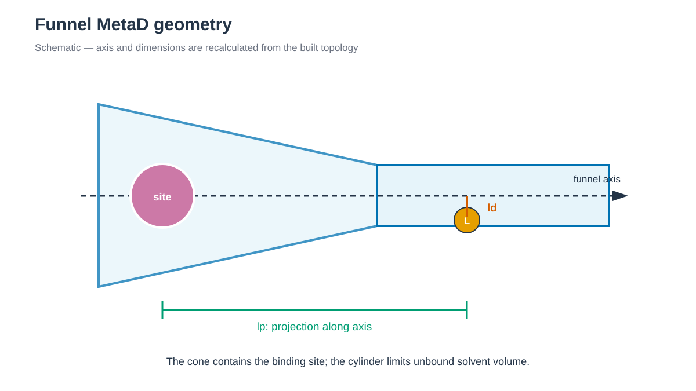

# Funnel Metadynamics / Funnel MetaD

*lp는 funnel axis 방향 이동을, ld는 axis에서 떨어진 radial distance를 나타냅니다. / lp measures motion along the funnel axis, while ld is the radial distance from it.*

## 한국어

Trypsin–benzamidine complex(PDB 3PTB)에 Funnel MetaD를 적용합니다.
Funnel-shaped restraint는 binding pocket의 넓은 cone을 solvent의 좁은
cylinder와 연결합니다. Ligand가 unbound state에서 불필요하게 넓은
solvent volume을 탐색하지 않도록 하며, `fps.lp`에 well-tempered MetaD
bias를 추가해 binding·unbinding 방향 sampling을 촉진합니다.

### Geometry

Axis는 Funnel MetaD 원 논문의 trypsin–benzamidine 정의를 3PTB에
적용합니다.

- Point A: Leu185 C, Pro225 Cα, Pro225 N의 center of mass
- Point B: Cys220 Cα, Lys224 C, Gly226 N의 center of mass
- `ZCC=1.8 nm`, `ALPHA=0.55 rad`, `RCYL=0.1 nm`
- `MINS=-0.5 nm`, `MAXS=3.7 nm`; axial wall은 -0.3, 3.5 nm

Raw 3PTB에서 A=(-2.323, 11.292, 7.015) Å, B=(-2.874, 13.242,
11.159) Å입니다. Build 후에는 tleap이 이동한 실제 coordinate에서 다시
계산합니다. Test build의 BEN COM은 `lp=1.007 nm`, `ld=0.191 nm`였고,
해당 lp의 cone radius 0.586 nm 안에 있었습니다.

### 실행

~~~bash
cd 1_Simulation/7_MetaD/7.2_funnel-MetaD
./download.sh
python3 prepare.py structure/3PTB.raw.pdb structure/complex.pdb
./build.sh structure/complex.pdb structure/BEN_ideal.sdf
./run.sh --dry-run
./run.sh
python3 anal.py
~~~

### 파일 역할

| 파일 | 역할 |
| --- | --- |
| `download.sh` | 3PTB PDB/mmCIF와 BEN SDF를 받고 checksum을 기록합니다. |
| `prepare.py` | Protein, BEN, Ca2+와 disulfide bond를 정리하고 axis residue mapping을 만듭니다. |
| `protonate_benzamidine.py` | Neutral RCSB SDF를 benzamidinium(+1)으로 바꾸는 internal helper입니다. |
| `build.sh` | BEN(+1) GAFF2/AM1-BCC parameter, ff19SB/TIP3P topology와 funnel geometry를 만듭니다. |
| `setup_funnel.py` | Topology atom index, alignment reference, axis, ligand COM과 anchor를 계산합니다. `build.sh`가 실행합니다. |
| `run.sh` | Minimization, 200 ps heating, 100 ps equilibration과 1 ns production을 실행하고 output을 `work/`에 저장합니다. |
| `anal.py` | `lp`/`ld`, funnel boundary bias, cone–cylinder crossing과 1D FES를 요약합니다. |

### 주요 option

`setup_funnel.py`는 protein Cα atom으로 `funnel-reference.pdb`를 만듭니다.
`FUNNEL_PS` alignment이 protein의 translation과 rotation을 따라가며, 가장 가까운
protein heavy atom을 `ANCHOR`로 선택합니다. `WHOLEMOLECULES`는 protein과
BEN의 periodic image를 복원합니다.

`FUNNEL` restraint의 `KAPPA=35100 kJ mol⁻¹ nm⁻²`와 geometry는
benzamidine–trypsin 참고값입니다. MetaD는 `fps.lp`에 0.05 nm width,
1.2 kJ/mol initial height, 1 ps deposition interval, `BIASFACTOR=10`을 사용합니다.
Heating과 equilibration에서 complex heavy atom restraint를 2.0에서
0.5 kcal mol⁻¹ Å⁻²로 낮춰 bound starting pose를 유지합니다.
Production은 나누지 않고 `work/`에서 1 ns를 한 번에 실행합니다. `COLVAR`,
`HILLS`도 같은 directory에 저장합니다. `FUNNEL_GRID`는 production output이
아니라 production 전에 PLUMED가 `FUNNEL` restraint를 구성하며 만드는 setup
grid입니다.

PLUMED 2.10은 `funnel` module을 기본으로 build하지 않습니다.
PLUMED를 build할 때 `./configure --enable-modules=funnel`을 사용하고 다음
command로 두 action을 확인합니다.

~~~bash
plumed manual --action FUNNEL_PS
plumed manual --action FUNNEL
~~~

`run.sh`도 simulation stage를 시작하기 전에 같은 검사를 수행합니다. PLUMED를
다시 build했다면 AMBER engine이 새 PLUMED kernel을 사용하는지도 coupled
run으로 확인합니다. 1 ns output은 workflow
학습용입니다. 충분한 bound–unbound recrossing, reweighting, uncertainty와
funnel-volume standard-state correction 없이 binding free energy로 보고하지 않습니다.

## English

This example applies Funnel MetaD to trypsin–benzamidine (PDB 3PTB). A
conical binding-site region joins a narrow bulk-solvent cylinder, while
well-tempered MetaD biases the ligand COM projection `fps.lp`.

The axis follows the original trypsin–benzamidine definition: point A is the
COM of Leu185 C, Pro225 Cα, and Pro225 N; point B is the COM of Cys220 Cα,
Lys224 C, and Gly226 N. The funnel uses `ZCC=1.8 nm`, `ALPHA=0.55 rad`,
`RCYL=0.1 nm`, and an axial grid from -0.5 to 3.7 nm. `setup_funnel.py`
recalculates the points from the built coordinates, generates a protein-Cα
alignment reference, and verifies that the initial BEN COM is inside the cone.

`build.sh` prepares benzamidinium(+1) with GAFF2/AM1-BCC and builds an
ff19SB/TIP3P system. `run.sh` performs minimization, 200 ps heating, 100 ps
equilibration, and one unsegmented 1 ns Funnel MetaD production run. The
restart, trajectory, `COLVAR`, and `HILLS` files are written directly under
`work/`. `FUNNEL_GRID` is a setup grid generated by PLUMED while parsing the
`FUNNEL` restraint before production; it is not a production-completion signal.

PLUMED must be configured with `./configure --enable-modules=funnel`. Check the
installed build with `plumed manual --action FUNNEL_PS` and
`plumed manual --action FUNNEL`. `run.sh` performs these checks before starting
any simulation stage. After rebuilding PLUMED, also verify that the AMBER engine
uses the new PLUMED kernel with a short coupled run. The 1 ns trajectory teaches
the workflow; it is not evidence of
converged binding thermodynamics without repeated recrossings, reweighting,
uncertainty analysis, and the funnel-volume standard-state correction.

## References / 참고 자료

- [Original Funnel MetaD paper](https://doi.org/10.1073/pnas.1303186110)
- [PLUMED 2.10 FUNNEL_PS](https://www.plumed.org/doc-v2.10/user-doc/html/_f_u_n_n_e_l__p_s.html)
- [PLUMED 2.10 FUNNEL](https://www.plumed.org/doc-v2.10/user-doc/html/_f_u_n_n_e_l.html)
- [PLUMED Funnel MetaD masterclass](https://www.plumed.org/doc-v2.9/user-doc/html/masterclass-22-1.html)
