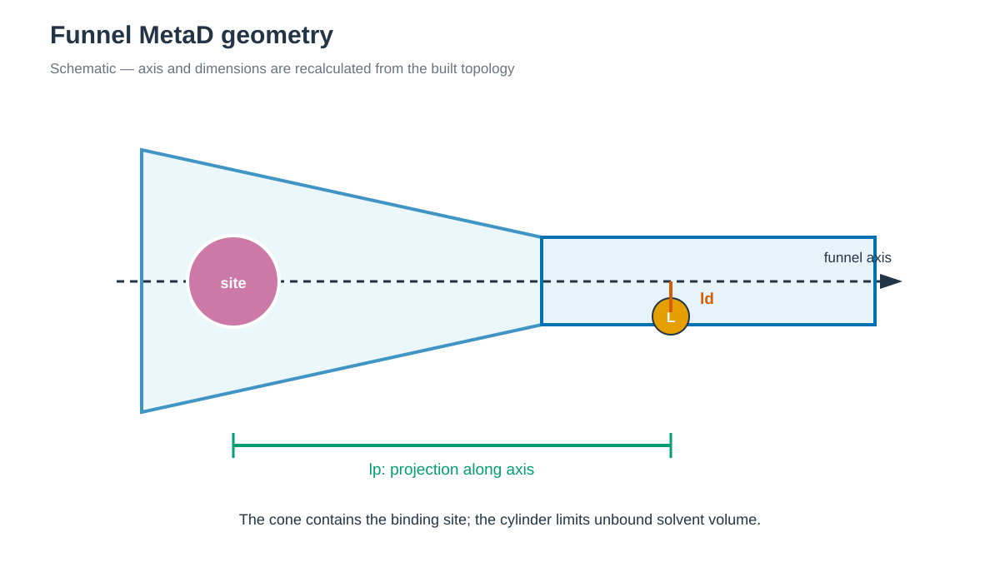

# Funnel Metadynamics / Funnel MetaD

*lp는 funnel axis 방향 이동을, ld는 axis에서 떨어진 radial distance를 나타냅니다. / lp measures motion along the funnel axis, while ld is the radial distance from it.*

## 한국어

Trypsin–benzamidine complex(PDB 3PTB)에 Funnel MetaD를 적용합니다.
Funnel-shaped restraint는 binding pocket의 넓은 cone을 solvent의 좁은
cylinder와 연결합니다. Ligand가 unbound state에서 불필요하게 넓은
solvent volume을 탐색하지 않도록 하며, `fps.lp`에 well-tempered MetaD
bias를 추가해 binding·unbinding 방향 sampling을 촉진합니다.

### Geometry

Axis는 Funnel MetaD 원 논문의 trypsin–benzamidine 정의를 3PTB에
적용합니다.

- Point A: Leu185 C, Pro225 Cα, Pro225 N의 center of mass
- Point B: Cys220 Cα, Lys224 C, Gly226 N의 center of mass
- `ZCC=1.8 nm`, `ALPHA=0.55 rad`, `RCYL=0.1 nm`
- `MINS=-0.5 nm`, `MAXS=3.7 nm`; axial wall은 -0.3, 3.5 nm

Raw 3PTB에서 A=(-2.323, 11.292, 7.015) Å, B=(-2.874, 13.242,
11.159) Å입니다. Build 후에는 tleap이 이동한 실제 coordinate에서 다시
계산합니다. Test build의 BEN COM은 `lp=1.007 nm`, `ld=0.191 nm`였고,
해당 lp의 cone radius 0.586 nm 안에 있었습니다.

### 실행

~~~bash
cd 1_Simulation/7_MetaD/7.2_funnel-MetaD
./download.sh
python3 prepare.py structure/3PTB.raw.pdb structure/complex.pdb
./build.sh structure/complex.pdb structure/BEN_ideal.sdf
./run.sh
python3 anal.py
~~~

### 파일 역할

| 파일 | 역할 |
| --- | --- |
| `download.sh` | 3PTB PDB/mmCIF와 BEN SDF를 받고 checksum을 기록합니다. |
| `prepare.py` | Protein, BEN, Ca2+와 disulfide bond를 정리하고 axis residue mapping을 만듭니다. |
| `protonate_benzamidine.py` | Neutral RCSB SDF를 benzamidinium(+1)으로 바꾸는 internal helper입니다. |
| `build.sh` | BEN(+1) GAFF2/AM1-BCC parameter, ff19SB/OPC topology와 funnel geometry를 만듭니다. |
| `setup_funnel.py` | Topology atom index, alignment reference, axis, ligand COM과 anchor를 계산합니다. `build.sh`가 실행합니다. |
| `run.sh` | Minimization, 200 ps heating, 100 ps equilibration과 1 ns production을 실행하고 output을 `work/`에 저장합니다. |
| `anal.py` | `lp`/`ld`, funnel boundary bias, cone–cylinder crossing과 1D FES를 요약합니다. |

### 주요 option

`setup_funnel.py`는 protein Cα atom으로 `funnel-reference.pdb`를 만듭니다.
`FUNNEL_PS` alignment이 protein의 translation과 rotation을 따라가며, 가장 가까운
protein heavy atom을 `ANCHOR`로 선택합니다. `WHOLEMOLECULES`는 protein과
BEN의 periodic image를 복원합니다.

`FUNNEL` restraint의 `KAPPA=35100 kJ mol⁻¹ nm⁻²`와 geometry는
benzamidine–trypsin 참고값입니다. MetaD는 `fps.lp`에 0.05 nm width,
1.2 kJ/mol initial height, 1 ps deposition interval, `BIASFACTOR=10`을 사용합니다.
Heating과 equilibration에서 complex heavy atom restraint를 2.0에서
0.5 kcal mol⁻¹ Å⁻²로 낮춰 bound starting pose를 유지합니다.
Production은 `work/`에서 1 ns를 실행합니다. `COLVAR`,
`HILLS`도 같은 directory에 저장합니다. `FUNNEL_GRID`는 production output이
아니라 production 전에 PLUMED가 `FUNNEL` restraint를 구성하며 만드는 setup
grid입니다.

PLUMED 2.10은 `funnel` module을 기본으로 build하지 않습니다.
PLUMED를 build할 때 `./configure --enable-modules=funnel`을 사용하고 다음
command로 두 action을 확인합니다.

~~~bash
plumed manual --action FUNNEL_PS
plumed manual --action FUNNEL
~~~

`run.sh`도 simulation stage를 시작하기 전에 같은 검사를 수행합니다. PLUMED를
다시 build했다면 AMBER engine이 새 PLUMED kernel을 사용하는지도 coupled
run으로 확인합니다. 1 ns output은 workflow
학습용입니다. 충분한 bound–unbound recrossing, reweighting, uncertainty와
funnel-volume standard-state correction 없이 binding free energy로 보고하지 않습니다.

Build는 기존 topology/restart file이 있으면 input을 변경하기 전에 중단하고 파일을 보존합니다. 새 build 전에는 기존 `work/`를 다른 위치에 보관하거나 별도 tutorial 사본을 사용합니다.

### Analysis 결과 저장

`anal.py`는 diagnostic TSV와 새 FES를 별도 temporary generation에서 만들고
확인한 뒤 `work/analysis/`을 교체합니다. `sum_hills`가 exit 0을 반환해도
새 `fes.dat`이 없거나 비어 있으면 실패로 처리하고 이전 결과를 유지합니다.
`--skip-fes`의 새 결과에는 과거 FES를 포함하지 않습니다.

자동 호출되는 `helpers/result_generation.py`가 완료한 output hash를
`analysis/.generation.json`에 기록합니다. 게시가 중단되어
`work/.analysis.pending`이 남으면 재실행을 거부합니다. 실행 process가 종료됐는지
확인한 뒤 marker의 previous/new directory를 보존하고 검사합니다.

## English

This example applies Funnel MetaD to trypsin–benzamidine (PDB 3PTB). A
conical binding-site region joins a narrow bulk-solvent cylinder, while
well-tempered MetaD biases the ligand COM projection `fps.lp`.

The axis follows the original trypsin–benzamidine definition: point A is the
COM of Leu185 C, Pro225 Cα, and Pro225 N; point B is the COM of Cys220 Cα,
Lys224 C, and Gly226 N. The funnel uses `ZCC=1.8 nm`, `ALPHA=0.55 rad`,
`RCYL=0.1 nm`, and an axial grid from -0.5 to 3.7 nm. `setup_funnel.py`
recalculates the points from the built coordinates, generates a protein-Cα
alignment reference, and verifies that the initial BEN COM is inside the cone.

`build.sh` prepares benzamidinium(+1) with GAFF2/AM1-BCC and builds an
ff19SB/OPC system. `run.sh` performs minimization, 200 ps heating, 100 ps
equilibration, and one 1 ns Funnel MetaD production run. The
restart, trajectory, `COLVAR`, and `HILLS` files are written directly under
`work/`. `FUNNEL_GRID` is a setup grid generated by PLUMED while parsing the
`FUNNEL` restraint before production; it is not a production-completion signal.

PLUMED must be configured with `./configure --enable-modules=funnel`. Check the
installed build with `plumed manual --action FUNNEL_PS` and
`plumed manual --action FUNNEL`. `run.sh` performs these checks before starting
any simulation stage. After rebuilding PLUMED, also verify that the AMBER engine
uses the new PLUMED kernel with a short coupled run. The 1 ns trajectory teaches
the workflow; it is not evidence of
converged binding thermodynamics without repeated recrossings, reweighting,
uncertainty analysis, and the funnel-volume standard-state correction.

### Analysis result storage

`anal.py` creates diagnostic TSV files and a fresh FES in a separate temporary
generation before replacing `work/analysis/`. An exit-zero `sum_hills` that
creates no nonempty `fes.dat` is a failure and preserves previous results.
A new `--skip-fes` generation does not retain the old FES.

The automatically called `helpers/result_generation.py` records output hashes
in `analysis/.generation.json`. Interrupted publication leaves
`work/.analysis.pending` and blocks reruns. Check that the process has ended,
then preserve and inspect the previous/new directories listed in the marker.

## References / 참고 자료

- [Original Funnel MetaD paper](https://doi.org/10.1073/pnas.1303186110)
- [PLUMED 2.10 FUNNEL_PS](https://www.plumed.org/doc-v2.10/user-doc/html/_f_u_n_n_e_l__p_s.html)
- [PLUMED 2.10 FUNNEL](https://www.plumed.org/doc-v2.10/user-doc/html/_f_u_n_n_e_l.html)
- [PLUMED Funnel MetaD masterclass](https://www.plumed.org/doc-v2.9/user-doc/html/masterclass-22-1.html)

Build stops before changing inputs when topology/restart files already exist, preserving those files. Preserve the existing `work/` elsewhere or use a separate tutorial copy before a new build.

### 동시 실행과 input 변경

Build와 run은 `work.writers/` registry를 공유합니다. 같은 output/state를 쓰는 작업은 동시에 실행하지 않습니다. `prepare.py`가 있는 경우 structure를 생성하는 작업도 input을 읽는 build와 충돌하면 거부합니다.

Run은 재사용할 결과의 input을 SHA256으로 비교합니다. Topology, 최초 coordinate file, stage input, predecessor restart와 restraint가 바뀌거나 기존 결과에 identity 기록이 없으면 파일을 보존하고 거부합니다. 이 tutorial은 고정 경로를 사용하므로 변경된 계산은 새 directory에 tutorial을 복사해 시작합니다.

정상 종료, command 실패와 INT/TERM에서는 자식 process의 종료를 확인한 뒤 자기 lock만 해제합니다. SIGKILL이나 node 장애로 남은 lock은 자동 삭제하지 않습니다. Error에 표시된 lock과 `owner.json`의 host, PID, command, scope를 확인하고 scheduler와 해당 host에서 모든 writer와 자식 process가 종료됐는지 확인한 뒤 그 lock directory만 수동 제거합니다. PID가 로컬에서 보이지 않는다는 이유만으로 제거하지 않습니다. `.gate/`도 같은 확인이 필요합니다.

지원하는 `--dry-run`과 `--help`는 보호나 identity 파일을 생성하지 않습니다. 진행 중인 work를 이동하거나 identity를 수정해 재사용하지 않습니다. 보호는 로컬 filesystem과 로컬 자식 process로 검증했으며 network filesystem, remote MPI와 다른 node의 writer 종료는 미검증입니다.

### Concurrent runs and input changes

Build and run share the `work.writers/` registry and reject concurrent writers to the same output/state. Where present, `prepare.py` also rejects structure writes that overlap an active build reader.

Run compares inputs for result reuse with SHA256. Changed topology, initial coordinates, stage input, predecessor restart or restraint, and results without identity records, are preserved and rejected. This tutorial uses fixed paths; start changed calculations in a new tutorial copy.

Normal exit, command failure and INT/TERM release only the owned lock after child termination is verified. Locks left by SIGKILL or node failure are retained. Inspect the reported lock and its `owner.json` host, PID, command and scopes; confirm through the scheduler and owning host that all writers and children stopped before manually removing only that lock directory. A PID missing locally is not sufficient. Apply the same checks to `.gate/`.

Supported `--dry-run` and `--help` do not create writer or identity files. Do not move active work trees or edit identities to reuse results. Protection was tested on a local filesystem with local child processes; network filesystems, remote MPI and termination of writers on other nodes remain unverified.

### Stage 완료 판정 / Stage completion

Input identity는 입력이 같은지 확인하며 engine의 성공 종료를 증명하지 않습니다.
Runner가 engine의 성공 종료와 필수 output을 확인한 뒤 만든 완료 증거가 있어야
stage를 재사용합니다. Output이 남았지만 완료 증거가 없거나 필수 output이
누락·비어 있으면 기존 결과를 보존하고 중단합니다. 기존 결과를 소급 인증하지
않습니다. 새 계산은 생성된 `work/`를 포함하지 않는 새 tutorial copy에서 시작합니다.
`ntwx=0`인 AMBER stage는 trajectory를 완료 조건으로 요구하지 않습니다.
지원되는 continuation은 기존 restart/state 전달 방식을 따릅니다.

Input identity checks unchanged inputs; it does not prove a successful engine exit.
A stage is reused only with completion evidence written after a successful engine
exit and required-output checks. Outputs without that evidence, or missing/empty
required outputs, are preserved and rejected. Existing results are not certified
retroactively. Start a new tutorial copy without generated `work/` directories for
a new calculation. AMBER stages with `ntwx=0` do not require a trajectory for
completion. Supported continuation retains its existing restart/state handoff.
