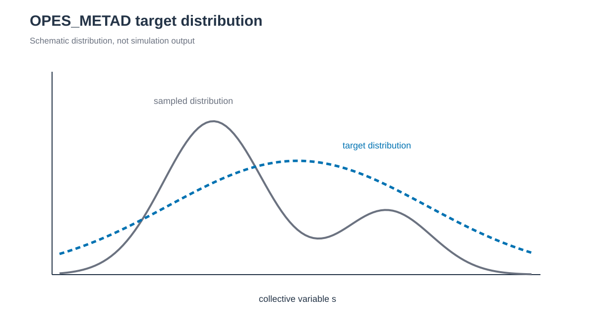

# OPES_METAD



*OPES는 sampled distribution을 추정하고 선택한 target distribution을 향하는 bias를 갱신합니다. / OPES estimates the sampled distribution and updates a bias toward the selected target distribution.*


## 한국어

OPES_METAD는 simulation 중에 CV distribution을 추정하고, 설정한 barrier 안에서
target distribution에 접근하도록 bias를 갱신합니다. 여기서는 alanine
dipeptide의 φ와 ψ를 bias합니다.

```bash
cd 1_Simulation/7_MetaD/7.3_OPES_METAD
./build.sh structure/alanine-dipeptide.pdb
./run.sh --dry-run
./run.sh
python3 anal.py
```

### Script 역할

| File | 역할 |
|---|---|
| `build.sh` | Argument로 받은 capped alanine PDB의 ff19SB/TIP3P topology를 만들고 CV atom을 확인합니다. |
| `check_topology.py` | `build.sh`가 자동 호출하며 CV atom 번호와 이름을 검사합니다. |
| `run.sh` | preparation stage와 1 ns OPES_METAD production을 실행합니다. |
| `anal.py` | φ/ψ, bias, effective sample size와 kernel 수를 production 전체에서 요약합니다. |

### 주요 option

`PACE=500`은 1 ps update interval입니다. `BARRIER=50` kJ/mol은 채우려는 최대
free-energy barrier를 제한하며 simulation 온도와 system에 맞춰 정해야 합니다.
`SIGMA=0.15` radian은 두 torsion의 initial kernel width입니다. `opes.rct`는
reweighting에 쓰는 offset이고 bias 자체가 아닙니다.

Production은 나누지 않고 `work/`에서 1 ns를 한 번에 실행합니다.
`STATE_WFILE=opes.state`는 마지막 adaptive state를 저장하고 `KERNELS`는
읽을 수 있는 kernel history를 기록합니다. Restart, trajectory, `COLVAR`,
`KERNELS`와 `opes.state`는 모두 `work/`에 저장합니다.

PLUMED 2.10은 `opes` module을 기본으로 build하지 않습니다. PLUMED configure에
`--enable-modules=opes`를 추가하고 실행 전에 action을 확인합니다.

```bash
plumed manual --action OPES_METAD
```

`run.sh`는 같은 검사를 수행합니다. Parse-only 검사는 별도 임시 filename을
사용하므로 production의 `KERNELS`, `opes.state`와 `COLVAR`를 생성하거나
partial production으로 판정하지 않습니다.

이 example은 adaptive state와 restart를 학습하는 용도입니다. 1 ns 결과로
정량 free energy나 수렴을 판단하지 않습니다. Keyword는 PLUMED 2.10
[`OPES_METAD`](https://www.plumed.org/doc-v2.10/user-doc/html/_o_p_e_s__m_e_t_a_d.html)를
기준으로 작성했습니다.

## English

`build.sh structure/alanine-dipeptide.pdb` builds the solvated system from the
supplied PDB. OPES_METAD adaptively estimates the φ/ψ distribution and builds a bias bounded
by `BARRIER=50` kJ/mol. `PACE=500` updates the bias every 1 ps, and the initial
kernel widths are 0.15 rad. The unsegmented 1 ns production writes its restart,
trajectory, `COLVAR`, `KERNELS`, and final `opes.state` directly under `work/`.
`anal.py` reports CV, bias, effective-sample-size, and kernel-count diagnostics.
PLUMED 2.10 must be configured with `--enable-modules=opes`; verify the action
with `plumed manual --action OPES_METAD`. The parse-only check uses separate
temporary filenames and cannot be mistaken for partial production. The 1 ns
example is not a converged free-energy calculation.
