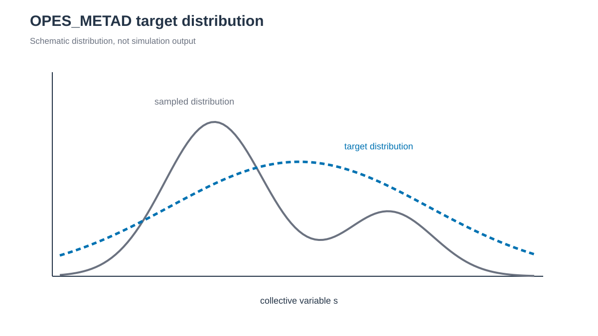

# OPES_METAD



*방문한 CV data로 `P_n(s)`를 먼저 추정한 뒤 well-tempered target에 필요한 bias를 계산합니다. / Visited CV data first estimate `P_n(s)`, from which the bias required for a well-tempered target is calculated.*


## 한국어

MetaD가 방문한 CV 위치에 bias를 직접 누적한다면, OPES_METAD는 방문 data를
reweighting하고 kernel density estimate를 사용해 unbiased probability
distribution `P_n(s)`를 먼저 추정합니다. 이어서 well-tempered target
distribution을 sampling하는 데 필요한 bias를 계산합니다. 여기서는 alanine
dipeptide의 φ와 ψ를 bias합니다.

```bash
cd 1_Simulation/7_MetaD/7.3_OPES_METAD
./build.sh structure/alanine-dipeptide.pdb
./run.sh
python3 anal.py
```

### Script 역할

| File | 역할 |
|---|---|
| `build.sh` | Argument로 받은 capped alanine PDB의 ff19SB/OPC topology를 만들고 CV atom을 확인합니다. |
| `check_topology.py` | `build.sh`가 자동 호출하며 CV atom 번호와 이름을 검사합니다. |
| `run.sh` | preparation stage와 1 ns OPES_METAD production을 실행합니다. |
| `anal.py` | φ/ψ, bias, effective sample size와 kernel 수를 production 전체에서 요약합니다. |

### 주요 option

`PACE=500`은 1 ps update interval입니다. `BARRIER=50` kJ/mol은 채우려는 최대
free-energy barrier를 제한하며 simulation 온도와 system에 맞춰 정해야 합니다.
`SIGMA=0.15` radian은 두 torsion의 initial kernel width입니다. `opes.rct`는
reweighting에 쓰는 offset이고 bias 자체가 아닙니다.

100 ps NPT equilibration은 `skinnb=5.0 Å`로 GPU pair-list 여유를 늘립니다.
같은 solvent box를 사용하는 WT-MetaD에서 확인한 설정이며 실제 cutoff는
`cut=10.0 Å`로 유지됩니다.

Production은 `work/`에서 1 ns를 실행합니다.
`STATE_WFILE=opes.state`는 마지막 adaptive state를 저장하고 `KERNELS`는
distribution estimate에 사용된 compressed kernel history를 기록합니다.
각 kernel을 MetaD hill과 같은 direct bias deposit으로 해석하지 않습니다.
Restart, trajectory, `COLVAR`,
`KERNELS`와 `opes.state`는 모두 `work/`에 저장합니다.

PLUMED 2.10은 `opes` module을 기본으로 build하지 않습니다. PLUMED configure에
`--enable-modules=opes`를 추가하고 실행 전에 action을 확인합니다.

```bash
plumed manual --action OPES_METAD
```

`run.sh`는 같은 검사를 수행합니다. Parse-only 검사는 별도 임시 filename을
사용하므로 production의 `KERNELS`, `opes.state`와 `COLVAR`를 생성하거나
partial production으로 판정하지 않습니다.

이 example은 adaptive state와 restart를 학습하는 용도입니다. 1 ns 결과로
정량 free energy나 수렴을 판단하지 않습니다. Keyword는 PLUMED 2.10
[`OPES_METAD`](https://www.plumed.org/doc-v2.10/user-doc/html/_o_p_e_s__m_e_t_a_d.html)를
기준으로 작성했습니다.

Build는 기존 topology/restart file이 있으면 input을 변경하기 전에 중단하고 파일을 보존합니다. 새 build 전에는 기존 `work/`를 다른 위치에 보관하거나 별도 tutorial 사본을 사용합니다.

## English

`build.sh structure/alanine-dipeptide.pdb` builds the solvated system from the
supplied PDB. Unlike MetaD, which directly accumulates bias at visited CV
positions, OPES_METAD reweights the visited data and uses a kernel-density
estimate of the unbiased `P_n(s)`. It then calculates the bias required for a
well-tempered target distribution, bounded here by `BARRIER=50` kJ/mol.
`PACE=500` updates the estimate and bias every 1 ps, and the initial
kernel widths are 0.15 rad. The 1 ns production writes its restart,
trajectory, `COLVAR`, `KERNELS`, and final `opes.state` directly under `work/`.
`KERNELS` records the compressed density-estimation history, not direct MetaD
hill deposits.
The 100 ps NPT equilibration uses `skinnb=5.0 Å` to enlarge the GPU pair-list
margin while retaining the physical `cut=10.0 Å` cutoff.
`anal.py` reports CV, bias, effective-sample-size, and kernel-count diagnostics.
PLUMED 2.10 must be configured with `--enable-modules=opes`; verify the action
with `plumed manual --action OPES_METAD`. The parse-only check uses separate
temporary filenames and cannot be mistaken for partial production. The 1 ns
example is not a converged free-energy calculation.

Build stops before changing inputs when topology/restart files already exist, preserving those files. Preserve the existing `work/` elsewhere or use a separate tutorial copy before a new build.

### 동시 실행과 input 변경

Build와 run은 `work.writers/` registry를 공유합니다. 같은 output/state를 쓰는 작업은 동시에 실행하지 않습니다. `prepare.py`가 있는 경우 structure를 생성하는 작업도 input을 읽는 build와 충돌하면 거부합니다.

Run은 재사용할 결과의 input을 SHA256으로 비교합니다. Topology, 최초 coordinate file, stage input, predecessor restart와 restraint가 바뀌거나 기존 결과에 identity 기록이 없으면 파일을 보존하고 거부합니다. 이 tutorial은 고정 경로를 사용하므로 변경된 계산은 새 directory에 tutorial을 복사해 시작합니다.

정상 종료, command 실패와 INT/TERM에서는 자식 process의 종료를 확인한 뒤 자기 lock만 해제합니다. SIGKILL이나 node 장애로 남은 lock은 자동 삭제하지 않습니다. Error에 표시된 lock과 `owner.json`의 host, PID, command, scope를 확인하고 scheduler와 해당 host에서 모든 writer와 자식 process가 종료됐는지 확인한 뒤 그 lock directory만 수동 제거합니다. PID가 로컬에서 보이지 않는다는 이유만으로 제거하지 않습니다. `.gate/`도 같은 확인이 필요합니다.

지원하는 `--dry-run`과 `--help`는 보호나 identity 파일을 생성하지 않습니다. 진행 중인 work를 이동하거나 identity를 수정해 재사용하지 않습니다. 보호는 로컬 filesystem과 로컬 자식 process로 검증했으며 network filesystem, remote MPI와 다른 node의 writer 종료는 미검증입니다.

### Concurrent runs and input changes

Build and run share the `work.writers/` registry and reject concurrent writers to the same output/state. Where present, `prepare.py` also rejects structure writes that overlap an active build reader.

Run compares inputs for result reuse with SHA256. Changed topology, initial coordinates, stage input, predecessor restart or restraint, and results without identity records, are preserved and rejected. This tutorial uses fixed paths; start changed calculations in a new tutorial copy.

Normal exit, command failure and INT/TERM release only the owned lock after child termination is verified. Locks left by SIGKILL or node failure are retained. Inspect the reported lock and its `owner.json` host, PID, command and scopes; confirm through the scheduler and owning host that all writers and children stopped before manually removing only that lock directory. A PID missing locally is not sufficient. Apply the same checks to `.gate/`.

Supported `--dry-run` and `--help` do not create writer or identity files. Do not move active work trees or edit identities to reuse results. Protection was tested on a local filesystem with local child processes; network filesystems, remote MPI and termination of writers on other nodes remain unverified.

### Stage 완료 판정 / Stage completion

Input identity는 입력이 같은지 확인하며 engine의 성공 종료를 증명하지 않습니다.
Runner가 engine의 성공 종료와 필수 output을 확인한 뒤 만든 완료 증거가 있어야
stage를 재사용합니다. Output이 남았지만 완료 증거가 없거나 필수 output이
누락·비어 있으면 기존 결과를 보존하고 중단합니다. 기존 결과를 소급 인증하지
않습니다. 새 계산은 생성된 `work/`를 포함하지 않는 새 tutorial copy에서 시작합니다.
`ntwx=0`인 AMBER stage는 trajectory를 완료 조건으로 요구하지 않습니다.
지원되는 continuation은 기존 restart/state 전달 방식을 따릅니다.

Input identity checks unchanged inputs; it does not prove a successful engine exit.
A stage is reused only with completion evidence written after a successful engine
exit and required-output checks. Outputs without that evidence, or missing/empty
required outputs, are preserved and rejected. Existing results are not certified
retroactively. Start a new tutorial copy without generated `work/` directories for
a new calculation. AMBER stages with `ntwx=0` do not require a trajectory for
completion. Supported continuation retains its existing restart/state handoff.
