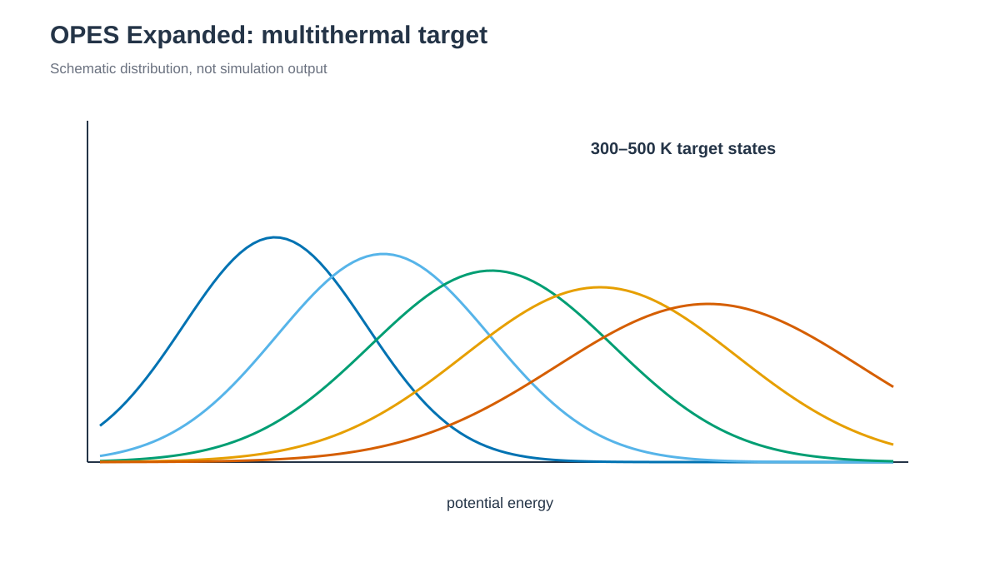

# OPES Expanded Multithermal



*Potential-energy 공간에서 여러 temperature state를 잇는 target distribution을 구성합니다. / A target distribution connects multiple temperature states in potential-energy space.*


## 한국어

OPES_EXPANDED와 `ECV_MULTITHERMAL`을 연결해 300–500 K의 potential-energy
distribution을 한 simulation에서 sampling합니다. Temperature replica를 만드는
REMD와 달리 하나의 walker가 expanded target distribution을 따라갑니다.

```bash
cd 1_Simulation/7_MetaD/7.4_OPES_EXPANDED
./build.sh structure/alanine-dipeptide.pdb
./run.sh --dry-run
./run.sh
python3 anal.py
```

### Script 역할

| File | 역할 |
|---|---|
| `build.sh` | Argument로 받은 capped alanine PDB에서 ff19SB/TIP3P system을 생성합니다. |
| `check_topology.py` | `build.sh`가 자동 호출하며 capped peptide atom ordering을 검사합니다. |
| `run.sh` | NPT equilibration 후 fixed-volume multithermal production을 1 ns로 실행합니다. |
| `anal.py` | potential energy, expanded CV, bias 범위와 `DELTAFS` state 수를 기록합니다. |

### 주요 option

`TEMP=300` K는 실제 thermostat 온도입니다. `TEMP_MIN=300` K와
`TEMP_MAX=500` K는 target multithermal range이며 production은 `ntb=1`,
`ntp=0`으로 box volume을 고정합니다. `PACE=500`은 1 ps마다 OPES estimate를
갱신합니다. 자동 temperature grid를 사용하므로 state 수는 생성된 `DELTAFS`에서
확인합니다.

Production 전 100 ps NPT equilibration은 `skinnb=5.0 Å`로 GPU pair-list 여유를
늘립니다. 같은 solvent box를 사용하는 WT-MetaD에서 확인한 설정이며 실제
cutoff는 `cut=10.0 Å`로 유지됩니다.

Production은 나누지 않고 `work/`에서 1 ns를 한 번에 실행하며 `opes.state`와
`DELTAFS`를 같은 directory에 저장합니다. `anal.py`가 출력하는 `ecv.ene`는
expanded CV이며 instantaneous physical temperature가 아닙니다.
Temperature별 observable은 별도 reweighting이 필요합니다.

PLUMED 2.10은 `opes` module을 기본으로 build하지 않습니다. PLUMED configure에
`--enable-modules=opes`를 추가하고 실행 전에 두 action을 확인합니다.

```bash
plumed manual --action ECV_MULTITHERMAL
plumed manual --action OPES_EXPANDED
```

`run.sh`는 같은 검사를 수행합니다. Parse-only 검사는 별도 임시 filename을
사용하므로 production의 `DELTAFS`, `opes.state`와 `COLVAR`를 생성하거나
partial production으로 판정하지 않습니다.

1 ns는 state 파일과 fixed-volume workflow를 학습하기 위한 길이입니다.
Keyword는 PLUMED 2.10
[`OPES_EXPANDED`](https://www.plumed.org/doc-v2.10/user-doc/html/_o_p_e_s__e_x_p_a_n_d_e_d.html)와
[`ECV_MULTITHERMAL`](https://www.plumed.org/doc-v2.10/user-doc/html/_e_c_v__m_u_l_t_i_t_h_e_r_m_a_l.html)을
기준으로 작성했습니다.

## English

`build.sh structure/alanine-dipeptide.pdb` builds the solvated system from the
supplied PDB. This example combines OPES_EXPANDED with `ECV_MULTITHERMAL` to sample a
300–500 K potential-energy target using one walker. The thermostat remains at
300 K. The 100 ps NPT equilibration uses `skinnb=5.0 Å` to enlarge the GPU
pair-list margin while retaining `cut=10.0 Å`; production then uses a fixed box
(`ntb=1`, `ntp=0`). The unsegmented
1 ns production writes its restart, trajectory, `COLVAR`, `opes.state`, and
`DELTAFS` directly under `work/`. `ecv.ene` is an expanded CV, not an
instantaneous physical temperature; temperature-resolved observables require
separate reweighting. PLUMED 2.10 must be configured with
`--enable-modules=opes`; verify `ECV_MULTITHERMAL` and `OPES_EXPANDED` with
`plumed manual --action ACTION`. The parse-only check uses separate temporary
filenames and cannot be mistaken for partial production. The 1 ns run is a
workflow example.
