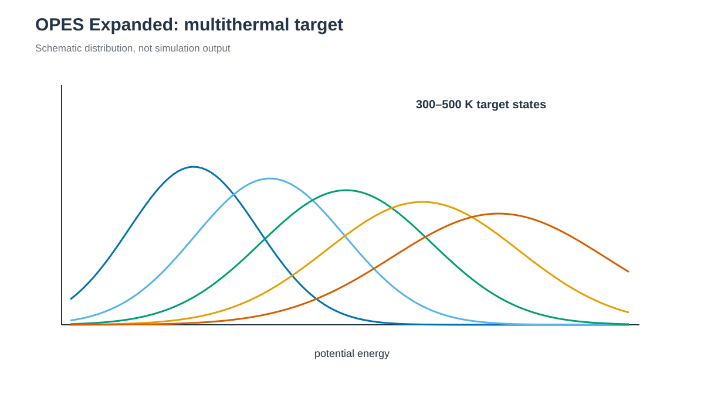

# OPES Expanded Multithermal



*Potential-energy sample로 `ΔF_n(T)`를 추정한 뒤 300–500 K expanded target에 필요한 bias를 계산합니다. / Potential-energy samples estimate `ΔF_n(T)`, from which the bias for a 300–500 K expanded target is calculated.*


## 한국어

OPES_EXPANDED와 `ECV_MULTITHERMAL`을 연결해 300–500 K의 potential-energy
distribution을 한 simulation에서 sampling합니다. Temperature replica를 만드는
REMD와 달리 하나의 walker가 expanded target distribution을 따라갑니다.
OPES_METAD처럼 CV probability distribution을 kernel density estimate로
구성하지 않습니다. Potential-energy data로 temperature state별 free-energy
offset `ΔF_n(T)`를 추정하고, 이 state들을 잇는 multithermal bias를 계산합니다.

```bash
cd 1_Simulation/7_MetaD/7.4_OPES_EXPANDED
./build.sh structure/alanine-dipeptide.pdb
./run.sh
python3 anal.py
```

### Script 역할

| File | 역할 |
|---|---|
| `build.sh` | Argument로 받은 capped alanine PDB에서 ff19SB/OPC system을 생성합니다. |
| `check_topology.py` | `build.sh`가 자동 호출하며 capped peptide atom ordering을 검사합니다. |
| `run.sh` | NPT equilibration 후 fixed-volume multithermal production을 1 ns로 실행합니다. |
| `anal.py` | potential energy, expanded CV, bias 범위와 `DELTAFS` state 수를 기록합니다. |

### 주요 option

`TEMP=300` K는 실제 thermostat 온도입니다. `TEMP_MIN=300` K와
`TEMP_MAX=500` K는 target multithermal range이며 production은 `ntb=1`,
`ntp=0`으로 box volume을 고정합니다. `PACE=500`은 1 ps마다 OPES estimate를
갱신합니다. 자동 temperature grid를 사용하므로 state 수는 생성된 `DELTAFS`에서
확인합니다.

Production 전 100 ps NPT equilibration은 `skinnb=5.0 Å`로 GPU pair-list 여유를
늘립니다. 같은 solvent box를 사용하는 WT-MetaD에서 확인한 설정이며 실제
cutoff는 `cut=10.0 Å`로 유지됩니다.

Production은 `work/`에서 1 ns를 실행하며 `opes.state`와
`DELTAFS`를 같은 directory에 저장합니다. `anal.py`가 출력하는 `ecv.ene`는
expanded CV이며 instantaneous physical temperature가 아닙니다.
Temperature별 observable은 별도 reweighting이 필요합니다.

PLUMED 2.10은 `opes` module을 기본으로 build하지 않습니다. PLUMED configure에
`--enable-modules=opes`를 추가하고 실행 전에 두 action을 확인합니다.

```bash
plumed manual --action ECV_MULTITHERMAL
plumed manual --action OPES_EXPANDED
```

`run.sh`는 같은 검사를 수행합니다. Parse-only 검사는 별도 임시 filename을
사용하므로 production의 `DELTAFS`, `opes.state`와 `COLVAR`를 생성하거나
partial production으로 판정하지 않습니다.

1 ns는 state 파일과 fixed-volume workflow를 학습하기 위한 길이입니다.
Keyword는 PLUMED 2.10
[`OPES_EXPANDED`](https://www.plumed.org/doc-v2.10/user-doc/html/_o_p_e_s__e_x_p_a_n_d_e_d.html)와
[`ECV_MULTITHERMAL`](https://www.plumed.org/doc-v2.10/user-doc/html/_e_c_v__m_u_l_t_i_t_h_e_r_m_a_l.html)을
기준으로 작성했습니다.

Build는 기존 topology/restart file이 있으면 input을 변경하기 전에 중단하고 파일을 보존합니다. 새 build 전에는 기존 `work/`를 다른 위치에 보관하거나 별도 tutorial 사본을 사용합니다.

## English

`build.sh structure/alanine-dipeptide.pdb` builds the solvated system from the
supplied PDB. This example combines OPES_EXPANDED with `ECV_MULTITHERMAL` to sample a
300–500 K potential-energy target using one walker. The thermostat remains at
300 K. Unlike OPES_METAD, OPES_EXPANDED does not construct a kernel-density
estimate of a CV probability distribution. It estimates the temperature-state
free-energy offsets `ΔF_n(T)` from potential-energy samples and calculates the
multithermal bias that connects those states. The 100 ps NPT equilibration uses `skinnb=5.0 Å` to enlarge the GPU
pair-list margin while retaining `cut=10.0 Å`; production then uses a fixed box
(`ntb=1`, `ntp=0`). The
1 ns production writes its restart, trajectory, `COLVAR`, `opes.state`, and
`DELTAFS` directly under `work/`. `ecv.ene` is an expanded CV, not an
instantaneous physical temperature; temperature-resolved observables require
separate reweighting. PLUMED 2.10 must be configured with
`--enable-modules=opes`; verify `ECV_MULTITHERMAL` and `OPES_EXPANDED` with
`plumed manual --action ACTION`. The parse-only check uses separate temporary
filenames and cannot be mistaken for partial production. The 1 ns run is a
workflow example.

Build stops before changing inputs when topology/restart files already exist, preserving those files. Preserve the existing `work/` elsewhere or use a separate tutorial copy before a new build.

### 동시 실행과 input 변경

Build와 run은 `work.writers/` registry를 공유합니다. 같은 output/state를 쓰는 작업은 동시에 실행하지 않습니다. `prepare.py`가 있는 경우 structure를 생성하는 작업도 input을 읽는 build와 충돌하면 거부합니다.

Run은 재사용할 결과의 input을 SHA256으로 비교합니다. Topology, 최초 coordinate file, stage input, predecessor restart와 restraint가 바뀌거나 기존 결과에 identity 기록이 없으면 파일을 보존하고 거부합니다. 이 tutorial은 고정 경로를 사용하므로 변경된 계산은 새 directory에 tutorial을 복사해 시작합니다.

정상 종료, command 실패와 INT/TERM에서는 자식 process의 종료를 확인한 뒤 자기 lock만 해제합니다. SIGKILL이나 node 장애로 남은 lock은 자동 삭제하지 않습니다. Error에 표시된 lock과 `owner.json`의 host, PID, command, scope를 확인하고 scheduler와 해당 host에서 모든 writer와 자식 process가 종료됐는지 확인한 뒤 그 lock directory만 수동 제거합니다. PID가 로컬에서 보이지 않는다는 이유만으로 제거하지 않습니다. `.gate/`도 같은 확인이 필요합니다.

지원하는 `--dry-run`과 `--help`는 보호나 identity 파일을 생성하지 않습니다. 진행 중인 work를 이동하거나 identity를 수정해 재사용하지 않습니다. 보호는 로컬 filesystem과 로컬 자식 process로 검증했으며 network filesystem, remote MPI와 다른 node의 writer 종료는 미검증입니다.

### Concurrent runs and input changes

Build and run share the `work.writers/` registry and reject concurrent writers to the same output/state. Where present, `prepare.py` also rejects structure writes that overlap an active build reader.

Run compares inputs for result reuse with SHA256. Changed topology, initial coordinates, stage input, predecessor restart or restraint, and results without identity records, are preserved and rejected. This tutorial uses fixed paths; start changed calculations in a new tutorial copy.

Normal exit, command failure and INT/TERM release only the owned lock after child termination is verified. Locks left by SIGKILL or node failure are retained. Inspect the reported lock and its `owner.json` host, PID, command and scopes; confirm through the scheduler and owning host that all writers and children stopped before manually removing only that lock directory. A PID missing locally is not sufficient. Apply the same checks to `.gate/`.

Supported `--dry-run` and `--help` do not create writer or identity files. Do not move active work trees or edit identities to reuse results. Protection was tested on a local filesystem with local child processes; network filesystems, remote MPI and termination of writers on other nodes remain unverified.

### Stage 완료 판정 / Stage completion

Input identity는 입력이 같은지 확인하며 engine의 성공 종료를 증명하지 않습니다.
Runner가 engine의 성공 종료와 필수 output을 확인한 뒤 만든 완료 증거가 있어야
stage를 재사용합니다. Output이 남았지만 완료 증거가 없거나 필수 output이
누락·비어 있으면 기존 결과를 보존하고 중단합니다. 기존 결과를 소급 인증하지
않습니다. 새 계산은 생성된 `work/`를 포함하지 않는 새 tutorial copy에서 시작합니다.
`ntwx=0`인 AMBER stage는 trajectory를 완료 조건으로 요구하지 않습니다.
지원되는 continuation은 기존 restart/state 전달 방식을 따릅니다.

Input identity checks unchanged inputs; it does not prove a successful engine exit.
A stage is reused only with completion evidence written after a successful engine
exit and required-output checks. Outputs without that evidence, or missing/empty
required outputs, are preserved and rejected. Existing results are not certified
retroactively. Start a new tutorial copy without generated `work/` directories for
a new calculation. AMBER stages with `ntwx=0` do not require a trajectory for
completion. Supported continuation retains its existing restart/state handoff.
