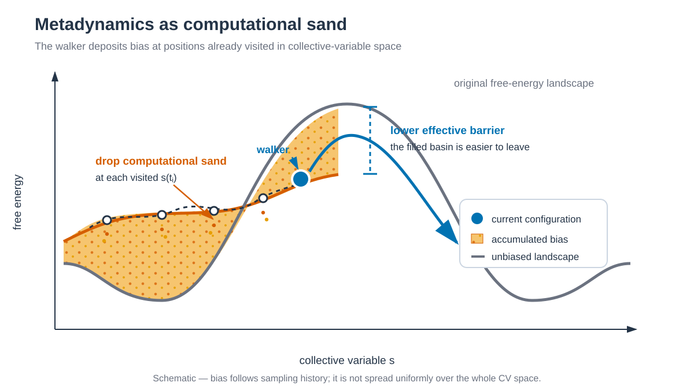

# Metadynamics and OPES / Metadynamics 및 OPES

*방문한 CV 위치에 computational sand처럼 bias를 쌓아 basin을 채우고 effective barrier를 낮춥니다. / Bias is deposited like computational sand at visited CV positions, filling the basin and lowering the effective barrier.*

## 한국어

AMBER가 MD를 계산하고 PLUMED가 collective variable(CV)과 bias를 처리합니다.
7.1, 7.3과 7.4는 ff19SB/TIP3P capped alanine dipeptide를 사용합니다.
7.2는 ff19SB/GAFF2/TIP3P trypsin–benzamidine를 사용합니다.
네 system 모두 solute와 box edge 사이에 20 Å TIP3P buffer를 둡니다.

| Directory | Method | Bias 대상 | 상태 파일 |
|---|---|---|---|
| `7.1_WT-MetaD/` | well-tempered MetaD | φ, ψ | `HILLS` |
| `7.2_funnel-MetaD/` | funnel MetaD | trypsin–BEN binding 경로 | `HILLS`, `FUNNEL_GRID` |
| `7.3_OPES_METAD/` | OPES_METAD | φ, ψ | `opes.state`, `KERNELS` |
| `7.4_OPES_EXPANDED/` | multithermal OPES_EXPANDED | potential energy | `opes.state`, `DELTAFS` |

WT-MetaD, Funnel MetaD와 OPES_METAD는 선택한 CV 공간의 barrier를
낮춥니다. MetaD를 computational sand에 비유하면, simulation walker가 방문한
CV 위치마다 sand에 해당하는 bias를 떨어뜨립니다. 방문이 반복된 basin이
채워지면 effective barrier가 낮아져 다른 영역으로 이동하기 쉬워집니다.
Bias를 CV 공간 전체에 미리 적용하는 것은 아닙니다.

MetaD는 방문한 CV 위치에 bias를 직접 누적합니다. OPES_METAD는 방문 data를
reweighting하여 unbiased probability distribution `P_n(s)`를 먼저 추정하고,
그 분포를 well-tempered target distribution으로 바꾸는 bias를 계산합니다.
OPES_EXPANDED는 kernel density estimate 대신 expanded state별 free-energy
offset `ΔF_n(λ)`를 추정하여 target bias를 계산합니다.

Funnel MetaD는 ligand의 solvent 탐색 부피를 cone과 cylinder로 제한합니다.
OPES Expanded example은 CV 공간 대신 300–500 K multithermal target을
구성합니다. 서로 다른 목표를 가진 method이므로 bias 크기만으로 성능을
비교하지 않습니다.

각 runnable directory에서 `build.sh`, `run.sh`, `python3 anal.py` 순서로
실행합니다. `build.sh`의 첫 argument는 준비한
PDB입니다. Funnel MetaD는 ligand SDF도 두 번째 argument로 받습니다.
Production은 나누지 않고 1 ns를 한 번에 실행하며 output과 PLUMED state를
각 tutorial의 `work/`에 직접 저장합니다.

Minimization, heating과 equilibration은 `*.out`과 `*.rst7`이 모두 있으면
건너뜁니다. 둘 중 일부만 있으면 해당 stage를 다시 실행합니다. Production
output이 하나라도 있으면 AMBER restart와 `HILLS`, `opes.state` 같은 bias state를
덮어쓰지 않도록 중단합니다.

PLUMED가 연결된 Amber의 `pmemd.cuda`가 기본 engine입니다. AmberTools만 설치한
환경에서는 PLUMED를 포함해 build한 `sander`를 `AMBER_ENGINE=sander`로 지정할
수 있습니다. 설치된 executable이 PLUMED 연동을 지원하는지는 짧은 coupled run으로
확인해야 합니다.

Funnel MetaD는 optional `funnel` module, 두 OPES example은 optional `opes`
module이 필요합니다. 네 example을 모두 실행할 PLUMED 2.10은 configure에
`--enable-modules=funnel+opes`를 지정합니다.

## English

AMBER propagates the MD while PLUMED evaluates the collective variables and
bias. Three examples use an ff19SB/TIP3P capped alanine dipeptide, while Funnel
MetaD uses ff19SB/GAFF2/TIP3P trypsin–benzamidine. All four systems use a 20 Å
TIP3P buffer between the solute and the box edge. They cover well-tempered MetaD on φ/ψ, Funnel MetaD for 3PTB
trypsin–benzamidine, OPES_METAD on φ/ψ, and multithermal OPES_EXPANDED over
300–500 K. Funnel MetaD requires PLUMED's optional `funnel` module, while both
OPES examples require the optional `opes` module. Configure both with
`--enable-modules=funnel+opes` when all four tutorials will be used.

Metadynamics can be viewed as adding computational sand: the simulation walker
deposits bias at the CV positions it has visited. As the sampled basin fills,
its effective barrier decreases and escape becomes more frequent. The bias is
not distributed uniformly over the full CV space in advance.

MetaD directly accumulates bias at visited CV positions. OPES_METAD instead
reweights the accumulated samples to estimate the unbiased probability
distribution `P_n(s)`, then calculates the bias needed to transform it toward
a well-tempered target distribution. OPES_EXPANDED does not use a kernel-density
estimate; it estimates the free-energy offsets `ΔF_n(λ)` of expanded states and
calculates the corresponding target bias.

Run `build.sh`, `run.sh`, and `python3 anal.py` in a
runnable directory. The first build argument is the prepared PDB; Funnel MetaD
also accepts the ligand SDF as its second argument. Production runs as one
single 1 ns calculation and writes its outputs and PLUMED state directly
under the tutorial `work/` directory. The default
engine is a PLUMED-enabled `pmemd.cuda`; a PLUMED-enabled `sander` can be selected
with `AMBER_ENGINE=sander`.

Minimization, heating, and equilibration are skipped when both their `*.out`
and `*.rst7` files exist; incomplete pairs are rerun. Existing production output
stops the workflow before the AMBER restart or bias state can be overwritten.
