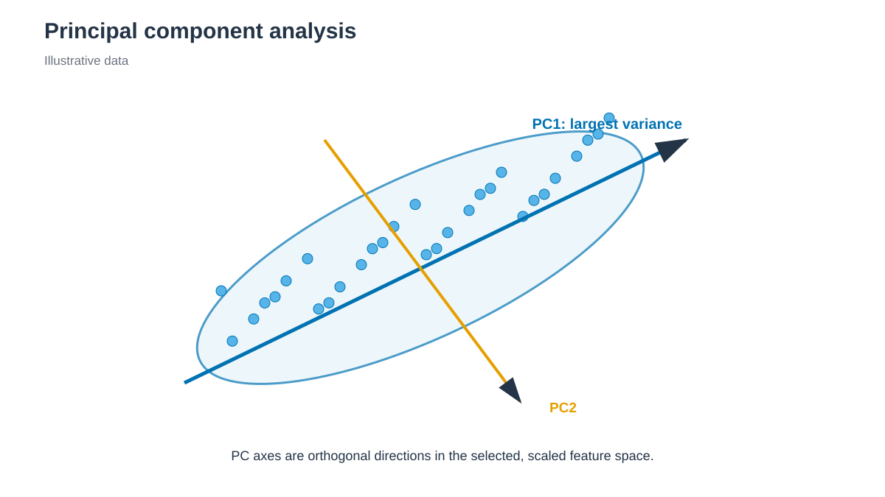

# PCA / 주성분 분석



*PC1은 선택하고 scaling한 feature에서 가장 큰 분산 방향을 나타냅니다. / PC1 is the largest-variance direction in the selected and scaled feature space.*


## 한국어

Chignolin residue 2–9의 φ/ψ를 sine/cosine feature로 바꾼 뒤 표준화하고 PCA를
적용합니다. PCA는 원래 feature의 분산을 가장 많이 설명하는 직교 축을 찾는
선형 방법입니다.

이 directory에서 실행합니다.

```bash
./run.sh
python3 anal.py
```

`run.sh`는 cpptraj으로 `output/phi_psi.dat`을 만듭니다. `anal.py`는
`features.tsv`, `projection.tsv`와 `explained_variance.tsv`를 기록하고 scree
plot 및 PC1–PC2 projection을 표시합니다.

다른 system은 `run.sh` 상단의 topology와 trajectory, cpptraj의 residue 범위를
함께 수정합니다. Feature scaling 여부와 atom/residue selection이 바뀌면 서로
다른 PCA basis가 되므로 projection을 직접 비교하지 않습니다.

### 결과 저장과 재실행

`run.sh`는 빈 temporary directory에서 새 결과를 계산하고 필수 output을
확인한 뒤 `output/`을 교체합니다. 계산 실패나 새 output 누락 시 이전 결과와
log를 유지합니다. 실패한 실행의 log 마지막 부분은 stderr에 출력합니다.

자동 호출되는 `result_generation.py`가 완료한 파일의 hash를
`output/.generation.json`에 기록합니다. `anal.py`는 이 기록을 확인하며,
후처리 파일을 저장하는 경우에도 새 결과를 함께 검증한 뒤 반영합니다.
기록이 없는 과거 결과는 `run.sh`로 다시 생성합니다.

게시가 중단되어 `.output.pending`이 남으면 결과를 소비하거나 다시 게시하지
않습니다. 실행 process가 종료됐는지 확인한 뒤 marker에 적힌 previous/new
directory를 함께 보존하고 검사합니다. 파일을 개별적으로 섞거나 marker만
삭제해서 재실행하지 않습니다.

## English

Cpptraj calculates residue 2–9 φ/ψ angles. Python converts them to standardized
sine/cosine features and performs PCA. Numeric outputs contain the scaled
features, projections, and individual/cumulative explained variance. PCA bases
from different feature definitions are not directly comparable.

### Result storage and reruns

`run.sh` calculates in an empty temporary directory, checks required outputs,
and then replaces `output/`. Calculation failure or missing new outputs leaves
the previous results and logs intact. Recent failed-generation log lines are
printed to stderr.

The automatically called `result_generation.py` records completed file hashes
in `output/.generation.json`. `anal.py` checks this record and, when saving
derived files, validates and publishes them together. Regenerate older results
without a record by running `run.sh`.

If publication stops with `.output.pending` present, readers and publishers
refuse to proceed. Check that the process has ended, then preserve and inspect
both previous/new directories listed in the marker. Do not mix individual files
or remove only the marker to retry.
