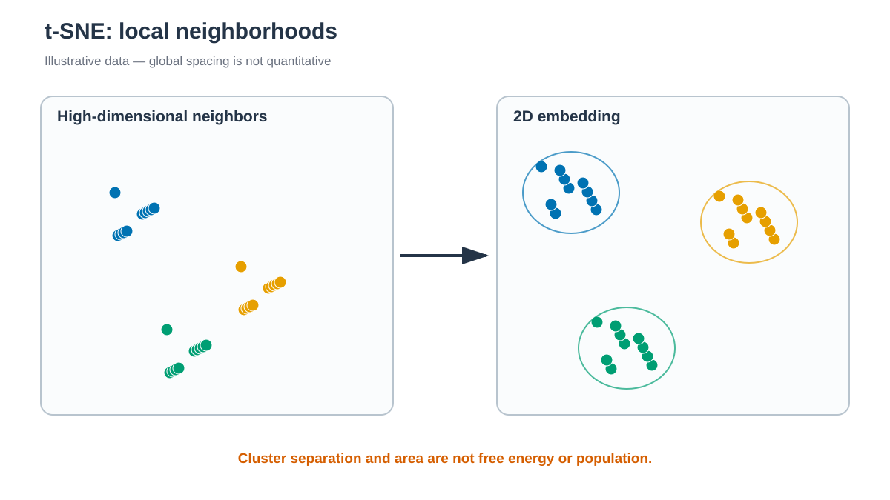

# t-SNE



*가까운 이웃은 강조되지만 cluster 사이 거리와 면적은 정량적으로 해석하지 않습니다. / Nearby observations are emphasized, but inter-cluster distances and areas are not quantitative.*


## 한국어

t-SNE는 고차원에서 가까운 frame이 2차원에서도 이웃이 되도록 확률 분포를
맞추는 nonlinear embedding입니다. Chignolin backbone dihedral feature를
표준화해 사용합니다.

```bash
./run.sh
python3 anal.py
```

기본값은 `perplexity=30`, `learning_rate="auto"`, `init="pca"`,
`max_iter=1000`, `random_state=20260809`입니다. `embedding.tsv`와
`metadata.tsv`를 만들고 frame 순서로 색칠한 plot을 표시합니다.

Perplexity는 유효 이웃 수와 관련된 parameter이며 frame 수보다 작아야 합니다.
Script는 frame이 부족해도 값을 자동으로 낮추지 않습니다. Seed와 perplexity가
다른 embedding의 회전, 모양과 cluster 간 거리를 정량 비교하지 않습니다.

### 결과 저장과 재실행

`run.sh`는 빈 temporary directory에서 새 결과를 계산하고 필수 output을
확인한 뒤 `output/`을 교체합니다. 계산 실패나 새 output 누락 시 이전 결과와
log를 유지합니다. 실패한 실행의 log 마지막 부분은 stderr에 출력합니다.

자동 호출되는 `result_generation.py`가 완료한 파일의 hash를
`output/.generation.json`에 기록합니다. `anal.py`는 이 기록을 확인하며,
후처리 파일을 저장하는 경우에도 새 결과를 함께 검증한 뒤 반영합니다.
기록이 없는 과거 결과는 `run.sh`로 다시 생성합니다.

게시가 중단되어 `.output.pending`이 남으면 결과를 소비하거나 다시 게시하지
않습니다. 실행 process가 종료됐는지 확인한 뒤 marker에 적힌 previous/new
directory를 함께 보존하고 검사합니다. 파일을 개별적으로 섞거나 marker만
삭제해서 재실행하지 않습니다.

## English

Scikit-learn t-SNE embeds standardized periodic backbone-dihedral features.
The fixed perplexity is 30 with PCA initialization and a recorded random seed.
The script refuses undersized data rather than silently changing perplexity.
Embedding distance and density are not free energies or populations.

### Result storage and reruns

`run.sh` calculates in an empty temporary directory, checks required outputs,
and then replaces `output/`. Calculation failure or missing new outputs leaves
the previous results and logs intact. Recent failed-generation log lines are
printed to stderr.

The automatically called `result_generation.py` records completed file hashes
in `output/.generation.json`. `anal.py` checks this record and, when saving
derived files, validates and publishes them together. Regenerate older results
without a record by running `run.sh`.

If publication stops with `.output.pending` present, readers and publishers
refuse to proceed. Check that the process has ended, then preserve and inspect
both previous/new directories listed in the marker. Do not mix individual files
or remove only the marker to retry.
