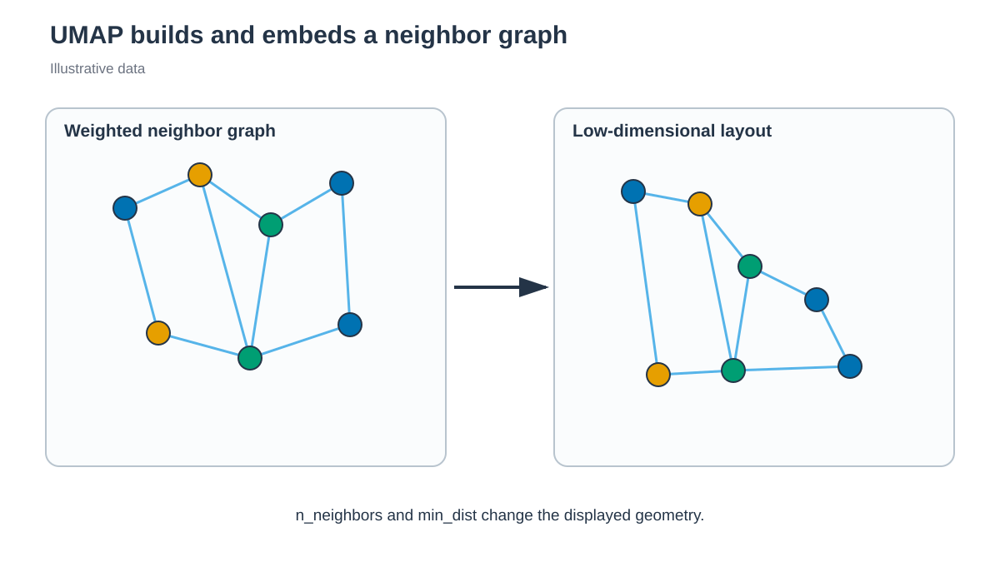

# UMAP



*UMAP은 고차원 neighbor graph의 연결 관계를 저차원에 배치합니다. / UMAP arranges high-dimensional neighbor-graph connectivity in a low-dimensional space.*


## 한국어

UMAP은 이웃 graph를 만든 뒤 저차원에서 그 연결 관계를 보존하는 nonlinear
embedding입니다. 입력은 표준화한 Chignolin backbone dihedral feature입니다.

```bash
./run.sh
python3 anal.py
```

기본값은 `n_neighbors=15`, `min_dist=0.1`, `metric="euclidean"`,
`random_state=20260809`입니다. `embedding.tsv`와 `metadata.tsv`를 생성합니다.
UMAP은 Numba cache를 system temporary directory에 만들며 repository에는 cache를
남기지 않습니다.

`n_neighbors`는 local/global structure의 균형에, `min_dist`는 저차원에서
point가 모일 수 있는 정도에 영향을 줍니다. Parameter가 다른 embedding의
거리와 밀도를 정량 비교하지 않습니다.

### 결과 저장과 재실행

`run.sh`는 빈 temporary directory에서 새 결과를 계산하고 필수 output을
확인한 뒤 `output/`을 교체합니다. 계산 실패나 새 output 누락 시 이전 결과와
log를 유지합니다. 실패한 실행의 log 마지막 부분은 stderr에 출력합니다.

자동 호출되는 `result_generation.py`가 완료한 파일의 hash를
`output/.generation.json`에 기록합니다. `anal.py`는 이 기록을 확인하며,
후처리 파일을 저장하는 경우에도 새 결과를 함께 검증한 뒤 반영합니다.
기록이 없는 과거 결과는 `run.sh`로 다시 생성합니다.

게시가 중단되어 `.output.pending`이 남으면 결과를 소비하거나 다시 게시하지
않습니다. 실행 process가 종료됐는지 확인한 뒤 marker에 적힌 previous/new
directory를 함께 보존하고 검사합니다. 파일을 개별적으로 섞거나 marker만
삭제해서 재실행하지 않습니다.

공개 analysis entry는 자동으로 `writer_guard.py`를 호출해 같은 output의 동시 writer를 거부합니다. Engine 실행부터 결과 게시까지 보호하며, signal 종료 시 child가 멈춘 뒤 lock을 해제합니다. Lock을 임의로 삭제해 실행을 재개하지 않습니다.

## English

UMAP builds a neighbor graph from standardized periodic dihedral features and
embeds it in two dimensions. The tutorial records UMAP parameters and version.
Its Numba cache is placed under the system temporary directory, not the
repository. Embedding geometry is not a thermodynamic observable.

### Result storage and reruns

`run.sh` calculates in an empty temporary directory, checks required outputs,
and then replaces `output/`. Calculation failure or missing new outputs leaves
the previous results and logs intact. Recent failed-generation log lines are
printed to stderr.

The automatically called `result_generation.py` records completed file hashes
in `output/.generation.json`. `anal.py` checks this record and, when saving
derived files, validates and publishes them together. Regenerate older results
without a record by running `run.sh`.

If publication stops with `.output.pending` present, readers and publishers
refuse to proceed. Check that the process has ended, then preserve and inspect
both previous/new directories listed in the marker. Do not mix individual files
or remove only the marker to retry.

Public analysis entries automatically use `writer_guard.py` to reject concurrent writers to the same output. Protection covers engine execution through publication, and signal cleanup drains children before releasing the lock. Do not delete a lock to force a retry.
