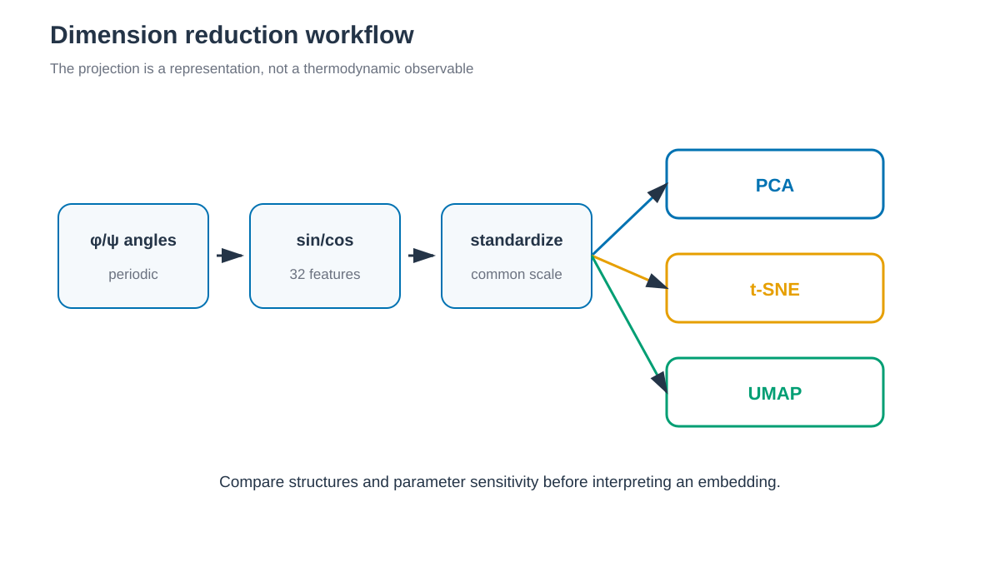

# Dimensionality reduction / 차원 축소



*세 방법은 같은 periodic feature에서 시작하지만 저차원 구조의 의미는 서로 다릅니다. / All three methods start from the same periodic features but give different meanings to the low-dimensional geometry.*


## 한국어

Chignolin residue 2–9의 backbone φ/ψ를 낮은 차원으로 투영합니다. 각 angle은
주기적 경계를 보존하도록 sine과 cosine으로 바꾸며, 각 tutorial은 같은
trajectory에서 feature를 직접 생성합니다.

- [PCA](4.1_PCA/)
- [t-SNE](4.2_tSNE/)
- [UMAP](4.3_UMAP/)

`ambertools26` 환경에 Python dependency를 설치합니다.

```bash
conda install -c conda-forge \
    "scikit-learn>=1.5,<2" \
    "umap-learn>=0.5.7,<0.6"
```

PCA의 explained variance는 선형 분산을 설명합니다. t-SNE와 UMAP embedding의
거리, 면적과 점 밀도는 population이나 free energy가 아닙니다.

## English

These tutorials project periodic sine/cosine features of Chignolin backbone
φ/ψ angles. PCA reports linear variance; t-SNE and UMAP provide nonlinear
visualizations whose distances and densities are not thermodynamic quantities.
Each leaf calculates its own features from the simulation trajectory.
