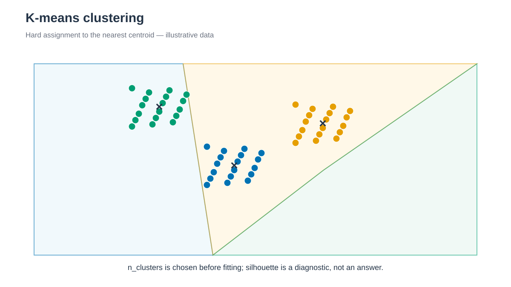

# K-means clustering



*각 frame은 가장 가까운 centroid의 cluster 하나에 배정됩니다. / Each frame is assigned to one cluster represented by its nearest centroid.*


## 한국어

K-means는 cluster 내부의 centroid distance 제곱합을 줄이도록 frame을 나눕니다.
구형이고 크기가 비슷한 cluster를 선호하며 cluster 수를 미리 정해야 합니다.

```bash
./run.sh
python3 anal.py
```

기본값은 `n_clusters=3`, `n_init=20`, `random_state=20260809`입니다. k=2–8의
silhouette score를 `silhouette.tsv`에 기록합니다. 선택한 세 cluster의 label,
population과 centroid에 가까운 representative frame은 `cluster_labels.tsv`,
`cluster_summary.tsv`, `representative_frames.tsv`에 기록합니다.

Silhouette maximum만으로 cluster 수를 확정하지 않습니다. 시간 순서와 구조를
확인하고 필요하면 `CLUSTER_COUNT`를 수정합니다.

### 결과 저장과 재실행

`run.sh`는 빈 temporary directory에서 새 결과를 계산하고 필수 output을
확인한 뒤 `output/`을 교체합니다. 계산 실패나 새 output 누락 시 이전 결과와
log를 유지합니다. 실패한 실행의 log 마지막 부분은 stderr에 출력합니다.

자동 호출되는 `result_generation.py`가 완료한 파일의 hash를
`output/.generation.json`에 기록합니다. `anal.py`는 이 기록을 확인하며,
후처리 파일을 저장하는 경우에도 새 결과를 함께 검증한 뒤 반영합니다.
기록이 없는 과거 결과는 `run.sh`로 다시 생성합니다.

게시가 중단되어 `.output.pending`이 남으면 결과를 소비하거나 다시 게시하지
않습니다. 실행 process가 종료됐는지 확인한 뒤 marker에 적힌 previous/new
directory를 함께 보존하고 검사합니다. 파일을 개별적으로 섞거나 marker만
삭제해서 재실행하지 않습니다.

## English

K-means partitions five-PC features using three clusters and 20 initializations.
Silhouette scores for k=2–8 are diagnostics rather than an automatic model
choice. The representative frame is nearest to each cluster center.

### Result storage and reruns

`run.sh` calculates in an empty temporary directory, checks required outputs,
and then replaces `output/`. Calculation failure or missing new outputs leaves
the previous results and logs intact. Recent failed-generation log lines are
printed to stderr.

The automatically called `result_generation.py` records completed file hashes
in `output/.generation.json`. `anal.py` checks this record and, when saving
derived files, validates and publishes them together. Regenerate older results
without a record by running `run.sh`.

If publication stops with `.output.pending` present, readers and publishers
refuse to proceed. Check that the process has ended, then preserve and inspect
both previous/new directories listed in the marker. Do not mix individual files
or remove only the marker to retry.
