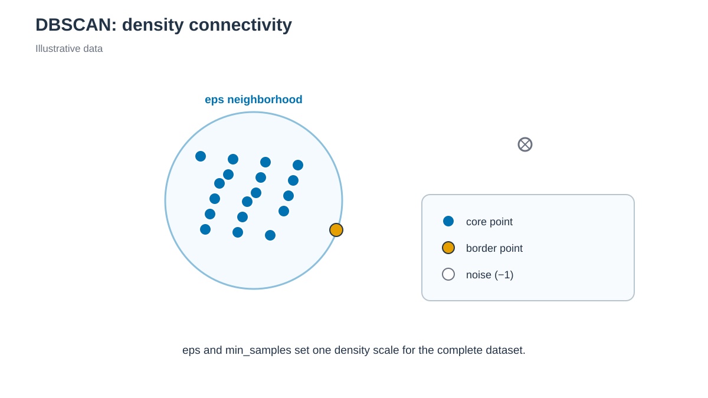

# DBSCAN clustering



*eps neighborhood와 min_samples가 하나의 density cutoff를 정합니다. / The eps neighborhood and min_samples define one density cutoff.*


## 한국어

DBSCAN은 `eps` 안에 `min_samples` 이상의 이웃이 있는 영역을 연결하고 희박한
frame을 noise로 분류합니다. Cluster 수를 미리 정하지 않지만 하나의 density
threshold를 사용합니다.

```bash
./run.sh
python3 anal.py
```

기본값은 `eps=1.2`, `min_samples=10`이며 noise label은 `-1`입니다.
`k_distance.tsv`와 plot으로 cutoff sensitivity를 확인합니다. Cluster가 없는
경우도 parameter 또는 sampling에 대한 결과이므로 label과 noise fraction을
그대로 기록합니다.

### 결과 저장과 재실행

`run.sh`는 빈 temporary directory에서 새 결과를 계산하고 필수 output을
확인한 뒤 `output/`을 교체합니다. 계산 실패나 새 output 누락 시 이전 결과와
log를 유지합니다. 실패한 실행의 log 마지막 부분은 stderr에 출력합니다.

자동 호출되는 `result_generation.py`가 완료한 파일의 hash를
`output/.generation.json`에 기록합니다. `anal.py`는 이 기록을 확인하며,
후처리 파일을 저장하는 경우에도 새 결과를 함께 검증한 뒤 반영합니다.
기록이 없는 과거 결과는 `run.sh`로 다시 생성합니다.

게시가 중단되어 `.output.pending`이 남으면 결과를 소비하거나 다시 게시하지
않습니다. 실행 process가 종료됐는지 확인한 뒤 marker에 적힌 previous/new
directory를 함께 보존하고 검사합니다. 파일을 개별적으로 섞거나 marker만
삭제해서 재실행하지 않습니다.

## English

DBSCAN connects dense regions using `eps=1.2` and `min_samples=10`; sparse
frames retain the noise label `-1`. The sorted k-neighbor distance is written
for sensitivity checks. A no-cluster result is preserved rather than hidden.

### Result storage and reruns

`run.sh` calculates in an empty temporary directory, checks required outputs,
and then replaces `output/`. Calculation failure or missing new outputs leaves
the previous results and logs intact. Recent failed-generation log lines are
printed to stderr.

The automatically called `result_generation.py` records completed file hashes
in `output/.generation.json`. `anal.py` checks this record and, when saving
derived files, validates and publishes them together. Regenerate older results
without a record by running `run.sh`.

If publication stops with `.output.pending` present, readers and publishers
refuse to proceed. Check that the process has ended, then preserve and inspect
both previous/new directories listed in the marker. Do not mix individual files
or remove only the marker to retry.
