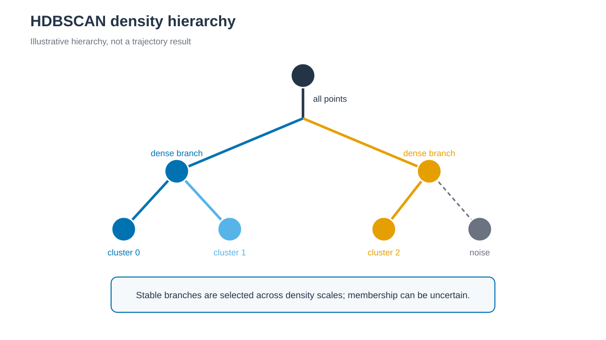

# HDBSCAN clustering



*여러 density scale에서 안정적인 branch를 cluster로 선택하고 나머지는 noise로 둘 수 있습니다. / Stable branches across density scales are selected as clusters while other points may remain noise.*


## 한국어

HDBSCAN은 여러 density scale의 hierarchy에서 안정적인 cluster를 선택하고
나머지 frame을 noise로 둘 수 있습니다. Scikit-learn 구현을 사용합니다.

```bash
./run.sh
python3 anal.py
```

기본값은 `min_cluster_size=50`, `min_samples=10`,
`cluster_selection_method="eom"`입니다. Frame별 membership probability와
cluster별 평균 probability를 기록합니다. Scikit-learn 1.9는 별도 `hdbscan`
package의 `cluster_persistence_`를 제공하지 않으므로 persistence를 임의로
계산하지 않습니다.

## English

Scikit-learn HDBSCAN selects clusters across density scales with a minimum
cluster size of 50. Frame and cluster summaries report membership probability.
Scikit-learn does not expose the separate `hdbscan` package's
`cluster_persistence_`, so this tutorial does not fabricate that quantity.
