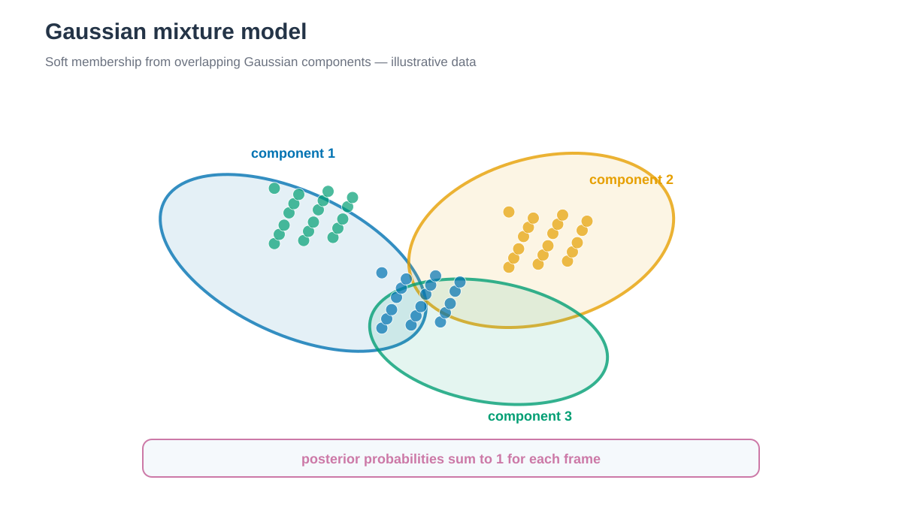

# Gaussian mixture model clustering



*Gaussian component가 겹치는 영역에서는 한 frame이 여러 component에 posterior probability를 가집니다. / In overlapping regions, one frame has posterior probabilities for multiple components.*


## 한국어

GMM은 feature 분포를 여러 Gaussian component의 합으로 나타냅니다. K-means와
달리 covariance와 frame별 posterior probability를 제공합니다.

```bash
./run.sh
python3 anal.py
```

기본값은 component 3개, full covariance, `n_init=10`, `reg_covar=1e-6`,
`random_state=20260809`입니다. Component 1–8의 AIC와 BIC를
`model_selection.tsv`에 기록합니다. Representative frame은 해당 component의
posterior probability가 가장 큰 frame입니다.

Gaussian mixture가 실제 metastable state와 일치한다고 가정하지 않습니다.
Component 수, covariance type과 trajectory 구간을 바꿔 sensitivity를 확인합니다.

## English

A three-component full-covariance Gaussian mixture reports soft posterior
probabilities. AIC and BIC for one through eight components are diagnostics.
The highest-posterior frame represents each component, but Gaussian components
are not automatically metastable molecular states.
