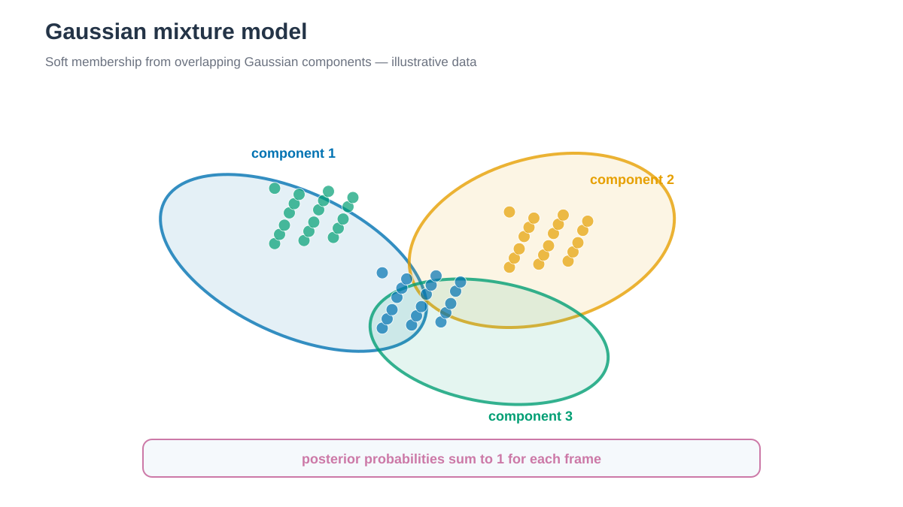

# Gaussian mixture model clustering



*Gaussian component가 겹치는 영역에서는 한 frame이 여러 component에 posterior probability를 가집니다. / In overlapping regions, one frame has posterior probabilities for multiple components.*


## 한국어

GMM은 feature 분포를 여러 Gaussian component의 합으로 나타냅니다. K-means와
달리 covariance와 frame별 posterior probability를 제공합니다.

```bash
./run.sh
python3 anal.py
```

기본값은 component 3개, full covariance, `n_init=10`, `reg_covar=1e-6`,
`random_state=20260809`입니다. Component 1–8의 AIC와 BIC를
`model_selection.tsv`에 기록합니다. Representative frame은 해당 component의
posterior probability가 가장 큰 frame입니다.

Gaussian mixture가 실제 metastable state와 일치한다고 가정하지 않습니다.
Component 수, covariance type과 trajectory 구간을 바꿔 sensitivity를 확인합니다.

### 결과 저장과 재실행

`run.sh`는 빈 temporary directory에서 새 결과를 계산하고 필수 output을
확인한 뒤 `output/`을 교체합니다. 계산 실패나 새 output 누락 시 이전 결과와
log를 유지합니다. 실패한 실행의 log 마지막 부분은 stderr에 출력합니다.

자동 호출되는 `result_generation.py`가 완료한 파일의 hash를
`output/.generation.json`에 기록합니다. `anal.py`는 이 기록을 확인하며,
후처리 파일을 저장하는 경우에도 새 결과를 함께 검증한 뒤 반영합니다.
기록이 없는 과거 결과는 `run.sh`로 다시 생성합니다.

게시가 중단되어 `.output.pending`이 남으면 결과를 소비하거나 다시 게시하지
않습니다. 실행 process가 종료됐는지 확인한 뒤 marker에 적힌 previous/new
directory를 함께 보존하고 검사합니다. 파일을 개별적으로 섞거나 marker만
삭제해서 재실행하지 않습니다.

공개 analysis entry는 자동으로 `writer_guard.py`를 호출해 같은 output의 동시 writer를 거부합니다. Engine 실행부터 결과 게시까지 보호하며, signal 종료 시 child가 멈춘 뒤 lock을 해제합니다. Lock을 임의로 삭제해 실행을 재개하지 않습니다.

## English

A three-component full-covariance Gaussian mixture reports soft posterior
probabilities. AIC and BIC for one through eight components are diagnostics.
The highest-posterior frame represents each component, but Gaussian components
are not automatically metastable molecular states.

### Result storage and reruns

`run.sh` calculates in an empty temporary directory, checks required outputs,
and then replaces `output/`. Calculation failure or missing new outputs leaves
the previous results and logs intact. Recent failed-generation log lines are
printed to stderr.

The automatically called `result_generation.py` records completed file hashes
in `output/.generation.json`. `anal.py` checks this record and, when saving
derived files, validates and publishes them together. Regenerate older results
without a record by running `run.sh`.

If publication stops with `.output.pending` present, readers and publishers
refuse to proceed. Check that the process has ended, then preserve and inspect
both previous/new directories listed in the marker. Do not mix individual files
or remove only the marker to retry.

Public analysis entries automatically use `writer_guard.py` to reject concurrent writers to the same output. Protection covers engine execution through publication, and signal cleanup drains children before releasing the lock. Do not delete a lock to force a retry.
