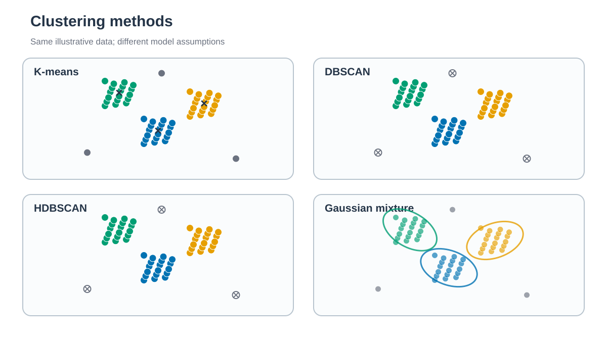

# Clustering / 군집화

*각 방법은 cluster shape, density와 membership에 서로 다른 가정을 둡니다. / Each method makes different assumptions about cluster shape, density, and membership.*

## 한국어

Chignolin backbone dihedral feature를 PCA 5차원으로 줄인 뒤 네 가지 방법으로
clustering합니다. 각 leaf는 feature와 PCA projection을 직접 계산하며 t-SNE나
UMAP embedding을 clustering input으로 사용하지 않습니다.

- [K-means](5.1_KMeans/)
- [DBSCAN](5.2_DBSCAN/)
- [HDBSCAN](5.3_HDBSCAN/)
- [Gaussian mixture model](5.4_GMM/)

Cluster label은 구조 state의 정답이 아닙니다. Parameter sensitivity, 시간에 따른
전이, representative frame과 독립 trajectory에서의 재현성을 함께 확인합니다.

## English

Four methods cluster standardized five-component PCA representations of
periodic Chignolin backbone-dihedral features. Each leaf is independent and
does not cluster t-SNE or UMAP coordinates. Labels require parameter and
trajectory-sensitivity checks before structural interpretation.
